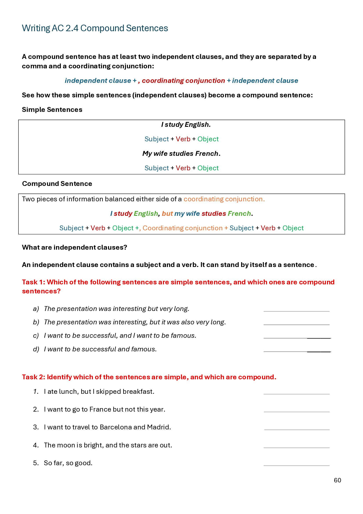
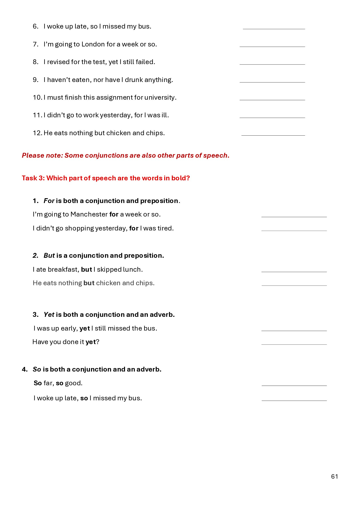
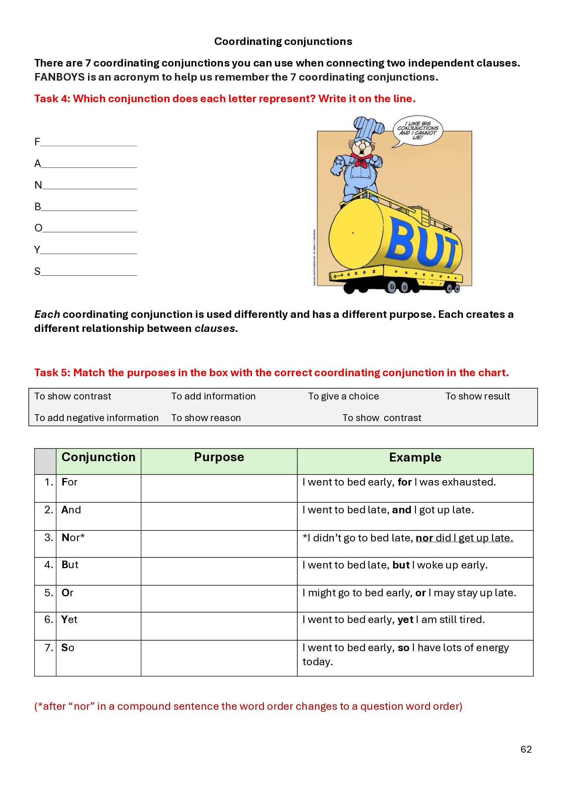
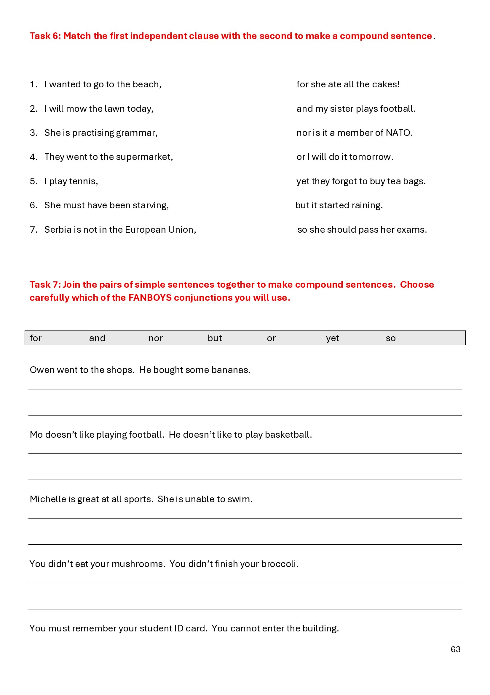
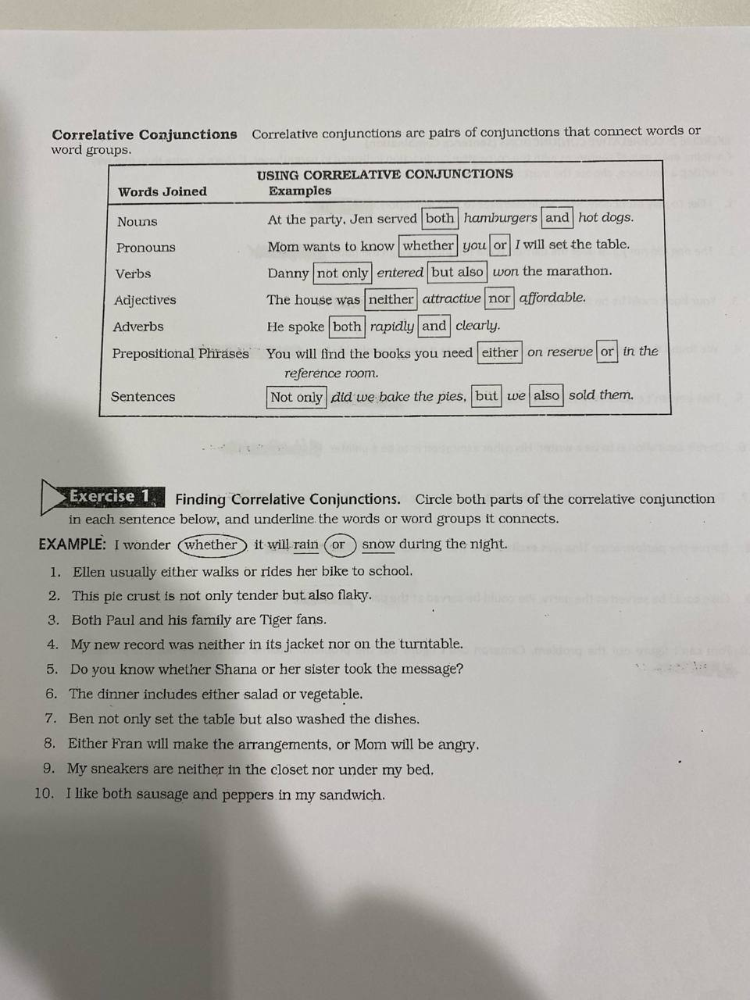
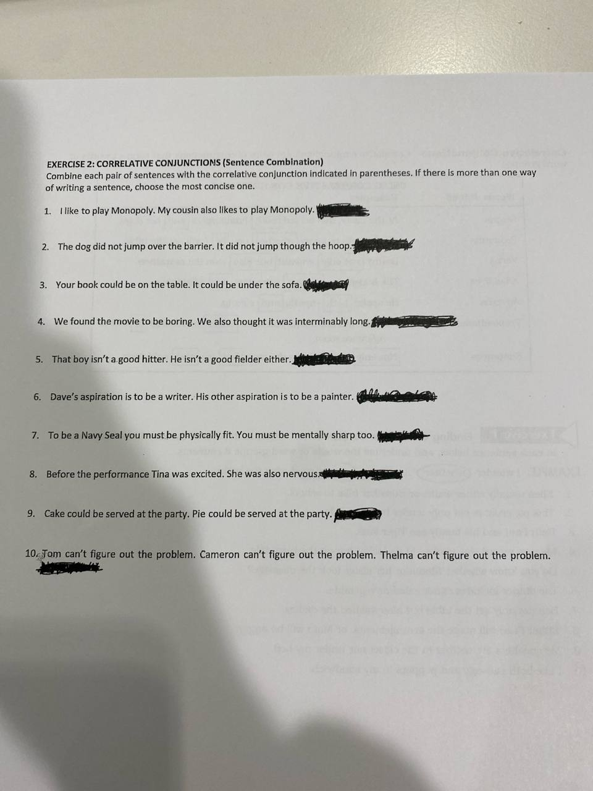

# 2026-04-28

## Topic

Розбір демо-екзамену; compound sentences (p.60–63); conjunctions & correlative conjunctions

## Class Notes

- Розбір демо екзамену - результати
- На reading екзамені не потрібно писати свої думки, потрібно знайти текст і вставити якщо просять!

- open Writing Boolet, compound sentences. p.60
They have more than one subject and more than one verb. They are made up of two or more simple sentences joined by a conjunction (and, but, or, so, yet) or by a semicolon (;).
Independent clause + conjunction + independent clause
Independent clause + ; + independent clause

Для чого використовується adverbs? Для того щоб описати дію, яка відбувається. Вони можуть описувати як часто відбувається дія, наскільки вона інтенсивна, коли вона відбувається і так далі.

conjunctions:
- so - використовується для того, щоб показати наслідок або результат дії. Після so ми очікуємо побачити результат того, що було сказано раніше.
- but - використовується для того, щоб показати контраст або протилежність між двома ідеями. Після but ми очікуємо побачити щось, що протилежне або відрізняється від того, що було сказано раніше.
- and - використовується для того, щоб додати інформацію або показати звʼязок між двома ідеями. Після and ми очікуємо побачити щось, що доповнює або розширює те, що було сказано раніше.
- or - використовується для того, щоб показати вибір або альтернативу між двома ідеями. Після or ми очікуємо побачити щось, що є альтернативою або вибором між тим, що було сказано раніше.
- yet - використовується для того, щоб показати контраст або протилежність між двома ідеями, але з додатковим відтінком несподіванки або незвичайності. Після yet ми очікуємо побачити щось, що є несподіваним або незвичайним порівняно з тим, що було сказано раніше.
- for - використовується для того, щоб показати причину або обґрунтування для дії. Після for ми очікуємо побачити щось, що пояснює причину або обґрунтування для того, що було сказано раніше.
- nor - використовується для того, щоб показати заперечення або відсутність чогось. Після nor ми очікуємо побачити щось, що заперечує або відсутнє порівняно з тим, що було сказано раніше.

- correlative conjunctions:
- either...or — використовується для того, щоб показати вибір між двома альтернативами. Після either...or ми очікуємо побачити щось, що є вибором між двома альтернативами. Shows a choice between two possibilities.
- neither...nor — використовується для того, щоб показати заперечення або відсутність чогось у двох варіантах. Після neither...nor ми очікуємо побачити щось, що заперечує або відсутнє в обох варіантах. To talk about two negative alternatives.
- both...and — використовується для того, щоб показати, що обидва елементи є важливими або доречними, they are true together. Після both...and ми очікуємо побачити щось, що показує, що обидва елементи є важливими або доречними.
- not only...but also — використовується для того, щоб показати, що не лише один елемент є важливим або доречним, а й інший елемент також є важливим або доречним. To add extra or surprising information.
- whether...or — використовується для того, щоб показати, що є два можливих варіанти або результати. Після whether...or ми очікуємо побачити щось, що показує два можливих варіанти або результати. To talk about two possibilities or outcomes.
- as...as — використовується для того, щоб показати порівняння між двома елементами. Після as...as ми очікуємо побачити щось, що показує порівняння між двома елементами.
- such...that — використовується для того, щоб показати, що один елемент є настільки значним, що це призводить до певного результату. Після such...that ми очікуємо побачити результат або наслідок.
  

Home Work:

## Materials

<!--
Put screenshots, scans, handouts into attachments/ subfolder:

-->

## New Words

→ see [vocab.md](../../vocab.md)
