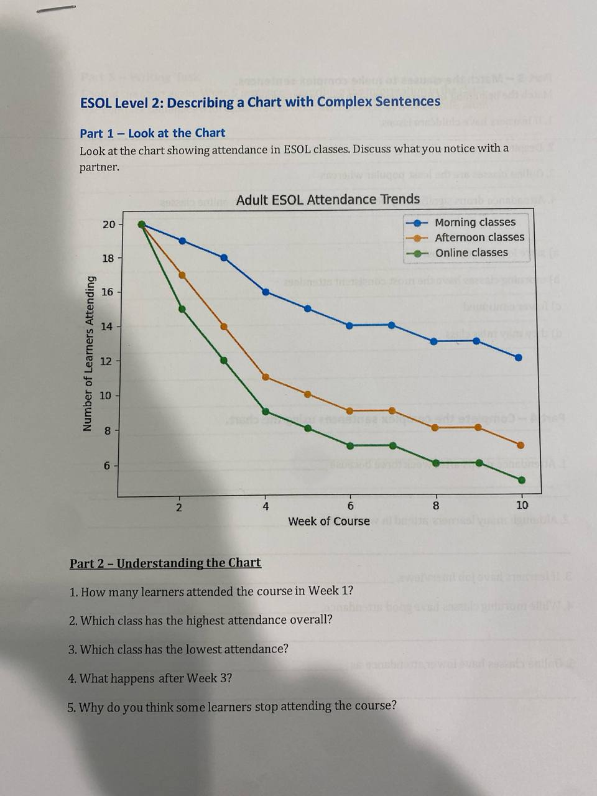
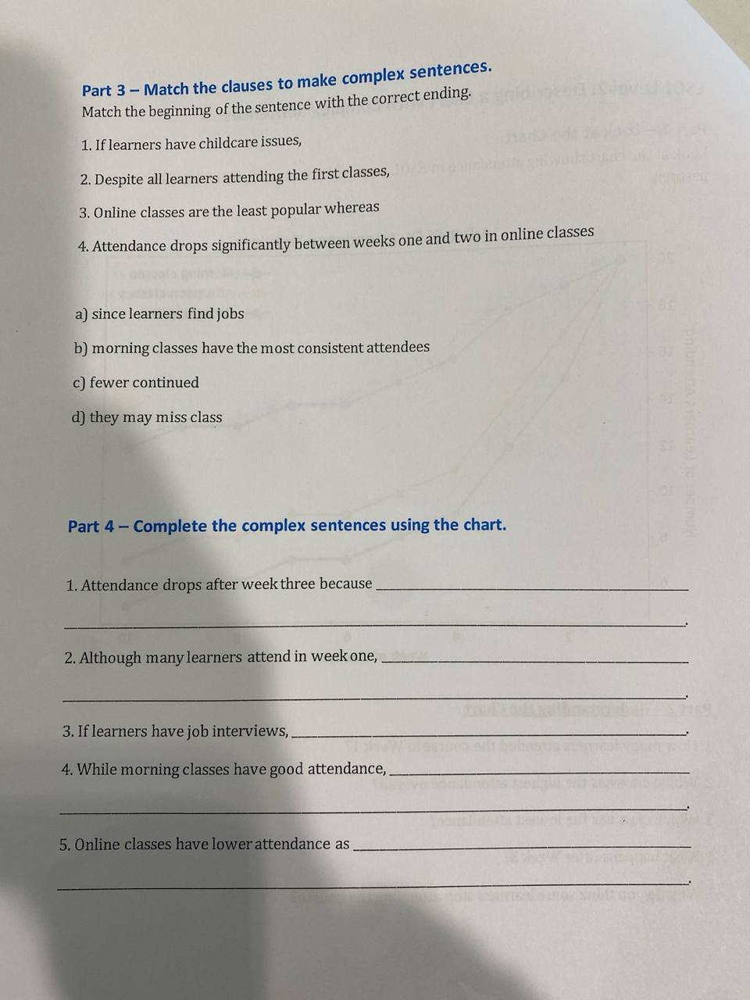
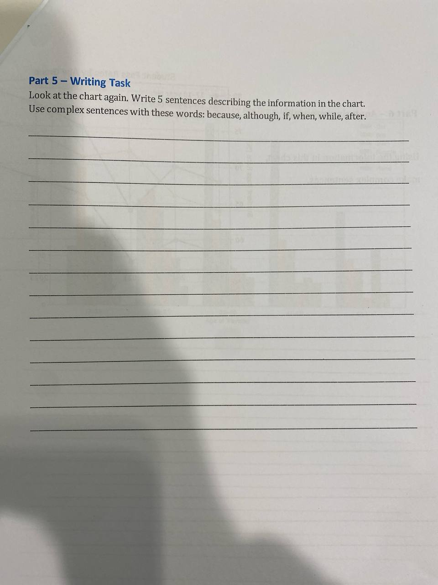
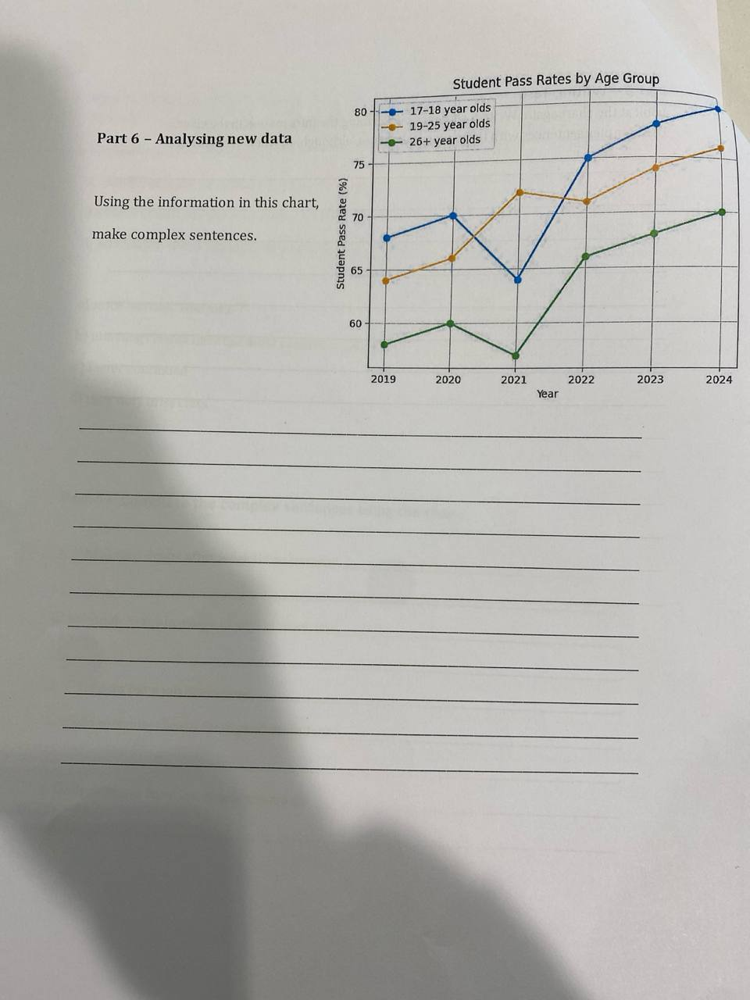
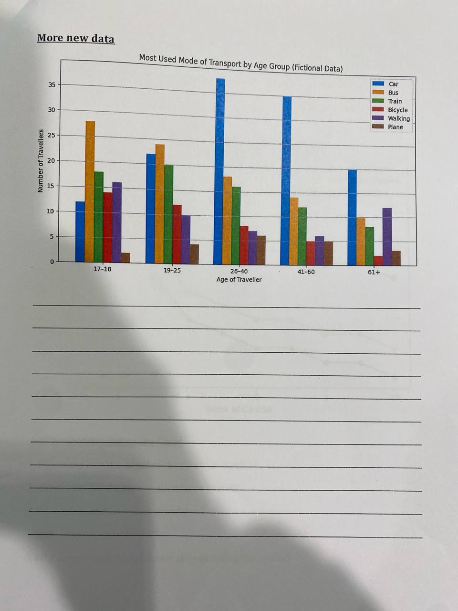

# 2026-05-12

## Topic

Complex sentences — describing charts with subordinating conjunctions (Writing Booklet p. 64–71)

## Class Notes

### Subordinating conjunctions (brainstorm on paper)

so that · while · by the time · as if · after · unless · since · in order that · if · because · although · whereas · before · only if · even if · as long as · when · as · once · even though · in case

### Worksheet: "ESOL Level 2: Describing a Chart with Complex Sentences"

**Part 1 – Look at the Chart**
Chart: *Adult ESOL Attendance Trends* — morning, afternoon, online classes over 10 weeks of course (number of learners attending).

**Part 2 – Understanding the Chart** (discussion questions)
1. How many learners attended the course in Week 1?
2. Which class has the highest attendance overall?
3. Which class has the lowest attendance?
4. What happens after Week 3?
5. Why do you think some learners stop attending the course?

**Part 3 – Match the clauses to make complex sentences**

| Beginning | Ending |
|-----------|--------|
| 1. If learners have childcare issues, | d) they may miss class |
| 2. Despite all learners attending the first classes, | c) fewer continued |
| 3. Online classes are the least popular whereas | b) morning classes have the most consistent attendees |
| 4. Attendance drops significantly between weeks one and two in online classes | a) since learners find jobs |

**Part 4 – Complete the complex sentences using the chart**
1. Attendance drops after week three because ___
2. Although many learners attend in week one, ___
3. If learners have job interviews, ___
4. While morning classes have good attendance, ___
5. Online classes have lower attendance as ___

**Part 5 – Writing Task**
Write 5 sentences describing the chart. Use: *because, although, if, when, while, after.*

## Homework

→ see [hw.md](hw.md)

## New Words

→ see [vocab.md](../../vocab.md)
