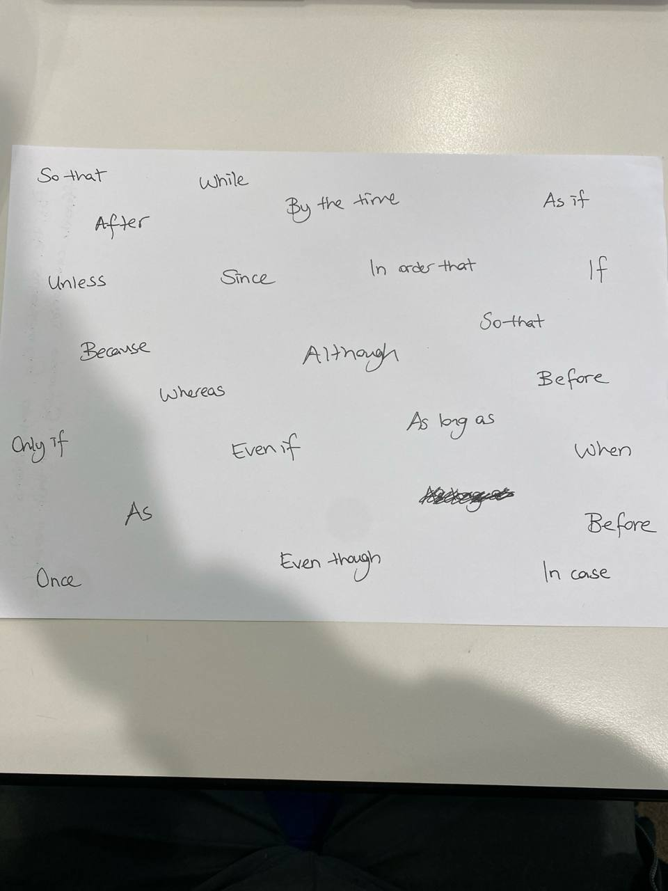

# Homework — 2026-05-12

**Assigned:** 2026-05-12
**Due:** 2026-05-19
**Status:** 🟢 Done

## Task

Part 6 — Using the information in each chart, write complex sentences:

using a list of subordinating conjunctions from pic:

**Chart 1: Student Pass Rates by Age Group (2019–2024)**
Three lines: 17–18 year olds, 19–25 year olds, 26+ year olds.

**Chart 2: Most Used Mode of Transport by Age Group (Fictional Data)**
Bar chart: Car, Bus, Train, Bicycle, Walking, Plane — for age groups 17–18, 19–25, 26–40, 41–60, 61+.

## Solution

→ see [hw_solution.md](hw_solution.md)
