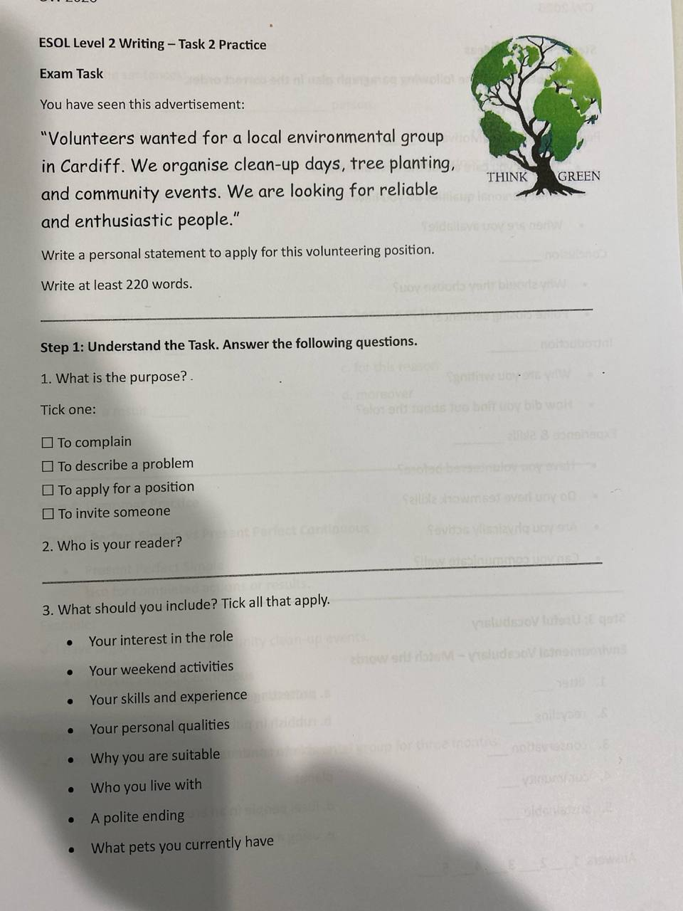
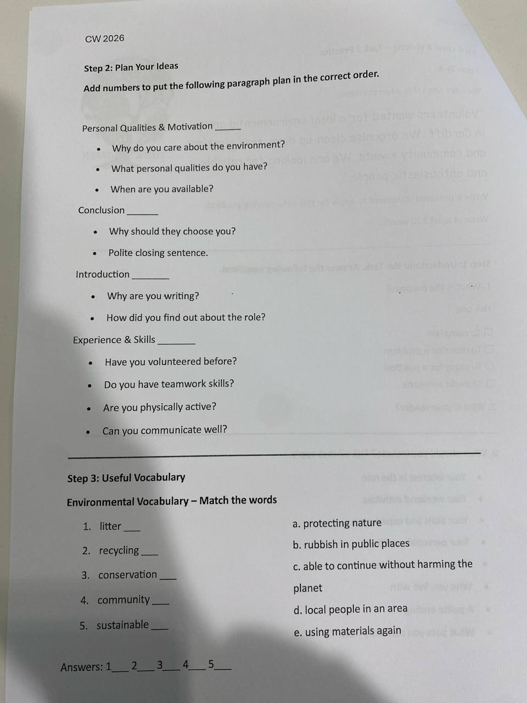
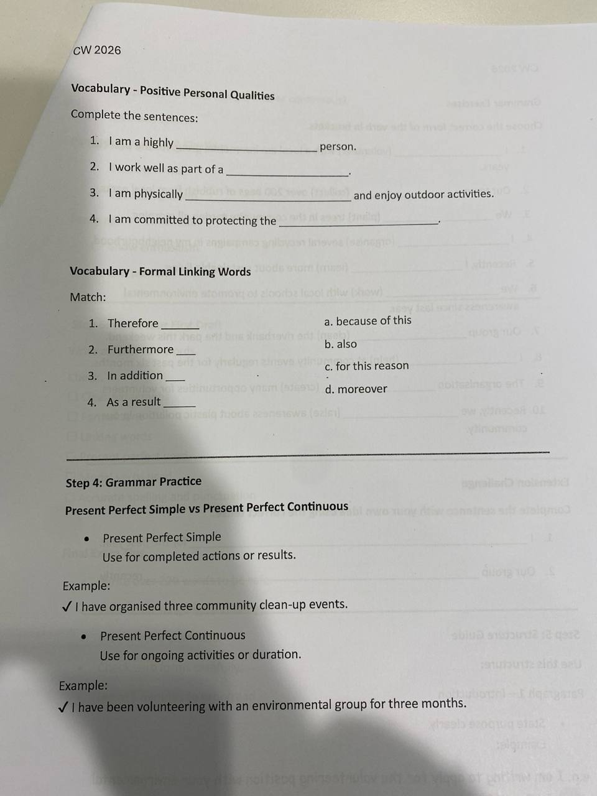
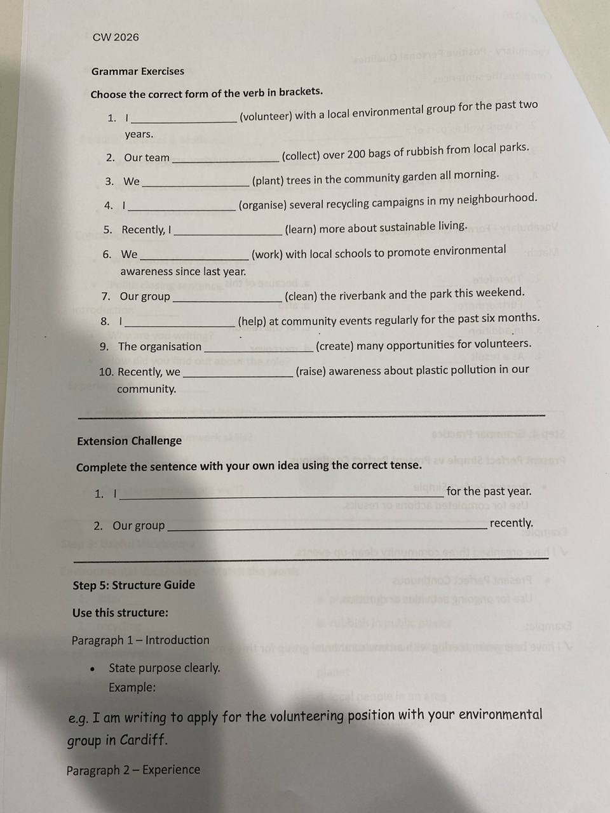
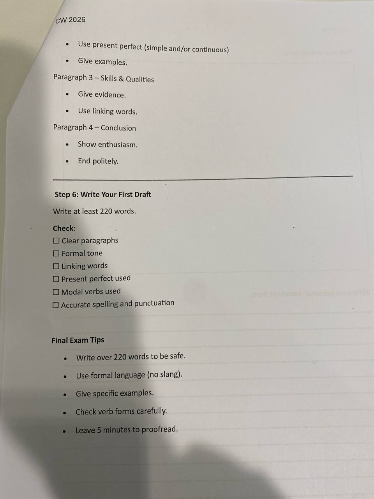
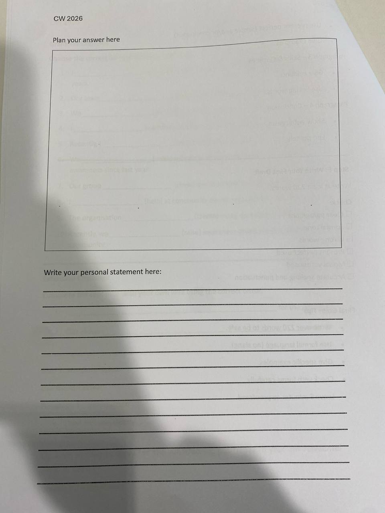

# 2026-05-19

## Topic

Personal Statement writing: CV vs Cover Letter vs Personal Statement. ESOL L2 Writing Task 2 Practice (6-step personal statement for a volunteering position).

## Class Notes

- take a test
https://www.16personalities.com/free-personality-test

Your personality type is:
Architect
INTJ-A

As an INTJ (Architect), you possess a rare combination of vision and pragmatism. Your analytical mind constantly seeks to understand the world around you, driven by an insatiable curiosity and a desire to improve systems and ideas. You approach life with a strategic mindset, always looking several steps ahead and planning for various contingencies.

Your independent nature is one of your defining characteristics. You value your autonomy and often prefer to work alone, trusting your own judgment and abilities above all else. This self-reliance, combined with your intellectual prowess, allows you to tackle complex problems with confidence and innovation.

## 1. Personality Traits

Energy
62% Introverted
A scene showing a man sitting by a tree and listening to music.
You likely prefer fewer, yet deep and meaningful, social interactions and feel drawn to calmer environments.

Mind
64% Intuitive
A scene showing two researchers discussing a flying car.
You’re likely very imaginative and open-minded, focusing on hidden meanings and distant possibilities.

Nature
67% Thinking
A scene showing a girl and a guy, with the guy introducing himself and the girl analyzing his behavior, with a thought bubble full of checkboxes floating above her head.
You likely focus on objectivity and rationality, putting effectiveness above social harmony.

Identity
74% Assertive
A scene showing a relaxed office worker paying no attention to their manager who is walking up to them.
You’re likely self-assured, even-tempered, and resistant to stress, refusing to worry too much.

While your rational approach to life serves you well in many situations, it can sometimes create challenges in your personal relationships. You may find emotional expressions and social niceties puzzling or unnecessary, preferring direct communication and logical discussions. This tendency can make you appear aloof or detached to others, even when you care deeply.

Your pursuit of knowledge and improvement is relentless. You have high standards for yourself and others, always striving for efficiency and effectiveness in all areas of life. This drive for perfection can be both a strength and a weakness, pushing you to achieve great things but also potentially leading to stress and burnout if not managed carefully.

## 2. Your Career Path

In your professional life, you thrive on intellectual challenges and the opportunity to implement your innovative ideas. You excel in roles that allow you to utilize your strategic thinking and problem-solving skills, often gravitating towards fields like science, technology, or business strategy. Your ability to see the big picture while also attending to crucial details makes you a valuable asset in any organization.

However, your preference for working independently and your dislike for office politics can sometimes hinder your career progression. Learning to navigate social dynamics and communicate your ideas effectively to others is crucial for your professional growth. Your unique insights are most valuable when they can be implemented, which often requires collaboration and buy-in from others.

### Your Strengths
#### Innovative Mindset
Your ability to see possibilities others overlook often helps you find smarter solutions and effective improvements at work.

#### Independent Worker
Your talent for working productively on your own allows you to manage tasks effectively without the need for constant direction or supervision.

#### Conceptual Thinking
You effortlessly grasp abstract, complex ideas, making you particularly suited to roles that require strategic analysis and long-term planning.

#### Continuous Improvement
You naturally focus on refining work processes and spotting inefficiencies, consistently improving project outcomes wherever you go.

#### Objective Judgment
Your capacity to make impartial decisions based on facts rather than favoritism or personal bias earns respect and trust from your colleagues.

#### Reliable Performance
When entrusted with critical tasks, you consistently deliver precise, high-quality results, making you a valued and dependable asset.

### Your Weaknesses
#### Discomfort with Networking
Your aversion to promoting yourself or making connections can limit career advancement opportunities, hiding your true worth from others.

#### Frustration with Constraints
You chafe at rules or procedures you deem pointless, potentially straining relationships with supervisors or organizational hierarchy.

#### Ignoring Social Dynamics
You tend to neglect office politics and informal social interactions, possibly missing cues or causing unintended misunderstandings.

#### Reluctance to Delegate Tasks
Believing strongly in your own abilities, you often hesitate to entrust responsibilities to others, leading to stress or unnecessary workload.

#### Overly Blunt Feedback
In your pursuit of truth and efficiency, you may deliver criticisms in ways that unintentionally demotivate or upset sensitive colleagues.

#### Impatience with Routine
You often feel restless when assigned tasks that seem repetitive or mundane, leading to occasional lapses in your attention or motivation.

---

## 3. Your Personal Growth

Your path to personal growth is paved with intellectual pursuits and self-reflection. You’re constantly seeking to expand your knowledge and improve your skills, driven by an internal desire for mastery. This quest for self-improvement often leads you to explore diverse subjects and challenge your own assumptions, fostering a rich inner life.

Yet, true personal growth for you also involves developing your emotional intelligence and interpersonal skills. While it may feel uncomfortable at first, learning to recognize and express your emotions, as well as understanding those of others, can greatly enhance your relationships and overall life satisfaction. Balancing your logical approach with emotional awareness is key to becoming a well-rounded individual.

### Your Strengths
#### Self-Directed Learning
You consistently take initiative in exploring new ideas, gaining deep knowledge without waiting for guidance from others.

#### Reflective Insight
You comfortably analyze your own thoughts and emotions, allowing you to make insightful changes to your beliefs and behaviors.

#### Openness to Challenging Ideas
You’re drawn toward unconventional ideas and willingly rethink your views if confronted with convincing and rational arguments.

#### Self-Disciplined Approach
You reliably maintain routines and create productive habits, steadily progressing toward your personal objectives.

#### Clarity of Purpose
Your ability to clearly identify what matters most helps you efficiently pursue meaningful goals without distraction.

#### Resilient Determination
Even when faced with setbacks, you retain the resolve necessary to adjust your strategy and persistently continue forward.

### Your Weaknesses
#### Avoiding Emotional Exploration
You sometimes neglect deeper emotional understanding and growth, believing logic and analysis alone are sufficient for self-improvement.

#### Hesitant to Seek Support
Your preference for solving all problems independently makes seeking advice or support challenging, limiting your personal development.

#### Too Rigid Expectations
Strict personal standards can make you overly self-critical and cause unnecessary stress when you inevitably fall short of perfection.

#### Reluctant to Celebrate Progress
Always eyeing the next milestone, you rarely pause to appreciate achievements or reflect positively on how far you’ve come.

#### Discomfort with Ambiguity
You prefer clarity and foreseeability, making it difficult to comfortably adapt when life presents ambiguous or uncertain scenarios.

#### Neglecting Leisure or Rest
Your drive for productivity and achievement may sometimes cause you to overlook the importance of rest, relaxation, and sustainable pacing.

## 4. Your Relationships

In your relationships, you value depth, authenticity, and intellectual connection above all else. You seek partners and friends who can engage in meaningful conversations and appreciate your unique perspective on the world. Your loyalty and commitment run deep, even if you don’t always express your feelings openly.

However, your tendency to prioritize logic over emotion can create challenges in your personal connections. You may struggle to understand or respond to others’ emotional needs, and your direct communication style might sometimes come across as harsh or insensitive. Learning to balance your natural rationality with empathy and emotional expression is crucial for building and maintaining fulfilling relationships, whether romantic, friendly, or familial.

### Your Strengths
#### Authentic Sincerity
You build trust through your honest and genuine interactions, making your connections deep, real, and stable.

#### Insightful Advice
Friends and partners appreciate your unique wisdom and analytical perspective, especially when facing difficult decisions.

#### Quietly Caring
Even though you avoid dramatic displays of affection, those close to you cherish your subtle yet meaningful gestures of care and thoughtfulness.

#### Selective Loyalty
Once you’ve established trust with someone, you dedicate unwavering support and steadfast commitment to that person over the long term.

#### Respecting Autonomy
You naturally recognize and encourage others’ independence, allowing freedom and personal space that most people truly value.

#### Meaningful Conversations
People who engage with you enjoy stimulating and intellectually enriching discussions that feel worthwhile and rewarding.

### Your Weaknesses
#### Insensitive to Emotions
Your rational nature can lead you to unintentionally overlook or undervalue emotional signals, leaving others feeling unheard or misunderstood.

#### Avoiding Social Rituals
Dislike of small talk or expected social gestures sometimes makes you appear aloof or indifferent to friends and acquaintances.

#### Withdrawn under Stress
When life becomes challenging or confusing, your instinct to isolate yourself may unintentionally distance you from people who care.

#### Difficulty Sharing Vulnerabilities
Your strong preference to appear competent and controlled can prevent authentic sharing of feelings, hindering emotional closeness.

#### Critical Communication
Occasionally harsh or overly direct remarks, though well-intended, might unintentionally wound others, damaging trust or closeness.

#### High Relationship Standards
Your specific criteria for friendship or partnership can lead to lasting dissatisfaction or frustration if your expectations aren’t consistently met.

---

## 5. CV vs Cover Letter vs Personal Statement

Three different documents — three different purposes. All formal, all about you, but used in different situations.

---

### CV (Curriculum Vitae)
*"The record of your life"* (Latin: course of life)

- A **structured list** of facts: education, work experience, skills, achievements, qualifications
- **Objective and factual** — no opinions, no feelings
- Usually **1–2 pages** (UK standard)
- Written in **implied first person** — no "I"; just "Managed a team of 5" not "I managed..."
- **Does not change much** between applications (you may tweak the order or emphasis)
- Employers scan it quickly — use clear headings and bullet points

**Typical sections:**
- Personal details (name, contact, LinkedIn)
- Personal profile / summary (2–3 lines)
- Work experience (most recent first)
- Education & qualifications
- Skills (languages, software, etc.)
- References

---

### Cover Letter
*"The introduction"*

- A **formal letter** (usually one page, 3–4 paragraphs) sent **together with your CV**
- Explains **why you want this specific job** and **why you are the right person**
- Written in **first person**: *"I am writing to apply for..."*
- **Always tailored** — you write a different letter for every job
- Shows your **personality and motivation** — something a CV cannot do
- Bridges the gap between your CV and the job description

**Typical structure:**
1. Opening — which job, where you saw it
2. Why this company / role interests you
3. What you bring (link your skills to their needs)
4. Closing — call to action, availability for interview

---

### Personal Statement
*"Your story and goals"*

- A **reflective piece of writing** about who you are, what drives you, and where you're going
- Used mainly for **university applications** (e.g. UCAS in the UK) or sometimes for jobs / scholarships
- Written in **first person**, more narrative and personal than a cover letter
- Usually **500–800 words** (UCAS: max 4,000 characters / ~650 words)
- Answers the question: *"Why do you want to study/do this, and what makes you ready for it?"*
- Includes: background, relevant experience, passion for the subject, future goals

---

### Comparison Table

| Feature | CV | Cover Letter | Personal Statement |
|---|---|---|---|
| Purpose | List your experience | Apply for one specific job | Explain your motivation & goals |
| Tone | Factual, neutral | Formal, persuasive | Personal, reflective |
| Person | No "I" (implied) | First person ("I") | First person ("I") |
| Length | 1–2 pages | 1 page | ~500–800 words |
| Tailored? | Slightly | Always | Usually (by field/programme) |
| Used for | Jobs, any application | Job applications | University / scholarships |
| Changes often? | Rarely | Every application | Rarely |

---

### Key Phrases

| Situation | Phrase |
|---|---|
| CV summary | *"A motivated professional with 3 years of experience in..."* |
| Cover letter opening | *"I am writing to apply for the position of... as advertised on..."* |
| Cover letter closing | *"I would welcome the opportunity to discuss my application further."* |
| Personal statement opening | *"My passion for... began when..."* |
| Personal statement closing | *"I am confident that this course will equip me to..."* |

---

Let's do some practice across these tasks:

---

## New Words

→ see [vocab.md](../../vocab.md)
