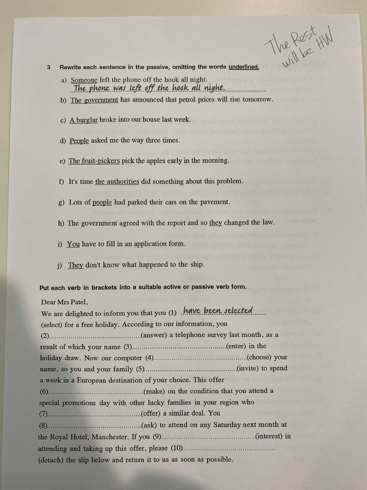
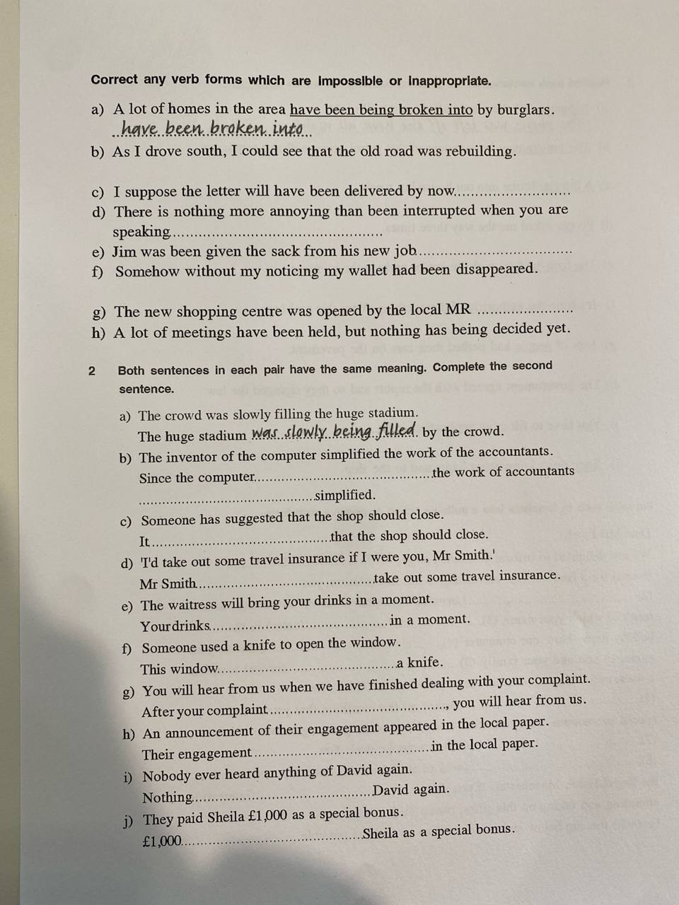

# 2026-06-02

## Topic

Model Answer Analysis (Personal Statement) + Passive Voice grammar.

## Class Notes

### Model Answer Analysis (240 words)

Read and analyse the model answer — identify: a range of tenses, compound sentences, complex sentences, conditional sentences, discourse markers.

> I am writing to apply for the volunteering position with your local environmental group in Cardiff. I recently saw your advertisement, and I am very interested in contributing to activities that improve our local community and protect the environment.
>
> I have always been passionate about environmental issues and have previously participated in community clean-up events in my neighbourhood. Through these experiences, I have developed strong teamwork and organisational skills. In addition, I have worked with people from a variety of cultural backgrounds, which has improved my communication skills. I am confident that I can work effectively as part of a team as well as independently when it is required.
>
> Furthermore, I am a reliable and enthusiastic person who enjoys outdoor activities. I regularly go walking and cycling, so I am physically fit and able to take part in tree planting and other practical tasks. I am also committed to promoting sustainable living and encouraging others to recycle and reduce waste. I believe that small actions can make a significant difference to our community.
>
> I am available at weekends and in the evenings, and I would welcome the opportunity to support your future projects. I would be grateful if you would consider my application, and I look forward to hearing from you.

Can you underline or highlight?
• A range of tenses
• Compound sentences
• Complex sentences
• Conditional sentences
• Discourse markers

---

### Passive Voice

**Why do we use the passive voice?**
- To focus on the action rather than the doer.
- To avoid mentioning the doer when it is unknown or irrelevant.

**When there is an `Agent` — use `by`:**
- The project was completed **by** the volunteers.

**When there is no Agent — use passive without `by`:**
- The area was cleaned up last weekend.

**When there is an `Instrument` — use `with`:**
- The park was maintained **with** the help of local residents.

**Verbs commonly used in passive sentences:**
- bring, give, lend, pass, pay, promise, sell, send, show, teach, tell, write

**Transitive verbs that CANNOT be used in passive:**
- become, fit, get, have, lack, let, like, resemble, suit, want, weigh

**Intransitive verbs (no object) CANNOT be used in passive:**
- fall, go, happen, occur, rain, rise, sleep, stay, swim, wait, work, etc.

**Types of agent:**

| Type | Meaning | Example |
| --- | --- | --- |
| Unknown agent | Не знаємо хто | My bike was stolen. |
| Generalised agent | Люди загалом | English is spoken worldwide. |
| Obvious agent | І так зрозуміло хто | He was arrested. |
| Unimportant agent | Неважливо хто | The road was repaired. |
| Impersonal agent | Агент прихований | It has been decided… |

---

## Homework

→ Passive voice exercises — see [hw.md](hw.md)

## New Words

→ see [vocab.md](../../vocab.md)
