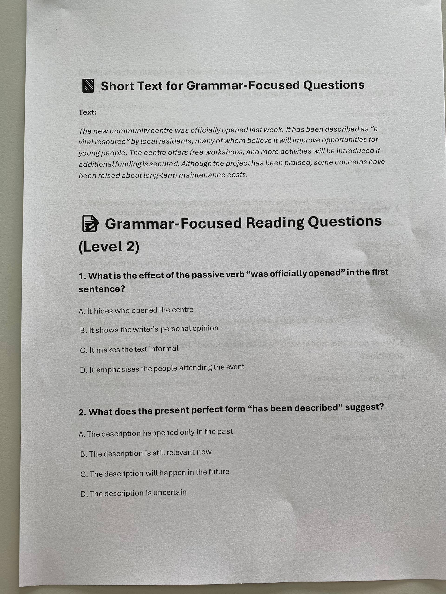
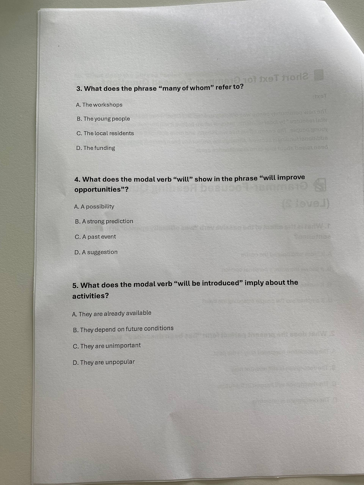
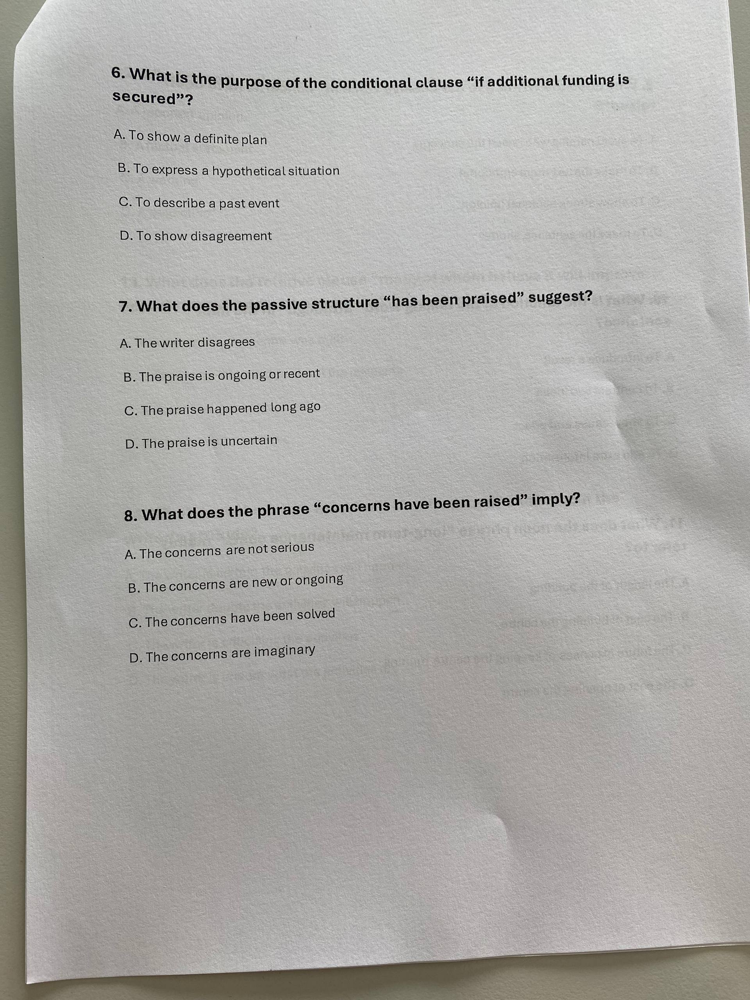
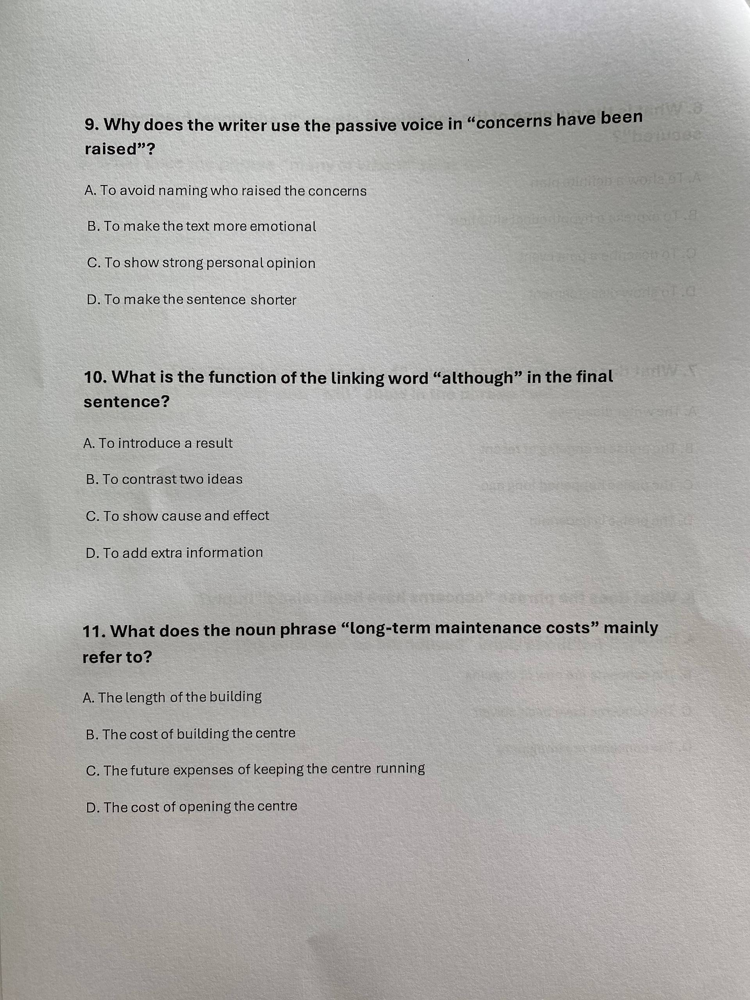
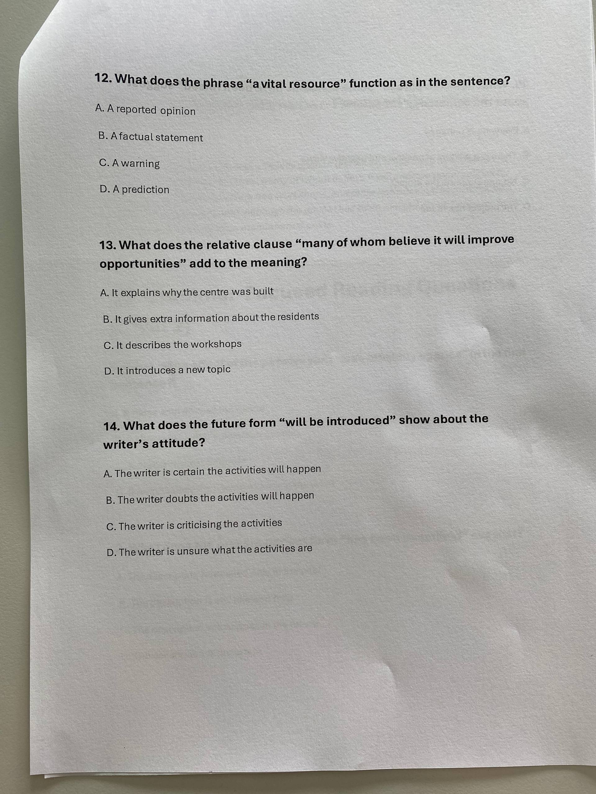
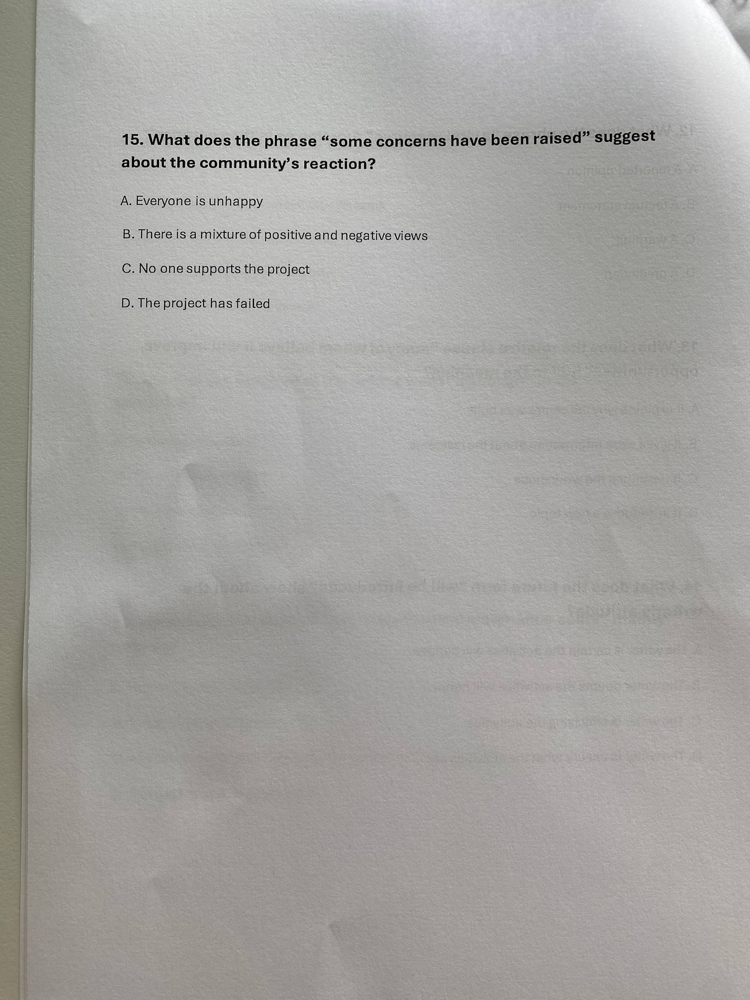

# YYYY-MM-DD

## Topic

## Class Notes

- Mock reading test

---

Grammar for exam(it's better to uses as much as possible in your writing, for at least 5 sentences in your writing):
- Passive voice
- Complex sentences
- Past modal verbs
- Present perfect/present perfect continuous
- Future tenses
- Past perfect
- 3rd conditional
- Used to/ would
- Relative clauses

---

https://forms.cloud.microsoft/pages/responsepage.aspx?id=6obV1UpX0EKWycwbCJb0eHk-cYD2GwtOjahSMuYWxfVUQ05DRUxXRE03TVVWR1FXU0dIRVFRUEFCOC4u&origin=QRCode&qrcodeorigin=presentation&route=shorturl

HW:

Task 2 Correspondence (Guide time 50 minutes)

Your employer has asked members of staff for their opinions on how the room used for staff breaks could be improved. Write a letter to Head Office giving your views on why the room is unsuitable at the moment and proposing some changes. Write to: Head Office, Home Retailers, 28 Lord Road, Southway, S1 6PK You must plan the points you are going to include and how you are going to introduce, develop and finish your writing. Write using paragraphs. Write 200 or more words.

Plan your letter here:

Letter here:

## Materials

<!--
Put screenshots, scans, handouts into attachments/ subfolder:

-->

## New Words

→ see [vocab.md](../../vocab.md)
