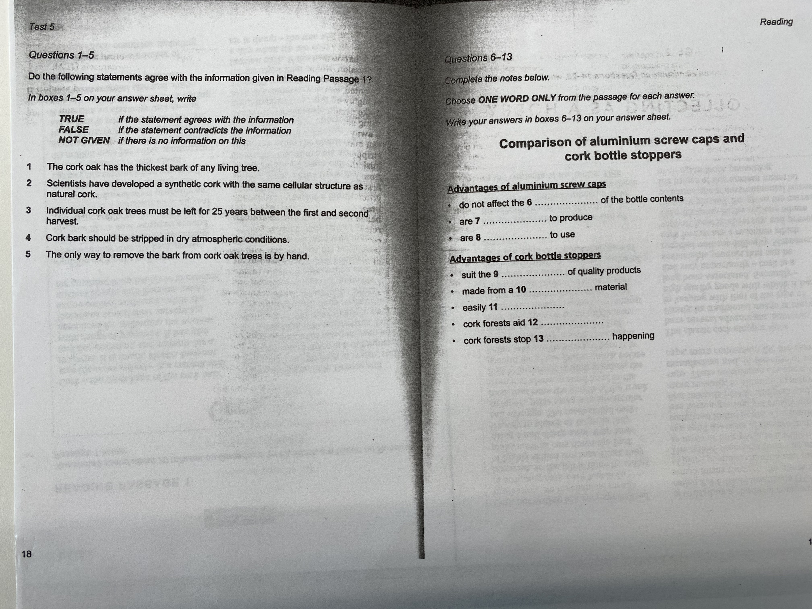

# 2026-04-14

## Topic

Report Writing — Line Graph Language & IELTS Reading Practice

---

## Class Notes

### Report Structure

A data-based report should follow this four-part structure:

1. **Introduction** — Briefly introduce the topic and the purpose of the report.
2. **Overview of the main trends** — Describe the main trends shown in the graph (increases, decreases, fluctuations).
3. **Detailed comparison** — Compare different data points or time periods to highlight significant changes or patterns.
4. **Reasons and future predictions** — Discuss possible reasons for the observed trends and make predictions about future developments.

---

### Line Graph Vocabulary

| Verb (base) | Past tense | Noun form |
|-------------|------------|-----------|
| increase | increased | increase |
| decrease / decline | decreased / declined | decrease / decline |
| fall / drop | fell / dropped | fall / drop |
| rise / go up | rose / went up | rise |
| remain stable / stay the same | remained stable / stayed the same | stability |
| fluctuate | fluctuated | fluctuation |
| grow / double | grew / doubled | growth |
| halve | halved | — |
| improve | improved | improvement |
| jump | jumped | jump |
| plummet | plummeted | plummet |
| soar / surge | soared / surged | surge |
| peak | peaked | peak |
| level off | levelled off | — |

---

### Adverbs to Describe Trends

| Strength | Adverbs |
|----------|---------|
| Strong | significantly, sharply, dramatically, rapidly |
| Moderate | steadily, considerably, moderately |
| Weak | gradually, slightly, marginally |

---

### Useful Language for Reports

**Introducing the graph / data:**
- The graph illustrates / shows / displays…
- The data indicates / reveals / suggests…
- There is a clear trend of…
- It can be observed that…
- The most noticeable change is…
- The data points to a significant increase / decrease in…
- The trend can be attributed to…
- The chart highlights the fluctuations in…
- The chart compares the trends in… over the period of…
- The data demonstrates a steady growth / decline in…

**Making comparisons:**
- In comparison to… / Compared to… / When compared to…
- In contrast to… / Conversely… / On the other hand…
- While… / Although… / Despite…
- Similarly… / Likewise… / In the same way…
- While X was increasing, Y was decreasing…
- While X was rising, Y was falling…
- While X was fluctuating, Y was remaining stable…

---

### IELTS Reading — Cork Passage

Practised IELTS Academic Reading with the *Cork* passage (Reading Passage 1).  
Task types covered:
- **True / False / Not Given** (Questions 1–5)
- **Notes Completion — one word only** (Questions 6–13)

→ see [attachments/text.md](attachments/text.md) for the full passage and questions.

---

## Materials

## New Words

→ see [vocab.md](vocab.md)
