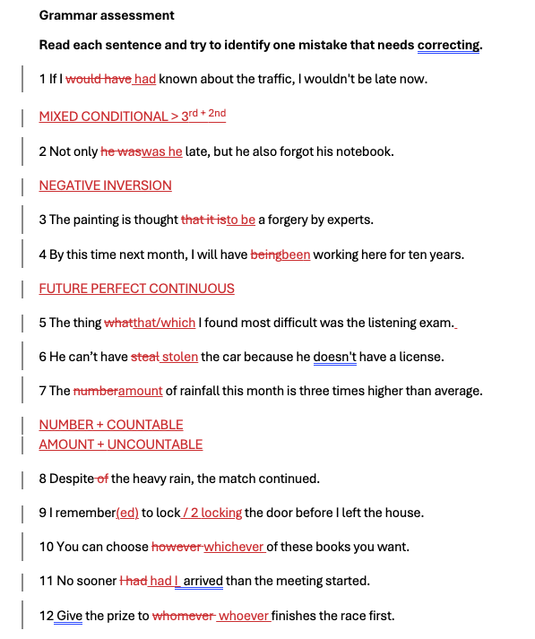
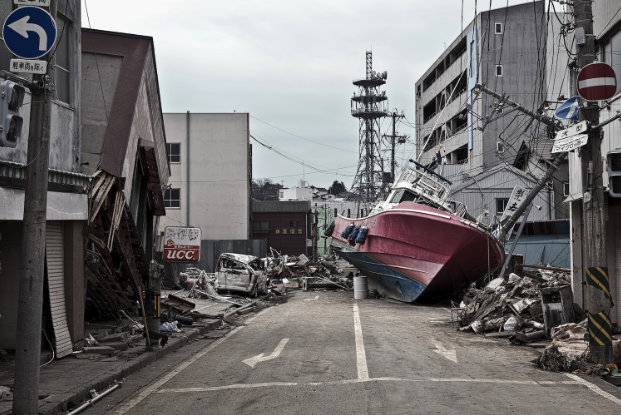

# 2026-03-11

## Topic

See lesson PDF (Jonathan's approach: all materials in one PDF)

## Class Notes

- All lesson content, exercises, and homework are inside the PDF: [11-03-2026.pdf](attachments/11-03-2026.pdf)
- (If you want to extract or summarize any part, open the PDF)
---

### Task 1  

### Task 2: Linking Words — Addition
**In addition, furthermore, moreover**  
We use these words to add extra information that supports or continues a previous idea.

What happened today on March 11th 2011?    

#### Example Matching

| Left Column | Right Column |
|-------------|-------------|
| 1. The tsunami that struck Japan on March 11th, 2011 knocked out the power supply at the Fukushima Daiichi nuclear plant. | A. Furthermore, many towns in the area remained largely empty for years because residents were unable to return. |
| 2. Following the disaster, the Japanese government ordered a large-scale evacuation of people living near the power plant. | B. In addition, powerful explosions destroyed the roofs and walls of some of the reactor units. |
| 3. Hydrogen gas built up inside several reactor buildings after the cooling systems failed. | C. Moreover, the failure of the cooling systems caused several nuclear reactors to overheat and melt down. |

**Answers:**  
1 — C (**Moreover**)  
2 — A (**Furthermore**)  
3 — B (**In addition**) 

#### Practice

Try to add a second sentence to these three ideas using moreover, in addition or furthermore 

1. Renewable energy is becoming increasingly important in many countries around the world. 
    >  Moreover, it helps reduce pollution that harms animals and their habitats.  
    >   Furthermore, countries are investing more in solar and wind power to reduce carbon emissions.  
    >   Furthermore, many companies invest in building resources.  
    >   Moreover, this energy might make all these countries participate in potential missions to other planets in the future.  
    >   Furthermore, it can help governments reduce energy costs in the long term.  

### EXAMPLES 

- Renewable energy is becoming increasingly important in many countries around the world. Moreover, governments are investing heavily in solar and wind power to reduce their dependence on fossil fuels. 

- Nuclear power provides large amounts of electricity without producing carbon emissions during operation. Furthermore, it can generate energy continuously, unlike some renewable sources that depend on weather conditions. 

- Global warming is already affecting weather patterns in many parts of the world. In addition, rising sea levels are threatening coastal cities and low-lying islands. 

---

### Linking Words: Addition & Contrast

| Addition | Contrast |
|-------------------|------------------|
| Furthermore | However |
| In addition | Nevertheless |
| Moreover | Nonetheless |
| Alternatives (less formal) | Alternatives (less formal) |
| Also | Even so |
| Additionally | Still |
| As well | Yet |

#### On this day 

Do you know what happened on March 11th 2020? 

---

### Task 3: Linking Words — Contrast

**However, nevertheless, nonetheless**  
We use these words to introduce contrasting information.

#### Example Matching

| Left Column | Right Column |
|-------------|-------------|
| 1. The COVID-19 vaccines were developed in record time and helped reduce the number of severe cases. | A. However, many people found it difficult to separate their work life from their personal life. |
| 2. Governments introduced lockdowns to slow the spread of the virus. | B. Nonetheless, many countries initially struggled to distribute them quickly to their populations. |
| 3. Working from home became much more common during the COVID-19 pandemic. | C. Nevertheless, many hospitals still faced enormous pressure during the worst waves of the pandemic. |

**Answers:**  
1 — B (**Nonetheless**)  
2 — C (**Nevertheless**)  
3 — A (**However**)

#### Practice

Try to add a second sentence to these three ideas using however, on the other hand, nevertheless. 

The COVID-19 vaccines were developed very quickly and helped reduce the number of severe cases. 

- Nevertheless, some countries such as Iran banned the import of vaccines which led to the death of many people. 

- Nevertheless, it has been suggested that there are plenty of countries that need to be reached as soon as possible. 

- Nevertheless, a small number of people reported serious health complications after vaccination. 

#### Example
 
1. The COVID-19 vaccines were developed very quickly and helped reduce the number of severe cases. However, some people remained hesitant to get vaccinated. 

---

## Materials

- [11-03-2026.pdf](attachments/11-03-2026.pdf)

## New Words

→ see [vocab.md](../../vocab.md#jonathan-wed)
