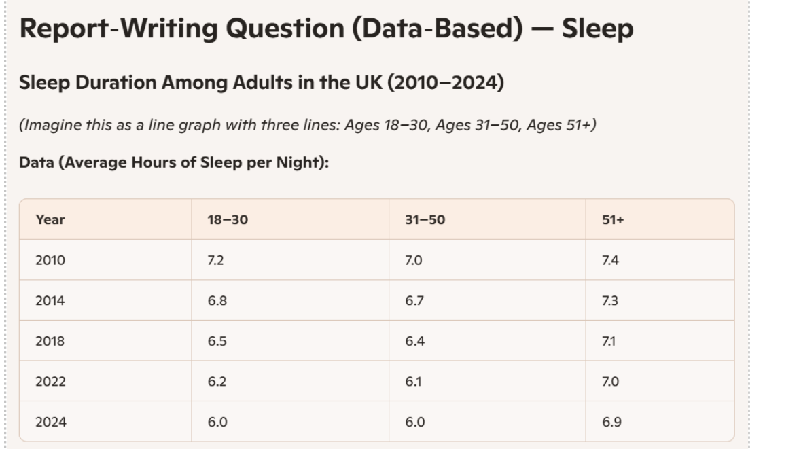
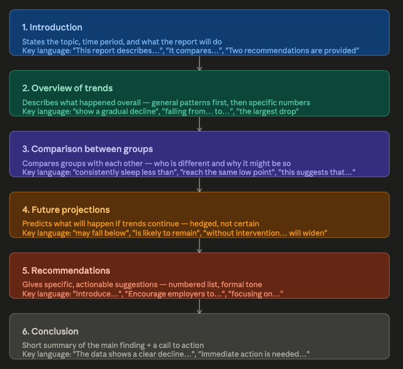

# 2026-04-15

## Topic

Report Writing — Data-Based Reports

---

## Class Notes

### Warm-up: Bird Names & Reading

- Named different birds as a warm-up activity
- Read a short text about the history of the Crow
- Completed a short quiz on the text
- Task: write **one sentence** summarising the text

---

### Sentence Practice: Benefits & Drawbacks

After the reading, practise using these structures:

- **One benefit of this idea is that…**
- **One disadvantage / downside / drawback of this idea is that…**

---

### Grammar Check

Fix the errors in these sentences:

1. Hardly I had stepped outside when it started to pour with rain.
2. I’d rather you don't smoke in the house if you don't mind.
3. It’s high time the government takes action against rising inflation.
4. She suggested to go to the new Italian restaurant in the city center.
5. Provided that you will finish your report by Friday, you can take Monday off.
6. The CEO, that I met at the conference last year, is stepping down next month.
7. Little he did realize that his discovery would change the world forever.
8. I am used to wake up at 5:00 AM every morning for my rowing practice.
9. Despite she had a broken leg, she managed to climb the stairs to her apartment.
10. Such was the force of the wind so that several trees were uprooted during the night.
11. Neither the manager nor the employees was aware of the security breach.
12. If only I didn't spend all my savings on that expensive car last year.

---

#### Corrected Sentences with Explanations

1. ✔️ **Hardly had I** stepped outside when it started to pour with rain.  
   _Negative adverbs (hardly, never, seldom, no sooner…) at the start of a sentence require inversion: auxiliary + subject._  
   Заперечні прислівники на початку речення вимагають інверсії: допоміжне дієслово + підмет.

2. ✔️ I'd rather you **didn't** smoke in the house if you don't mind.  
   _"I'd rather" + another subject requires the past subjunctive (didn't, weren't, etc.)._  
   "I'd rather" з іншим підметом вимагає past subjunctive.

3. ✔️ It's high time the government **took** action against rising inflation.  
   _"It's high time" + past subjunctive — the verb goes to past tense to express urgency._  
   "It's high time" + past subjunctive — дієслово в минулому часі виражає терміновість.

4. ✔️ She suggested **going** to the new Italian restaurant in the city center.  
   _"Suggest" is followed by a gerund (V-ing), not an infinitive._  
   Після "suggest" — герундій (V-ing), не інфінітив.

5. ✔️ Provided that you **finish** your report by Friday, you can take Monday off.  
   _In conditional clauses introduced by "if", "provided that", "as long as" — no "will"._  
   У підрядних умовних реченнях після "provided that / if / as long as" — "will" не вживається.

6. ✔️ The CEO, **whom** I met at the conference last year, is stepping down next month.  
   _Non-defining relative clauses about people use "who" or "whom" (object), not "that"._  
   У non-defining відносних реченнях про людей — "who/whom", не "that".

7. ✔️ **Little did he** realize that his discovery would change the world forever.  
   _"Little" as a negative adverb at the start requires inversion: auxiliary + subject._  
   "Little" на початку речення — інверсія: допоміжне дієслово + підмет.

8. ✔️ I am used to **waking** up at 5:00 AM every morning for my rowing practice.  
   _"Be used to" describes a habit and is followed by a gerund (V-ing), not an infinitive._  
   "Be used to" (звикнути до) + герундій (V-ing).

9. ✔️ **Despite having** a broken leg, she managed to climb the stairs to her apartment.  
   _"Despite" and "in spite of" are prepositions — they require a noun or gerund, not a clause._  
   "Despite / in spite of" — прийменники; після них — іменник або герундій, не підрядне речення.

10. ✔️ Such was the force of the wind **that** several trees were uprooted during the night.  
    _Fixed structure: "such + be + noun + that". No "so" after "such…"._  
    Стала конструкція: "such + be + іменник + that". Після "such" не вживається "so".

11. ✔️ Neither the manager nor the employees **were** aware of the security breach.  
    _With "neither…nor", the verb agrees with the subject closest to it ("employees" → plural → "were")._  
    З "neither…nor" дієслово узгоджується з найближчим підметом ("employees" → множина → "were").

12. ✔️ If only I **hadn't spent** all my savings on that expensive car last year.  
    _"If only" + past perfect expresses regret about a past action._  
    "If only" + past perfect — жаль про минуле.

---

### Vocabulary

- **cigarette butts** — недопалки
- **whitewash** — виправдання (спроба замаскувати щось погане)

---

### Discussion: What Is a Report?

In groups, discuss the following questions:

1. What is a report?
2. Why do people write reports?
3. How are reports usually organised?

---

### In-Class Activity: Sleep Data Analysis

In groups, discuss the data in the graph below. Describe **general trends and changes**.

---

### Model Reports: Sleep Duration

Two versions of a report on the chart were produced in class.

---

#### Version 1 — Student Draft

**Sleep Duration Among Adults in the UK (2010–2024)**

**Introduction**  
The purpose of this report is to examine changes in sleep duration among adults in the United Kingdom between 2010 and 2024. The data covers three age groups: 18–30, 31–50, and 51+, and is based on average hours of sleep per night.

**Findings**  
Overall, the data reveals a consistent downward trend in sleep duration across all age groups over the 14-year period.  
In 2010, adults aged 18–30 averaged 7.2 hours of sleep per night. By 2024, this figure had fallen to 6.0 hours — a decline of 1.2 hours. The 31–50 age group followed a similar pattern, dropping from 7.0 hours in 2010 to 6.0 hours in 2024. Notably, by 2024 these two groups had converged at the same level.  
The 51+ group recorded the highest sleep duration throughout the entire period, starting at 7.4 hours in 2010 and ending at 6.9 hours in 2024. Although this group also experienced a decline, the drop of 0.5 hours was the smallest among the three groups.

**Conclusion**  
To summarise, sleep duration has decreased across all adult age groups in the UK over the past 14 years. Younger adults have been affected most significantly, while older adults have maintained relatively higher sleep levels. These findings suggest a growing sleep deficit, particularly among people under 50.

**Recommendations**  
It is recommended that public health campaigns raise awareness of the importance of adequate sleep. Furthermore, employers and educational institutions should consider flexible scheduling to support healthier sleep habits, especially among younger age groups.

---

#### Version 2 — Teacher's Model

**Report on Changes in Adult Sleep Duration (2010–2024)**

**Introduction**  
This report describes trends in average sleep duration among three age groups in the UK between 2010 and 2024. It compares the data and makes predictions about future sleep habits. Two recommendations are also provided for improving sleep in the most affected group.

**Overview of Trends**  
All three age groups show a gradual decline in average sleep hours over the 14‑year period. Adults aged 18–30 experience the largest drop, falling from 7.2 hours in 2010 to just 6.0 hours in 2024. The 31–50 group follows a similar pattern, decreasing from 7.0 to 6.0 hours. Adults aged 51+ show the smallest change, reducing only slightly from 7.4 to 6.9 hours.

**Comparison Between Age Groups**  
Younger adults consistently sleep less than older adults. By 2024, both the 18–30 and 31–50 groups reach the same low point of 6.0 hours, while the 51+ group maintains almost an hour more sleep. This suggests that work pressure, screen use, and lifestyle factors may affect younger adults more strongly.

**Future Projections**  
If current trends continue, the younger groups may fall below six hours within the next few years. The older group is likely to remain more stable, although a slow decline may continue. Without intervention, the gap between recommended sleep and actual sleep will widen.

**Recommendations**  
Introduce targeted sleep‑education workshops for adults aged 18–30, focusing on screen habits and evening routines.  
Encourage employers and colleges to promote healthier schedules, such as reducing late‑evening workload and supporting regular sleep patterns.

**Conclusion**  
The data shows a clear decline in sleep across all age groups, with younger adults most affected. Immediate action is needed to prevent further reductions and support long‑term wellbeing.

---

### Report Structure Analysis

The teacher used Version 2 to analyse how a good data-based report is organised.

Key takeaways:
- **Each section has one clear function.** The introduction does not contain conclusions; recommendations do not repeat data from the trends section.
- **Headings** help the reader navigate and understand the structure — every section is labelled.
- **The main title** is essential — it tells the reader immediately what the report is about.

---

## Materials

  
  

## New Words

→ see [vocab.md](../../vocab.md)
