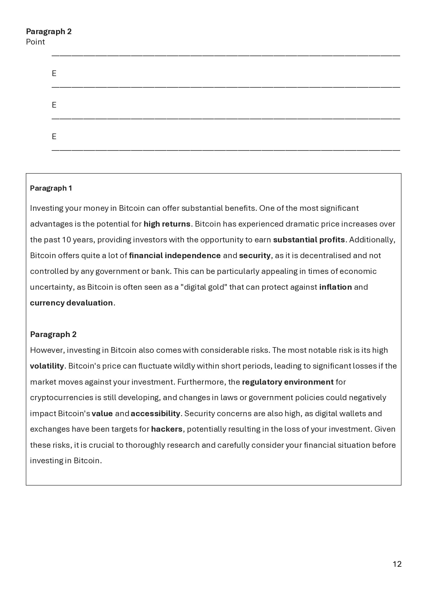

# Homework — YYYY-MM-DD

**Assigned:** YYYY-MM-DD
**Due:** YYYY-MM-DD
**Status:** 🔴 Not started / 🟡 In progress / 🟢 Done

## Task

-

<!-- Reference booklet pages (page N = pN.jpg):

-->

## Materials

<!--
Put screenshots of the task, scanned handout pages, etc. into attachments/ subfolder:

-->
