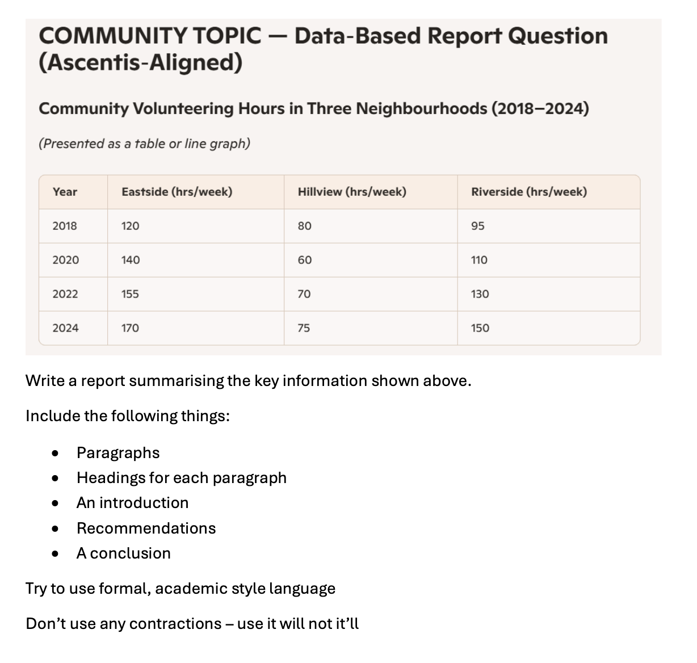

# Homework — 2026-04-15

**Assigned:** 2026-04-15  
**Due:** 2026-04-22  
**Status:** 🔴 Not started

---

## Task

> **COMMUNITY TOPIC — Data-Based Report Question (Ascentis-Aligned)**
>
> **Community Volunteering Hours in Three Neighbourhoods (2018–2024)**
>
> | Year | Eastside (hrs/week) | Hillview (hrs/week) | Riverside (hrs/week) |
> |------|---------------------|---------------------|----------------------|
> | 2018 | 120                 | 80                  | 95                   |
> | 2020 | 140                 | 60                  | 110                  |
> | 2022 | 155                 | 70                  | 130                  |
> | 2024 | 170                 | 75                  | 150                  |
>
> Write a report summarising the key information shown above.
>
> Include the following things:
> - Paragraphs
> - Headings for each paragraph
> - An introduction
> - Recommendations
> - A conclusion
>
> Try to use formal, academic style language.  
> Do not use any contractions — use *it will* not *it'll*.

---

### Report Structure (from class)

Use the teacher's model as a guide. Each section should have **one clear function**:

| Section | Function |
|---------|----------|
| **Introduction** | State what the report is about and what data it covers |
| **Overview of Trends** | Describe the general direction of change for each neighbourhood |
| **Comparison** | Highlight similarities and differences between neighbourhoods |
| **Recommendations** | Suggest actions based on the findings |
| **Conclusion** | Summarise the key findings briefly |

---

### Useful Language (from class)

**Describing trends:**
- … shows a gradual increase / decline over the period
- … experienced the largest / smallest rise, rising from … to …
- … remained relatively stable, dropping only slightly from … to …

**Comparing:**
- By 2024, both … and … had reached …
- … consistently recorded higher / lower figures than …
- This suggests that …

**Making recommendations:**
- It is recommended that …
- … should consider …
- Introduce … to encourage …

**Linking:**
- Overall, … / In contrast, … / Notably, … / Furthermore, …

---

## Materials

