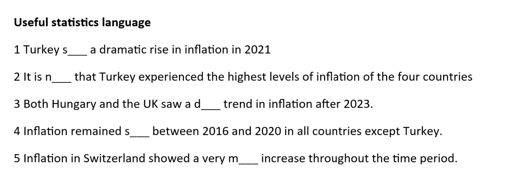
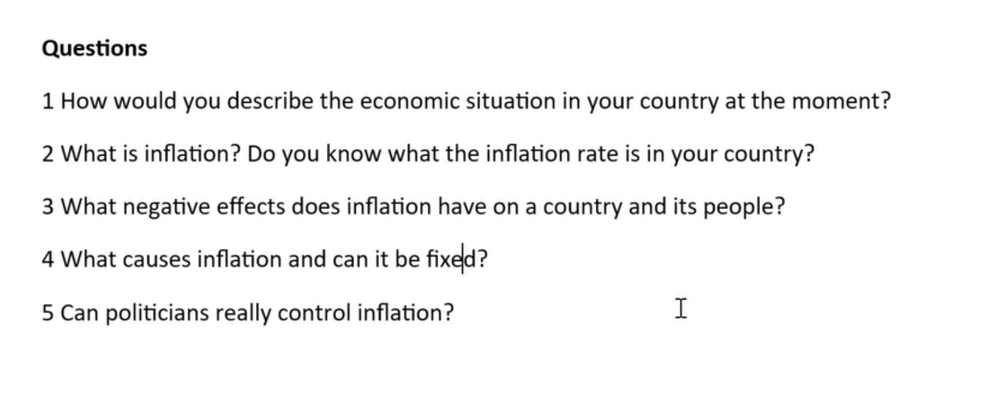
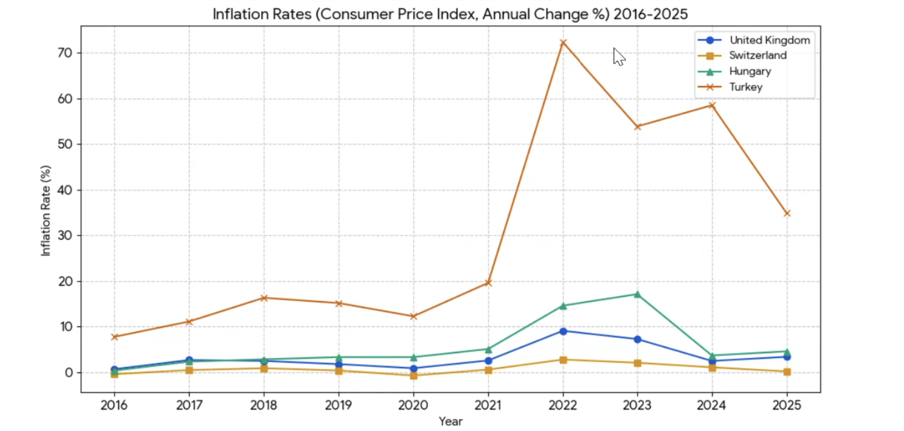
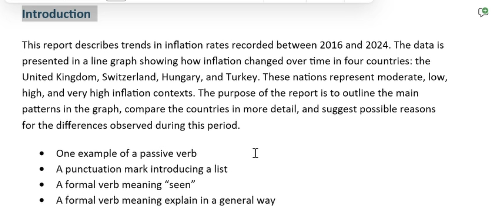
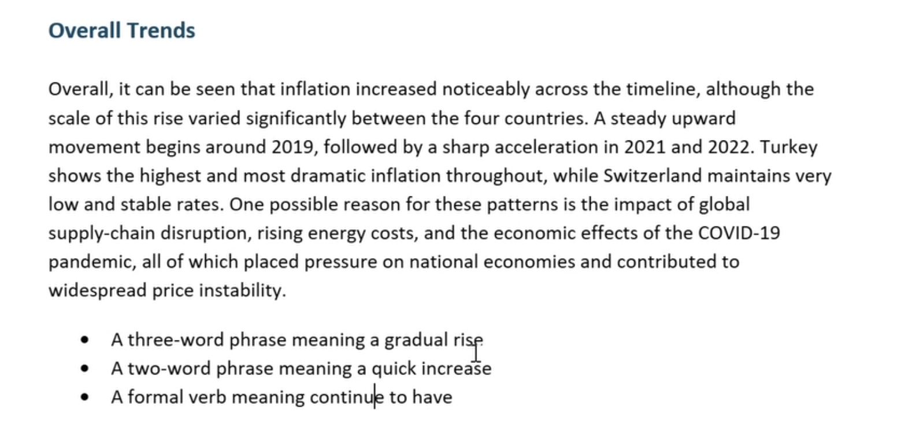
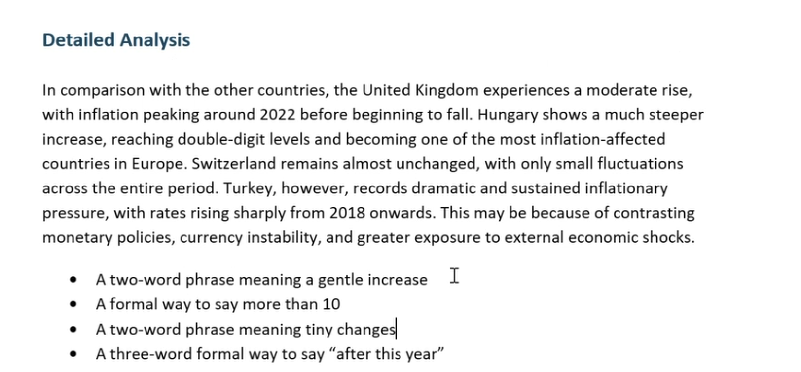
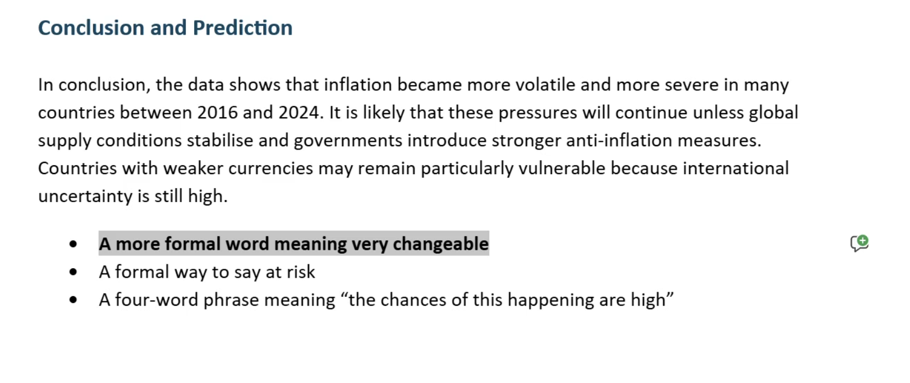
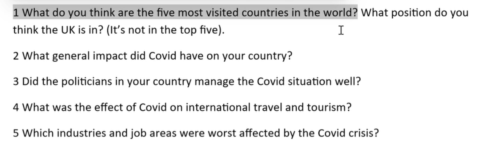
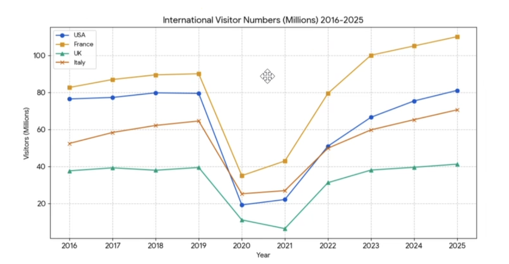

# 2026-04-22

## Topic

## Class Notes

- потрібно зрозуміти історію з картинки

📖 Історія (простими словами)
Це про гіперінфляцію в Німеччині (1920-ті роки).
Після Першої світової війни:
  * уряд почав друкувати дуже багато грошей
  * через це гроші швидко втратили свою цінність

Як це сказати англійською (для уроку)

The picture shows a period of hyperinflation in Germany, when money lost its value and people needed huge amounts of cash to buy basic goods. As a result, money became almost worthless, and even children used it for playing.

---

- проговорити наступні 5 питань

Questions
1 How would you describe the economic situation in your country at the moment?
2 What is inflation? Do you know what the inflation rate is in your country?
3 What negative effects does inflation have on a country and its people?
4 What causes inflation and can it be fixed?
5 Can politicians really control inflation?

---

- графік для репорту

key notes / bullet points, щоб ти міг швидко побудувати відповідь 

Key Notes (Graph Overview)

🔹 What the graph shows
	•	Inflation rates (%)
	•	4 countries: UK, Switzerland, Hungary, Turkey
	•	Period: 2016–2025

Overall trends
	•	UK → low, slight rise → peak in 2022 → decline
	•	Switzerland → very low, stable
	•	Hungary → moderate growth → peak 2023 → drop
	•	Turkey → extremely high, very volatile

UK 🇬🇧
	•	~1% in 2016
	•	gradual increase
	•	peak ~9% in 2022
	•	then falls to ~4% in 2025

👉 stable but affected by global trends

Switzerland 🇨🇭
	•	lowest inflation overall
	•	mostly between 0–3%
	•	very stable

👉 most stable economy in the graph

Hungary 🇭🇺
	•	slow rise until 2020
	•	sharp increase after 2021
	•	peak ~17% in 2023
	•	then drops again

👉 noticeable but not extreme

Turkey 🇹🇷
	•	already higher than others (7–17% before 2021)
	•	huge spike → ~72% in 2022
	•	remains very high (50–60%)
	•	drops to ~35% in 2025

👉 by far the highest + most unstable

Key comparisons
	•	Turkey >> all others (massive difference)
	•	Switzerland < UK < Hungary < Turkey
	•	2022–2023 → глобальний пік (energy crisis, etc.)

Useful phrases (для speaking)
	•	rose sharply / increased gradually
	•	reached a peak of…
	•	remained stable
	•	declined afterwards
	•	significantly higher than…

Main key point(my opinion):
The key feature of the graph is the strong contrast between stable inflation in countries like the UK and Switzerland and the extreme inflation in Turkey.

---

Useful statistics language
1. Turkey s___ a dramatic rise in inflation in 2021
2. It is n___ that Turkey experienced the highest levels of inflation of the four countries
3. Both Hungary and the UK saw a d___ trend in inflation after 2023.
4. Inflation remained s___ between 2016 and 2020 in all countries except Turkey.
5. Inflation in Switzerland showed a very m___ increase throughout the time period.

1. see
2. noticeable
3. downward | opposite -> upward
4. stable, steady
5. marginal
- ці слова досить корисні для використання в speaking та writing, тому рекомендую їх вивчити і використовувати

Вибрати одне із 5 питань і написати про нього коротку відповідь (для speaking)

Q2 What is inflation? Do you know what the inflation rate is in your country?

Додаткова інфа для відповіді на це питання:
Ukraine's annual inflation rate for 2024 is approximately 6.5%, marking a significant decrease from over 12.85% in 2023 and 20.18% in 2022. Recent data indicates volatility, with inflation dropping to 9.3% in November 2025, driven by food price declines, after periods of high volatility due to the ongoing war. 
Federal Reserve Economic Data | FRED | St. Louis Fed
Federal Reserve Economic Data | FRED | St. Louis Fed
 +1
Key Inflation Details (2024-2025):
2024 Annual Rate: 6.5%
Nov 2025 Trend: Eased to 9.3% after a peak, with sharp drops in vegetable and sugar prices, but rising costs for meat and fuel.
Long-Term Projection: The National Bank of Ukraine (NBU) aims to bring inflation down to 4.00% by 2027, according to economic models. 
Statista
Statista
 +3
The high rates in 2022–2023 were largely driven by supply chain disruptions, destruction of infrastructure, and increased transportation costs directly resulting from the war. 
Trading Economics
Trading Economics

Answer:
Inflation is the general increase in prices over time, which reduces the purchasing power of money. In Ukraine, inflation has been quite volatile in recent years due to the war and economic instability. For example, it was over 20% in 2022 and around 12% in 2023, but it decreased to about 6.5% in 2024. More recently, it has been around 9%, although it is expected to fall further in the future.

---

Introduction
This report describes trends in inflation rates recorded between 2016 and 2024. The data is
presented in a line graph showing how inflation changed over time in four countries: the
United Kingdom, Switzerland, Hungary, and Turkey. These nations represent moderate, low,
high, and very high inflation contexts. The purpose of the report is to outline the main
patterns in the graph, compare the countries in more detail, and suggest possible reasons
for the differences observed during this period.

• One example of a passive verb
• A punctuation mark introducing a list
• A formal verb meaning "seen"
• A formal verb meaning explain in a general way

Overall Trends
Overall, it can be seen that inflation increased noticeably across the timeline, although the
scale of this rise varied significantly between the four countries. A steady upward
movement begins around 2019, followed by a sharp acceleration in 2021 and 2022. Turkey
shows the highest and most dramatic inflation throughout, while Switzerland maintains very
low and stable rates. One possible reason for these patterns is the impact of global
supply-chain disruption, rising energy costs, and the economic effects of the COVID-19
pandemic, all of which placed pressure on national economies and contributed to
widespread price instability.

• A three-word phrase meaning a gradual rise.
• A two-word phrase meaning a quick increase
• A formal verb meaning continue to have

Detailed Analysis
In comparison with the other countries, the United Kingdom experiences a moderate rise,
with inflation peaking around 2022 before beginning to fall. Hungary shows a much steeper
increase, reaching double-digit levels and becoming one of the most inflation-affected
countries in Europe. Switzerland remains almost unchanged, with only small fluctuations
across the entire period. Turkey, however, records dramatic and sustained inflationary
pressure, with rates rising sharply from 2018 onwards. This may be because of contrasting
monetary policies, currency instability, and greater exposure to external economic shocks.
• A two-word phrase meaning a gentle increase
• A formal way to say more than 10
• A two-word phrase meaning tiny changes
• A three-word formal way to say "after this year"

Conclusion and Prediction
In conclusion, the data shows that inflation became more volatile and more severe in many
countries between 2016 and 2024. It is likely that these pressures will continue unless global
supply conditions stabilise and governments introduce stronger anti-inflation measures.
Countries with weaker currencies may remain particularly vulnerable because international
uncertainty is still high.
• A more formal word meaning very changeable
• A formal way to say at risk
• A four-word phrase meaning "the chances of this happening are high"

---

Group activity.

Report language
Consider which of the two options is most suitable for report style writing. 

1. The purpose of this report is to ___ the main findings from the survey.
a) outline	
b) talk about

2. A total of 42 participants ___ in the questionnaire last week.
a) took part	
b) joined in

3. Most respondents stated that the current facilities are ___ for large groups.
a) inadequate	
b) not good

4. Several students ___ that the booking system is confusing.
a) reported	
b) said

5. The majority of users expressed a desire for clearer signage; ___, many asked for maps.
a) in addition	
b) also

6. The data ___ that students prefer online materials to printed ones.
a) indicates	
b) shows

7. Based on the findings, it is ___ that the library extend its opening hours.
a) recommended	
b) said
 
8. This report will be ___ into three sections: Purpose, Findings, and Recommendations.
a) divided	
b) split

9. A small number of participants ___ concerns about noise levels.
a) raised	
b) brought up

10. To conclude, further research is needed to ___ whether these changes improve satisfaction.
a) determine	
b) find out

11. The results were ___ by comparing responses across all age groups.
a) analysed	
b) looked at

12. Feedback was collected using an online form, which ___ participants to comment freely.
a) enabled	
b) let

13. A significant proportion of respondents ___ dissatisfaction with the current timetable.
a) expressed	
b) showed

14. The findings are presented ___ for clarity and ease of reference.
a) below	
b) down here
 
 
15. Many students stated that the instructions were unclear; ___, several tasks were completed incorrectly.
a) as a result	
b) so

16. The report aims to ___ the key issues identified during the trial period.
a) highlight	
b) point out

17. The majority of comments were ___ positive, though some concerns were noted.
a) generally	
b) kind of

18. It is important to ___ that only 18 students responded to the second section.
a) note	
b) say

19. The committee should ___ the introduction of a booking reminder system.
a) consider	
b) think about

20. The evidence strongly ___ the need for improved staff training.
a) supports	
b) backs up
 
1 a) outline
2 a) took part
3 a) inadequate
4 a) reported
5 a) in addition
6 a) indicates
7 a) recommended
8 a) divided
9 a) raised
10 a) determine
11 a) analysed
12 a) enabled
13 a) expressed
14 a) below
15 a) as a result
16 a) highlight
17 a) generally
18 a) note
19 a) consider
20 a) supports

remember:

| Informal | Formal |
|----------|--------|
| talk about | outline |
| joined in | took part |
| not good | inadequate |
| said | reported |
| also | in addition |
| shows | indicates |
| split | divided |
| find out | determine |
| looked at | analysed |
| let | enabled |
| kind of | generally |
| so | as a result |
| think about | consider |
| backs up | supports |

Let's have a speaking practice:

1. What do you think are the five most visited countries in the world? What position do you
think the UK is in? (It's not in the top five).
2. What general impact did Covid have on your country?
3. Did the politicians in your country manage the Covid situation well?
4. What was the effect of Covid on international travel and tourism?
5. Which industries and job areas were worst affected by the Covid crisis?

2 min to make some notes, then 2 min to speak about one of the questions.

Homework

## Materials

<!--
Put screenshots, scans, handouts into attachments/ subfolder:

-->

## New Words

→ see [vocab.md](../../vocab.md)
