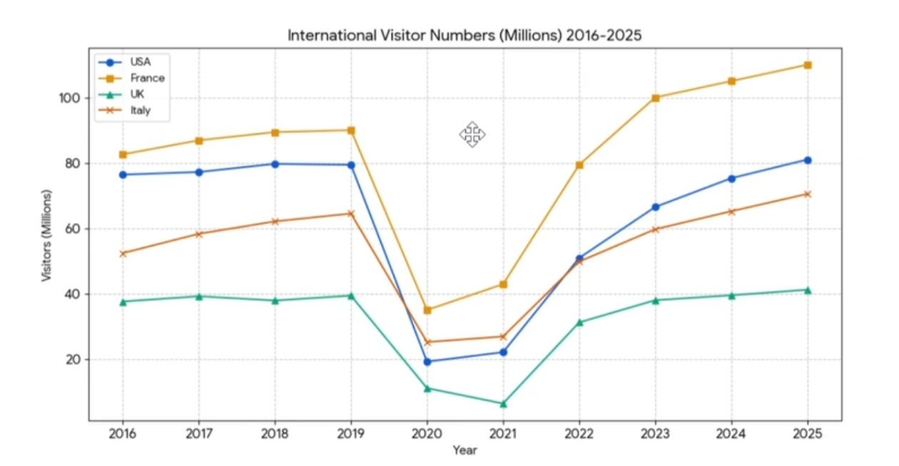

# Homework — 2026-04-22

**Assigned:** 2026-04-22
**Due:** 2026-04-29
**Status:** 🟢 Done

## Task

Write a formal report describing trends in international visitor numbers (2016–2025) for four countries: the USA, France, the UK, and Italy. The data is presented as a line graph.

## Materials

- [hw_solution.md](hw_solution.md)
