# 2026-04-29

## Topic

Advanced grammar error correction (SET 4); food delivery speaking & comparison; Dabbawalas reading comprehension

## Class Notes

- Find the mistakes in the following sentences and correct them.

SET 4 
 
1 Despite of his extensive experience in the field, he failed to identify the fundamental flaw in the project.
2 On no account the alarm should be deactivated while the building is occupied by staff.
3 I am really looking forward to meet the keynote speaker at the gala dinner this evening.
4  The company has been under fire recently, resulting in many of their shareholders to sell their stocks.
5 Such was the complexity of the puzzle than even the experts were left scratching their heads.
6 By the time the rescue team arrived, the hikers have been waiting in the freezing cold for six hours.
7 The project manager insisted on the team to finish the report before the weekend started.
8 Seldom we have witnessed such a display of athletic prowess in a local competition.
9 The accountant was accused of having being involved in the embezzlement of company funds.
10 There is no point to try to convince him once he has already made up his mind.
11 Neither the torrential rain or the strong winds could deter the fans from attending the concert.
12 The city has seen a significant increase in the amount of tourists visiting the historic district.

answers:

1
❌ Despite of his extensive experience…
✔ Despite his extensive experience in the field, he failed to identify the fundamental flaw in the project.
✔ In spite of his extensive experience in the field, he failed to identify the fundamental flaw in the project.
👉 despite + noun / in spite of + noun

2
❌ On no account the alarm should be…
✔ On no account should the alarm be deactivated while the building is occupied by staff.
👉 інверсія після негативних виразів / negative inversion

⸻

3
❌ looking forward to meet
✔ I am really looking forward to meeting the keynote speaker at the gala dinner this evening.
👉 look forward to + -ing

⸻

4
❌ resulting in many of their shareholders to sell…
✔ The company has been under fire recently, resulting in many of its shareholders selling their stocks.
👉 result in + -ing, its (singular)

⸻

5
❌ Such… than
✔ Such was the complexity of the puzzle that even the experts were left scratching their heads.
👉 such… that

⸻

6
❌ have been waiting
✔ By the time the rescue team arrived, the hikers had been waiting in the freezing cold for six hours.
👉 past perfect continuous

⸻

7
❌ insisted on the team to finish
✔ The project manager insisted that the team (should) finish the report before the weekend started.
✔ The project manager insisted on finishing the report before the weekend started. (зміна структури)
👉 insist that + clause / insist on + -ing

⸻

8
❌ Seldom we have witnessed
✔ Seldom have we witnessed such a display of athletic prowess in a local competition.
👉 інверсія

⸻

9
❌ having being involved
✔ The accountant was accused of having been involved in the embezzlement of company funds.
👉 having been

⸻

10
❌ no point to try
✔ There is no point in trying to convince him once he has already made up his mind.
✔ It is pointless to try to convince him once he has already made up his mind.
👉 no point in + -ing / it is pointless to

⸻

11
❌ neither… or
✔ Neither the torrential rain nor the strong winds could deter the fans from attending the concert.
👉 neither… nor

⸻

12
❌ amount of tourists
✔ The city has seen a significant increase in the number of tourists visiting the historic district.
✔ The city has seen a significant increase in tourist numbers in the historic district.
👉 number of / tourist numbers

---

Conversation
1. Compare your experience of using home food delivery services? What is similar and what
is different in your experiences?
2. Compare your opinion of the impact of the Covid pandemic on food delivery services.
What is similar and what is different in your opinion?
3. Compare what you know or imagine about this food delivery service used in India. What
is similar and what is different in your thinking?

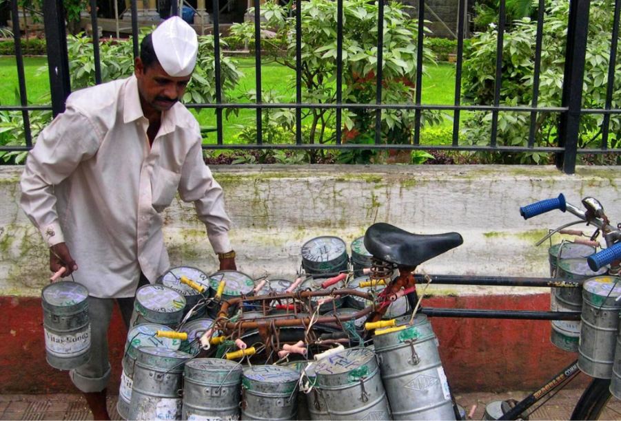

1️⃣ Compare your experience of using food delivery

In my experience, food delivery services are quite convenient and easy to use. Similarly, most platforms offer a wide range of restaurants and quick ordering through mobile apps. However, there are also some differences, especially in delivery times and prices. For example, in some cases delivery can be very fast, while in others it may take much longer depending on demand. In addition, service quality can vary depending on the location and the restaurant.

⸻

2️⃣ Impact of Covid on food delivery

In my opinion, the Covid pandemic had a major impact on food delivery services. Similarly, many people started using these services more frequently because restaurants were closed. However, I think the long-term effects are different, as some people have returned to eating out, while others continue to rely on delivery. In addition, many companies improved their logistics and technology during the pandemic.

⸻

3️⃣ Food delivery in India (comparison)

From what I know, food delivery services in India are often very fast and highly organised. Similarly, they provide convenience and a wide choice of food, just like in other countries. However, one major difference is the scale and efficiency of delivery systems, especially in large cities. For example, some services use traditional methods and local knowledge to deliver food quickly. In addition, prices may be lower compared to Western countries.

---

✔ Хороший варіант (B2)

In Ukraine, we had a similar type of service many years ago. People used to travel around towns and villages selling products like milk, meat, and vegetables, and locals would come outside to buy them.

⸻

✔ З comparison (ідеально для цього завдання)

In Ukraine, we had a similar type of service many years ago, when people travelled around towns and villages selling products like milk, meat, and vegetables. Similarly, it was convenient because people did not need to go to the shops. However, unlike modern delivery services, it was not ordered online but relied on direct contact between sellers and customers.

⸻

✔ Трохи сильніше (B2+)

In Ukraine, a similar concept existed many years ago, when mobile sellers travelled around towns and villages offering products like milk, meat, and vegetables. Similarly, it provided convenience for local people. However, unlike modern food delivery services, it was based on direct interaction rather than digital platforms.

---

practice reading exercises
youtube% Dabbawalas: How India's 130-year-old food
https://www.youtube.com/watch?v=KDD32skx-zM

and the age of food delivery apps like ubereats skipthedishes and doordash it's hard to imagine this type of convenience without the technology but there is one food delivery service which sends out more than 200 000 meals a day and has been doing so for the past hundred and thirty years they are the mumbai dubawalas also known as dabbawalas in about four hours they deliver home-cooked meals to people at work every day and all without using modern technology mumbai dabbawalas employs about 5 000 people many of them have had little to no education and have never learned to read so how do they keep these orders in order the double wallets get on their bicycles around 9am and pick up homemade lunches from their assigned neighborhoods which are generally the same every day using what's called dabbas or indian lunchboxes after picking up the lunchboxes usually made by the partners parents or house staff of the intended recipient they have until 10 30 am to bike to the nearest train station over the next hour they load all of the lunchboxes on the train this is where keeping track of everything gets really tough but they use a pretty basic trick a vital part of their delivery service is a coating system so the lids are labeled with letters numbers and symbols indicating where these lunch boxes have to be delivered to who's delivering them and the homes where they came from between 11 30 and 12 the double wallas offload from the train and continue sorting between noon and 1 they deliver lunches to their clients during this hour over 200 000 deliveries are made across mumbai they all kind of have to work together in harmony in order to uh to allow sort of the double values to perform sort of at the level of performance the mumbai dabbawalas are known for being punctual with their deliveries their mission statement since they first started running in 1890 has been to always deliver on time they believe that delivering lunch is like delivering medicine and so now it's a mission statement right when you sort of think about that you're not just delivering lunches to people you're saving people's lives the double wallets don't just deliver lunches to people at work they also pick up lunch boxes from the individuals after they're done and deliver them back to their homes the same day all this efficiency has the business community intrigued including harvard business school which has done a case study the simplicity of sort of how they do things actually help them so they don't have to deal with sort of a lot of complexity that we sort of typically find so sometimes you know keeping things quite simple and be laser focused on what it is that you're trying to achieve is really important tomke spent a day with the dubawalas in mumbai for his research and thinks companies around the world can learn from the mumbai dabbawalas in an age where we are so focused on modern technology sometimes the best plan is the simplest these orders in order is that it weird many of them have had little to no education and can't read okay it doesn't matter what i'm saying right

---

Reading
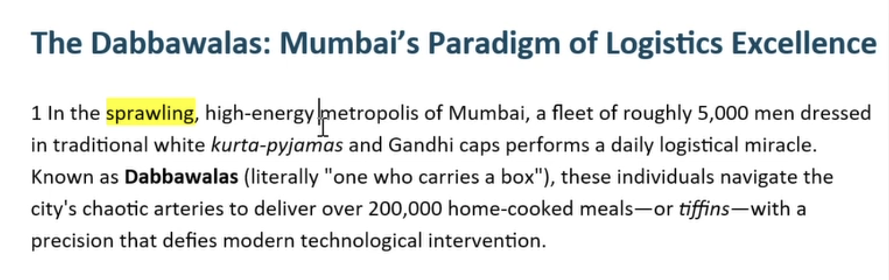

The Dabbawalas: Mumbai's Paradigm of Logistics Excellence
1 In the sprawling, high-energy petropolis of Mumbai, a fleet of roughly 5,000 men dressed in traditional white kurta-pyjamas and Gandhi caps performs a daily logistical miracle. Known as Dabbawalas (literally "one who carries a box"), these individuals navigate the city's chaotic arteries to deliver over 200,000 home-cooked meals— or tiffins-with a precision that defies modern technological intervention.

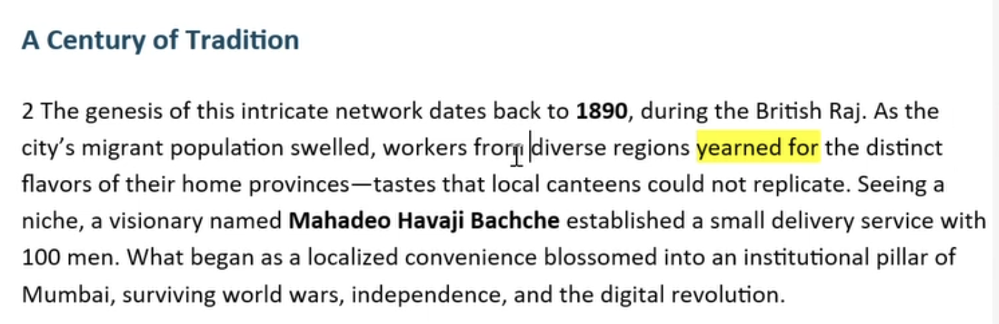

A Century of Tradition
2 The genesis of this intricate network dates back to 1890, during the British Raj. As the city's migrant population swelled, workers from diverse regions yearned for the distinct flavors of their home provinces- tastes that local canteens could not replicate. Seeing a niche, a visionary named Mahadeo Havaji Bachche established a small delivery service with 100 men. What began as a localized convenience blossomed into an institutional pillar of Mumbai, surviving world wars, independence, and the digital revolution.

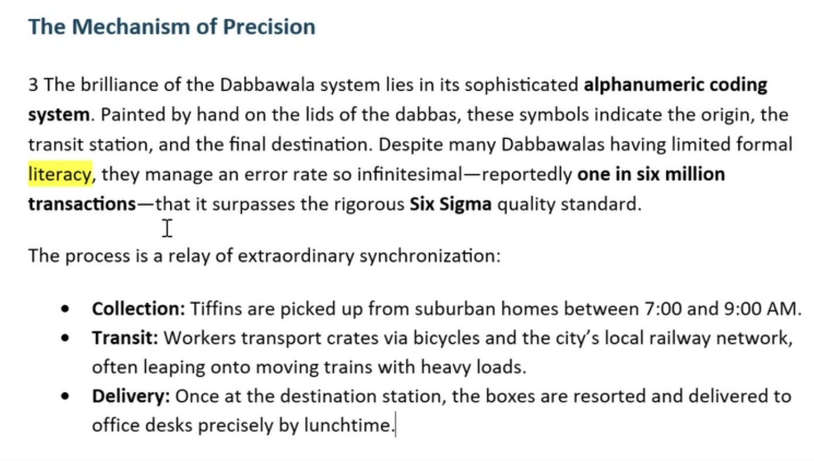

The Mechanism of Precision
3 The brilliance of the Dabbawala system lies in its sophisticated alphanumeric coding system. Painted by hand on the lids of the dabbas, these symbols indicate the origin, the transit station, and the final destination. Despite many Dabbawalas having limited formal literacy, they manage an error rate so infinitesimal— reportedly one in six million transactions— that it surpasses the rigorous Six Sigma quality standard.

The process is a relay of extraordinary synchronization:
* Collection: Tiffins are picked up from suburban homes between 7:00 and 9:00 AM.
* Transit: Workers transport crates via bicycles and the city's local railway network,
  often leaping onto moving trains with heavy loads.
* Delivery: Once at the destination station, the boxes are resorted and delivered to
  office desks precisely by lunchtime.

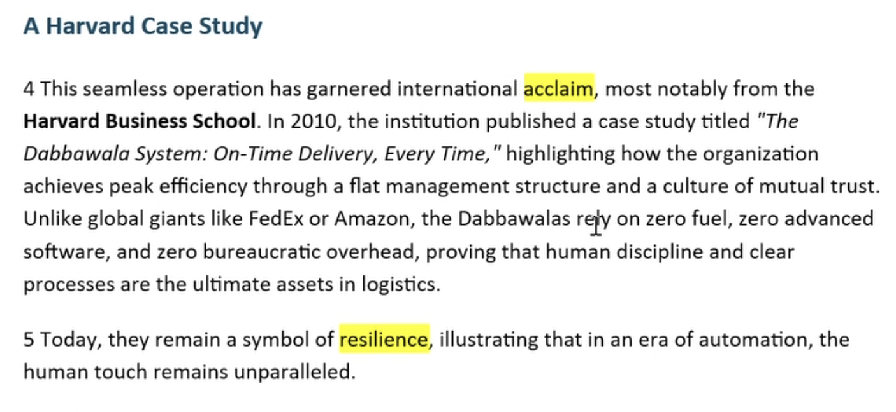

A Harvard Case Study
4 This seamless operation has garnered international acclaim, most notably from the Harvard Business School. In 2010, the institution published a case study titled "The Dabbawala System: On-Time Delivery, Every Time, " highlighting how the organization achieves peak efficiency through a flat management structure and a culture of mutual trust. Unlike global giants like FedEx or Amazon, the Dabbawalas rejy on zero fuel, zero advanced software, and zero bureaucratic overhead, proving that human discipline and clear processes are the ultimate assets in logistics.
5 Today, they remain a symbol of resilience, illustrating that in an era of automation, the human touch remains unparalleled.

---

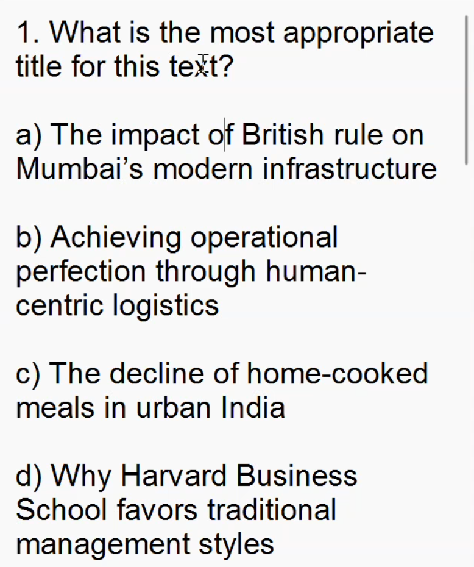

1. What is the most appropriate title for this text?
a) The impact of British rule on Mumbai's modern infrastructure
b) Achieving operational perfection through human-centric logistics
c) The decline of home-cooked meals in urban India
d) Why Harvard Business School favors traditional management styles

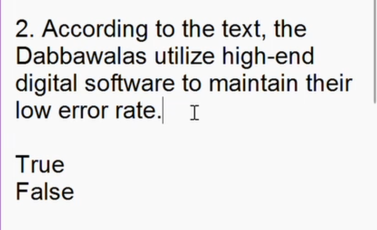

2. According to the text, the Dabbawalas utilize high-end digital software to maintain their low error rate.

True
False

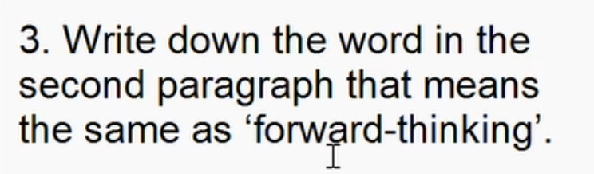

3. Write down the word in the second paragraph that means the same as 'forward-thinking'.

visionary

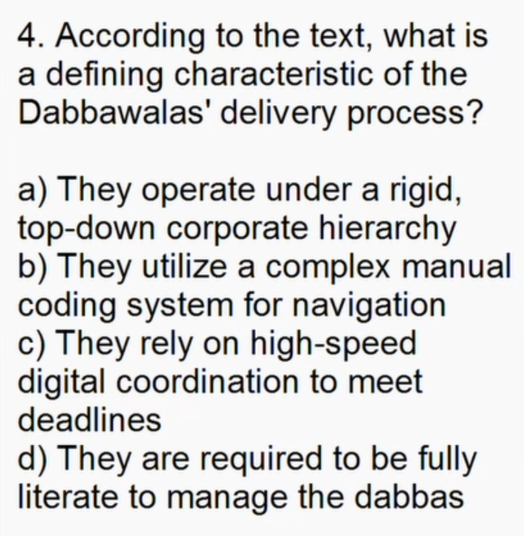

4. According to the text, what is a defining characteristic of the Dabbawalas' delivery process?
a) They operate under a rigid, top-down corporate hierarchy
b) They utilize a complex manual coding system for navigation
c) They rely on high-speed digital coordination to meet deadlines
d) They are required to be fully literate to manage the dabbas

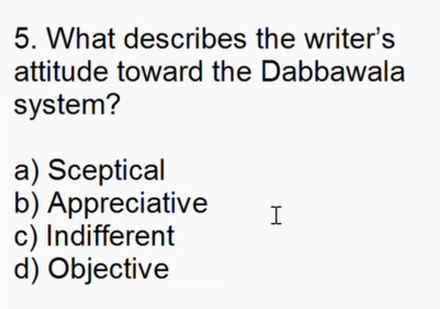

5. What describes the writer's attitude toward the Dabbawala system?
a) Sceptical
b) Appreciative
c) Indifferent
d) Objective

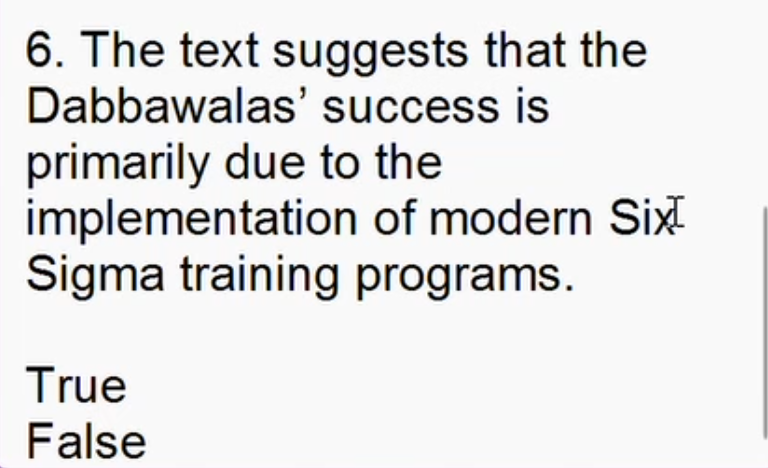

6. The text suggests that the Dabbawalas' success is primarily due to the implementation of modern Six Sigma training programs.
True
False

HW:
read the article and answer the questions

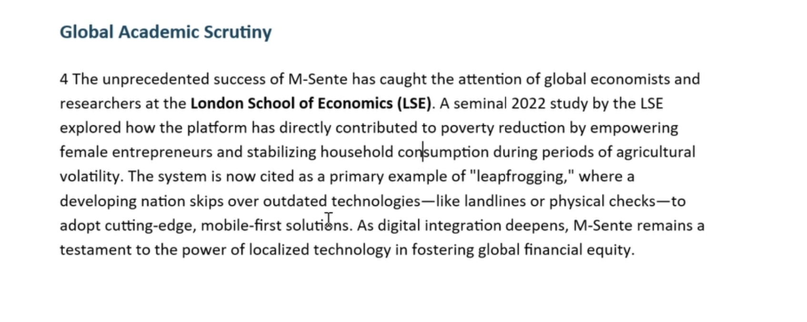
Better to recheck in Teams!

Global Academic Scrutiny 

4 The unprecedented success of M-Sente has caught the attention of global economists and researchers at the London School of Economics (LSE). A seminal 2022 study by the LSE explored how the platform has directly contributed to poverty reduction by empowering female entrepreneurs and stabilizing household consumption during periods of agricultural volatility. The system is now cited as a primary example of "leapfrogging," where a developing nation skips over outdated technologies—like landlines or physical checks—to adopt cutting-edge, mobile-first solutions. As digital integration deepens, M-Sente remains a testament to the power of localized technology in fostering global financial equity. 

Reading Comprehension Questions 

1. What is the most appropriate title for this text?  

a) The history of traditional banking in East Africa 

b) Bridging the wealth gap through mobile-first innovation 

c) The technical limitations of 4G networks in developing nations 

d) Why the London School of Economics criticizes mobile money 

2. According to the text, M-Sente requires users to have a high-speed internet connection to process transactions.  

True  

False  

3. Write down the word in the second paragraph that means the same as ‘essential foundation’.  

4. According to the text, what is a defining characteristic of M-Sente’s agent network?  

a) Agents are required to be certified financial advisors 

b) It functions as a centralized system managed by urban banks 

c) It utilizes local shopkeepers to facilitate cash-to-digital exchanges 

d) It relies on expensive infrastructure to maintain liquidity 

5. What describes the writer’s attitude toward the M-Sente system?  

a) Dismissive 

b) Analytical and admiring 

c) Cynical 

d) Cautious 

6. The text suggests that M-Sente was originally designed by Western banks to replace East African local currencies.  

True  

False  

## Materials

<!--
Put screenshots, scans, handouts into attachments/ subfolder:

-->

## New Words

→ see [vocab.md](../../vocab.md)
