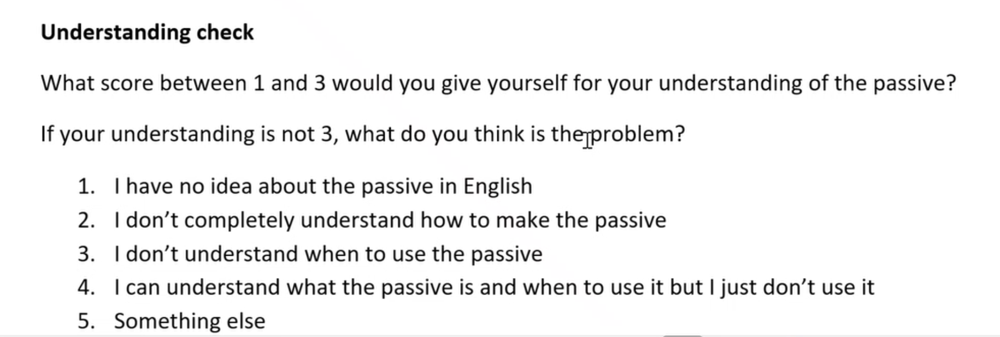
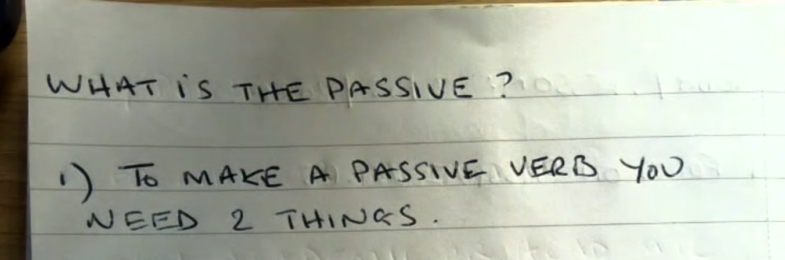
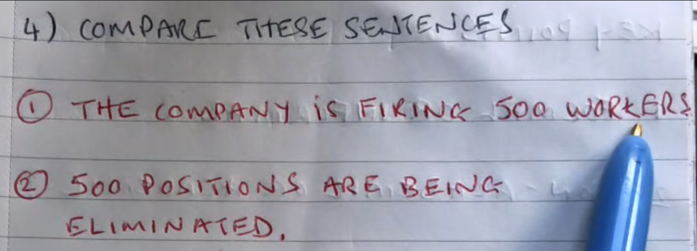
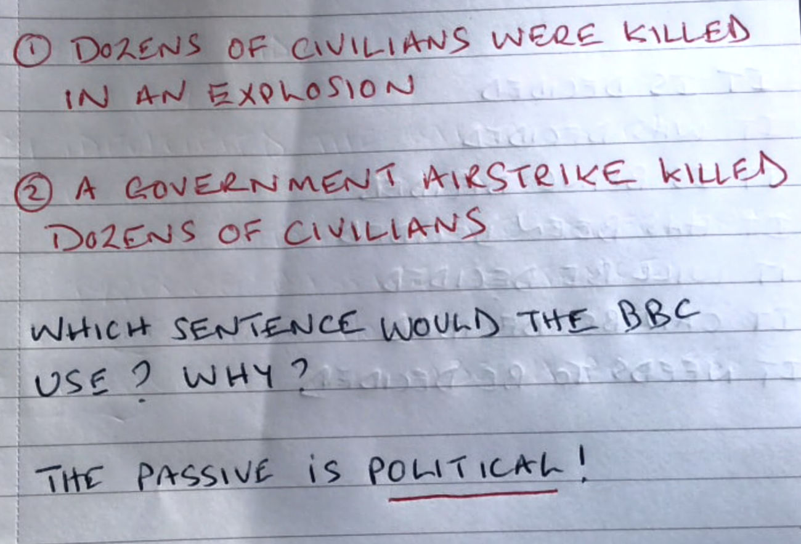
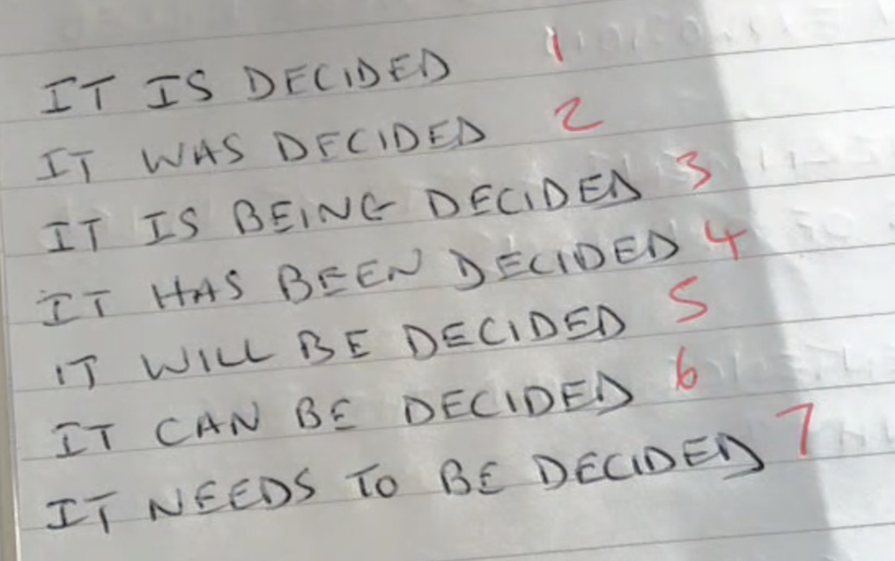
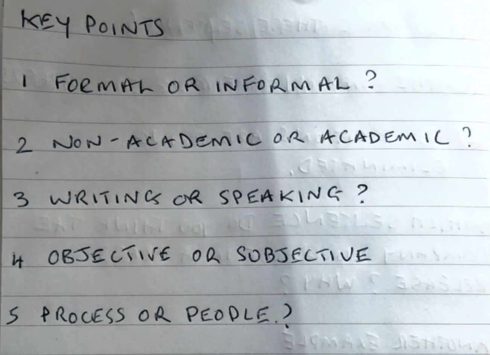
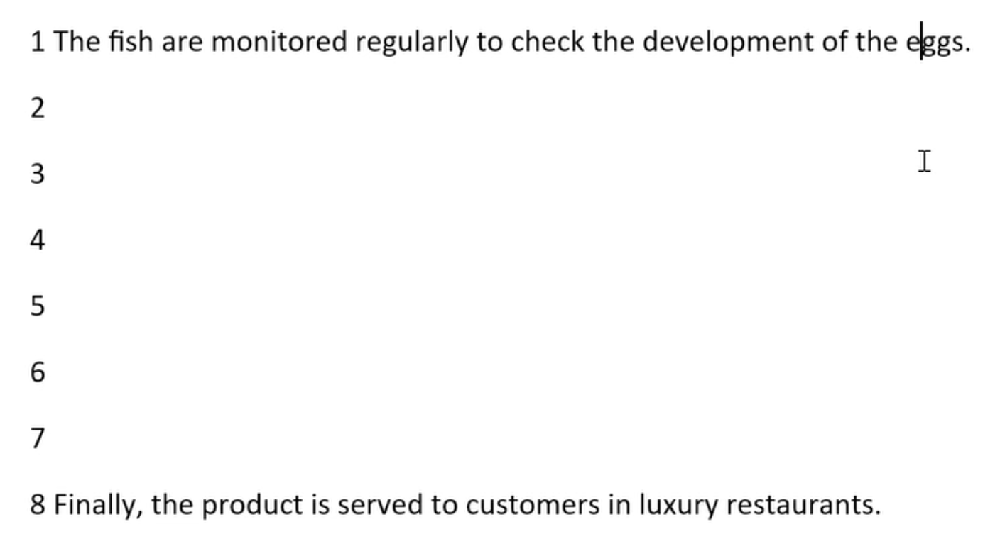
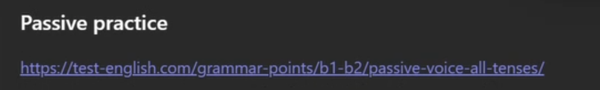

# 2026-05-13

## Topic

Passive Voice — structure, tenses, political usage; error correction; process writing (caviar)

## Class Notes

- teacher ask students - do they have the issue with the passive?

Understanding check
What score between 1 and 3 would you give yourself for your understanding of the passive?
If your understanding is not 3, what do you think is the problem?
1. I have no idea about the passive in English
2. I don't completely understand how to make the passive
3. I don't understand when to use the passive
4. I can understand what the passive is and when to use it but I just don't use it
5. Something else

My score was: 1

WHAT iS THE PASSIVE?
1) To MAKE A PASSIVE VERB YOU
NEED 2 THINGS.
- to be(is/are/was/were/being/been) + V3(past participle)

2) WHAT IS THE OPPOSITE OF A PASSIVE VERB 3

- 1.The boy kicked the ball. (active)
- 2.The ball was kicked by the boy. (passive)

3) HOW DOES THE FOCUS CHANGE IN SENTENCES 1 AND 2?

4) COMPARE TIMESE SENTENCES
- 1.THE COMPANY iS FIRING 500 WORKERS
- 2.500 POSITIONS ARE BEING ELIMINATED.

5) WHICH SENTENCE DO YOU THINK THE COMPANY WOULD USE IN A PRESS RELEASE? WHY ?
- (2)

1) DOZENS OF CIVILIANS WERE KILLED IN AN EXPLOSION
2) A GOVERNMENT AIRSTRIKE KILLED DOZENS OF CIVILIANS

WHICH SENTENCE WOULD THE BBC USE ? WHY ?

THE PASSIVE iS POLITICAL!

1. IT IS DECIDED (Present Simple)
2. IT WAS DECIDED (Past Simple)
3. IT IS BEING DECIDED (Present Continuous)
4. IT HAS BEEN DECIDED (Present Perfect)
5. IT WILL BE DECIDED (Future Simple)
6. IT CAN BE DECIDED (Modal)
7. IT NEEDS TO BE DECIDED (infinitive passive)

Choose the one to describe(usually) the passive in the sentence:
KEy POINTS
1 FORMAL OR INFORMAL?
2 NON- ACADEMIC OR ACADEMIC?
3 WRITINGS OR SPEAKING?
4 OBJECTIVE OR SUBJECTIVE
5 PROCESS OR PEOPLE??

answer:
1. Formal
2. Academic
3. Writing
4. Objective
5. Process

✔ Passive Voice — Key Characteristics

1️⃣ FORMAL OR INFORMAL?

✔ FORMAL

🧠
Passive voice частіше використовується у:
	•	reports
	•	academic writing
	•	news
	•	official texts

Example:

The report was completed yesterday.

⸻

2️⃣ NON-ACADEMIC OR ACADEMIC?

✔ ACADEMIC

🧠
Academic writing дуже любить passive:

The experiment was conducted in 2024.

Бо фокус не на людині.

⸻

3️⃣ WRITING OR SPEAKING?

✔ WRITING (usually)

🧠
Passive частіше у formal writing.
У speaking люди частіше використовують active.

⸻

4️⃣ OBJECTIVE OR SUBJECTIVE?

✔ OBJECTIVE

🧠
Passive робить текст:
	•	нейтральним
	•	безособовим

Mistakes were made.

(не кажемо хто 😄)

⸻

5️⃣ PROCESS OR PEOPLE?

✔ PROCESS

🧠
Passive фокусується на:
	•	дії
	•	процесі
	•	результаті

НЕ на людині.

---

The list:

1 All participants will been notified of the results by the end of the working day.
2 The suspect was seen to entered the jewelry store through the ventilation shaft.
3 We had the entire office security system to be upgraded following the break-in.
4 Every year, millions of tons of plastic is being dumped into the world's oceans.
5 The budget should have made a priority by the committee before the fiscal year ended.
6 The witness was made sign the statement without having a lawyer present.
7 A series of unfortunate events have been happened during the production of the film.
8 The professor really objects to be interrupted while he is explaining a complex theory.
9 It is reported the government to be planning a significant overhaul of the tax system.
10 A state-of-the-art research facility is going to be builded on the outskirts of the city.
11 The ancient ruins have been belonged to the state since their discovery in 1920.
12 These medical records must been stored in a fireproof cabinet at all times.

1. be
2. see + someone + doing something: entering
3. have + object + past participle, have something done: have the security system upgraded
4. are being
5. should have been made
6. made + object + base form, make someone do something: made the witness to sign
7. have [been] happened - have happened
8. objects to + verb-ing: objects to being interrupted
9. is reported + to-infinitive: is reported to be planning
10. is going to be built
11. have [been] belonged - have belonged
12. must be stored

---

Put these sentences into the correct passive forms
You should use
2 Present / 2 Past / 2 Future / 2 Continuous / 2 Present Perfect
1 the sculpture / carve / the artist / last year
2 the files / upload / the technician / right now
3 the package / deliver / the courier / next week
4 the room / clean / the staff / every day
5 the project / complete / the team / recently
6 the contract / sign / the director / yesterday
7 the results / announce / the committee / tomorrow
8 the tickets / check / the inspector / at the moment
9 the invitations / send / the secretary / already
10 the buses / check / the inspectors / every morning
 
1. The sculpture was carved the artist last year. (Past Simple Passive)
2. The files are being uploaded by the technician right now. (Present Continuous Passive)
3. The package will be delivered by the courier next week. (Future Simple Passive)
4. The room is cleaned by the staff every day. (Present Simple Passive)
5. The project has been completed by the team recently. (Present Perfect Passive)
6. The contract was signed by the director yestarday. (Past Simple Passive)
7. The results will be announced by the committee tomorrow. (Future Simple Passive)
8. The tickets are being checked by the inspector at the moment. (Present Continuous Passive)
9. The invitations have already been sent by the secretary. (Present Perfect Passive)
10. The buses are checked by the inspectors every morning. (Present Simple Passive)

---

bear - bore - born
The sculpture was born in 2020.
I was born in 1990.

---

Why is caviar is soo expensive?

---

Write the story

1 The fish are monitored regularly to check the development of the eggs.
2
3
4
5
6
7
8 Finally, the product is served to customers in luxury restaurants.

1. The fish are monitored regularly to check the development of the eggs.
2. The eggs are carefully harvested by the workers.
3. The eggs are then cleaned and sorted by size.
4. The sorted eggs are salted to enhance their flavor and preserve them.
5. The salted eggs are packed into jars or tins for storage and transportation.
6. The packed caviar is stored in refrigerated conditions to maintain its quality.
7. The caviar is distributed to high-end retailers and restaurants around the world.
8. Finally, the product is served to customers in luxury restaurants.

HW: write the story of how caviar is made using the passive voice. Use the sentences above as a guide and add more details if you like.

## Materials

<!--
Put screenshots, scans, handouts into attachments/ subfolder:

-->

## New Words

→ see [vocab.md](../../vocab.md)
