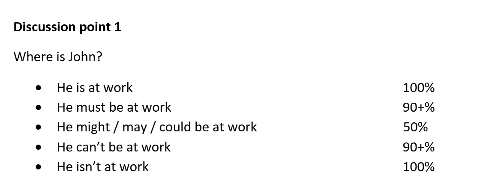
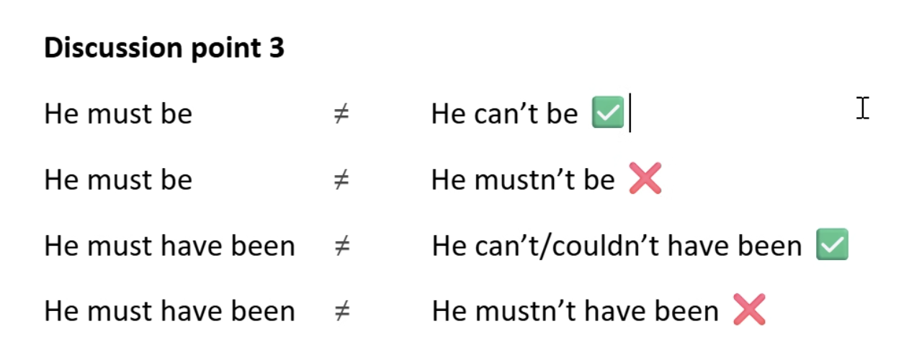
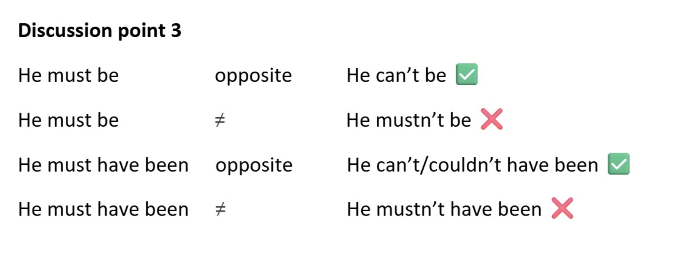
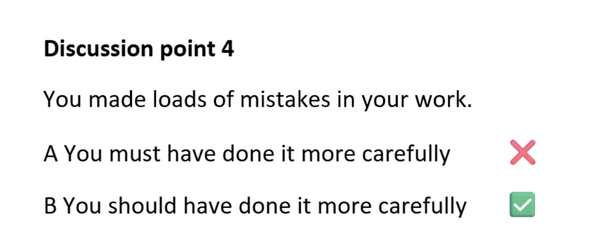
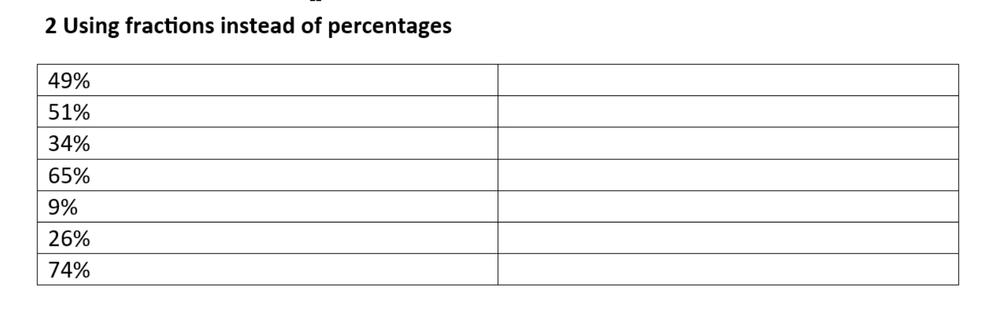
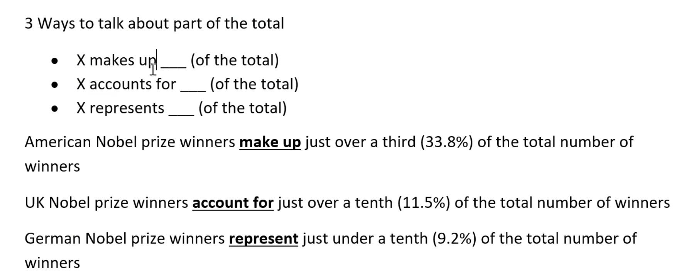
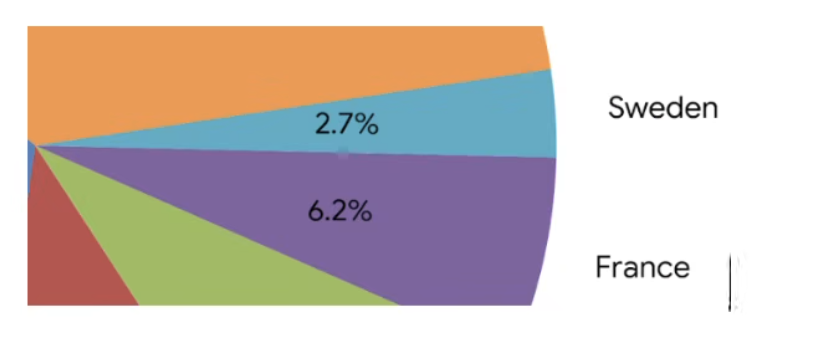
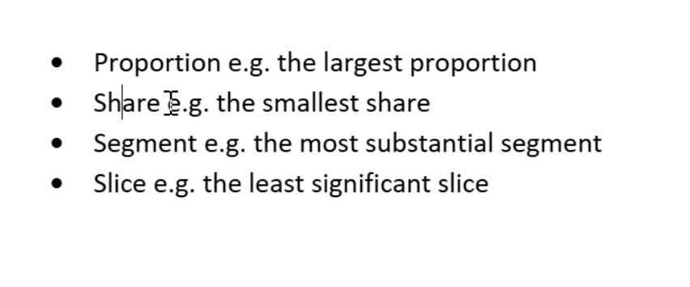
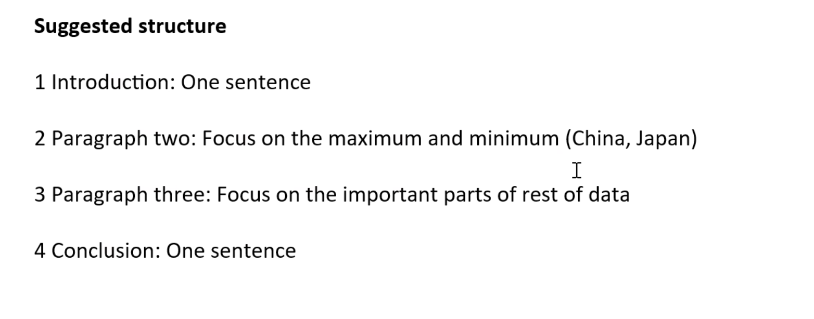
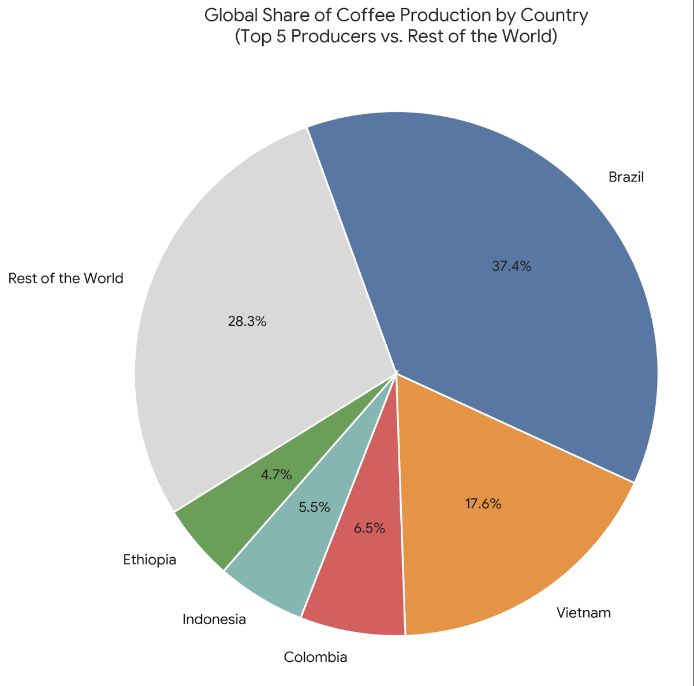

# 2026-05-20

## Topic

## Class Notes

Різниця між 
A This book is very bad written
B This book is very badly written

---

Тема modal verbs of deduction

Grammar evidence
Modal verbs of deduction
Sherlock Holmes and all detectives use deduction all the time in their work.
What does deduction mean?

Example
The lipstick on the glass drunk by the visitor means the killer MUST / MIGHT HAVE BEEN a
woman.
The way the blood appeared on the wall means the killer MUST / MIGHT HAVE BEEN| left-
handed.

In groups to discuss about the evidence for statements at the pic below and to make deductions

Present
| Modal | Meaning | Confidence |
|-------|---------|------------|
| MUST | 90% certain | 90% |
| MIGHT | 50% certain | 50% |
| MAY | 50% certain | 50% |
| COULD | 50% certain | 50% |
| CAN'T | 0% certain | 0% |

Past
| Modal | Meaning | Confidence |
|-------|---------|------------|
| MUST HAVE | 90% certain | 90% |
| MIGHT HAVE | 50% certain | 50% |
| MAY HAVE | 50% certain | 50% |
| COULD HAVE | 50% certain | 50% |
| CAN'T HAVE | 0% certain | 0% |

Why A is wrong and why B is correct?

Discussion point 4
You made loads of mistakes in your work.
A You must have done it more carefully
B You should have done it more carefully

---

Find the mistakes in the sentences below and correct them:
Modal verbs of deduction
1 I am absolutely certain Sarah didn't steal the money because she wasn't even in the office; she must not have done it.
2 The ground is completely dry, so it should have rained last night, but the weather forecast predicted a massive storm.
3 Someone left the freezer door wide open; it may have been the kids, or it must have been the wind.
4 The lights are all off and nobody is answering the door; they should have gone out for dinner, but I'm not entirely sure.
5 You looked incredibly exhausted and pale yesterday morning; you can’t have slept badly the night before.
6 The window was smashed from the inside and the jewelry is gone, so the burglar can't have escaped through it.
7 I can't find my glasses anywhere; I must have left them at the restaurant, but it's also possible I left them in the car.
8 Look at all this traffic on the highway; there can't have been a major accident up ahead.
9 He got a perfect score on an incredibly difficult exam; he might have studied a lot.
10 She found out about the surprise party; someone should have leaked the secret to her beforehand.
11 The package was marked "Fragile," but the delivery driver threw it over the fence; he might have handled it with more care.
12 Wow, you climbed all the way to the top of that steep mountain in under an hour; you may have been exhausted by the end of it!

1. She can't have done it.
2. so it can't have rained last night
3. it could have been the kids, but it also could have been the wind.
4. they might have gone out for dinner
5. you must have slept badly the night before
6. the burglar must have escaped through it.
7. I might have left them at the restaurant, but it's also possible I left them in the car.

---

Які країні мають найбільше Нобелівських переможців

Чому ці 5 країн в топі

Pie chart of Nobel Prize winners by country

1 Ways to say a little more / less
* Slightly less than / more than
* Just under / Just over
* A fraction under / over

50% = a half
25% = a quarter
75% = three quarters
33% = a third
66% = two thirds
10% = a tenth

|||
|-|-|
| 49% | slightly less than a half |
| 51% | just over a half |
| 34% | a fraction over a third |
| 65% | slightly less than two thirds |
| 9% | a fraction under a tenth |
| 26% | just under a quarter |
| 74% | slightly less than three quarters |

if you want to be more accurate, you can say: slightly less than a half(49%) or just over a half(51%)

3 Ways to talk about part of the total
* X makes up ___ (of the total)
* X accounts for ___ (of the total)
* X represents ___ (of the total)
American Nobel prize winners make up just over a third (33.8%) of the total number of
winners
UK Nobel prize winners account for just over a tenth (11.5%) of the total number of winners
German Nobel prize winners represent just under a tenth (9.2%) of the total number of
winners

---
Write 2 sentences using make up, account for, or represent to talk about part of the total in the pie chart below:

✔ French Nobel prize winners make up slightly more than 6% of the total.
✔ Swedish Nobel prize winners account for 2.7% of the total.

---

Топ 5 країн за CO2 викидами

---

HW: about coffee

## Materials

<!--
Put screenshots, scans, handouts into attachments/ subfolder:

-->

## New Words

→ see [vocab.md](../../vocab.md)
