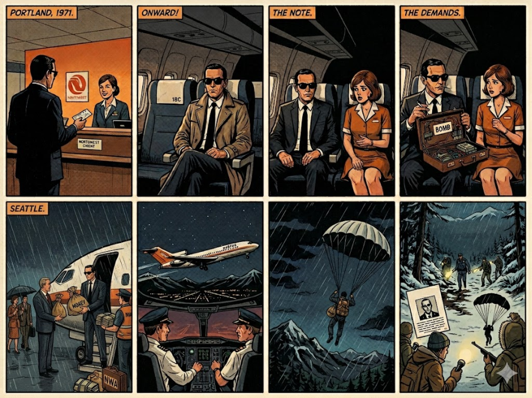
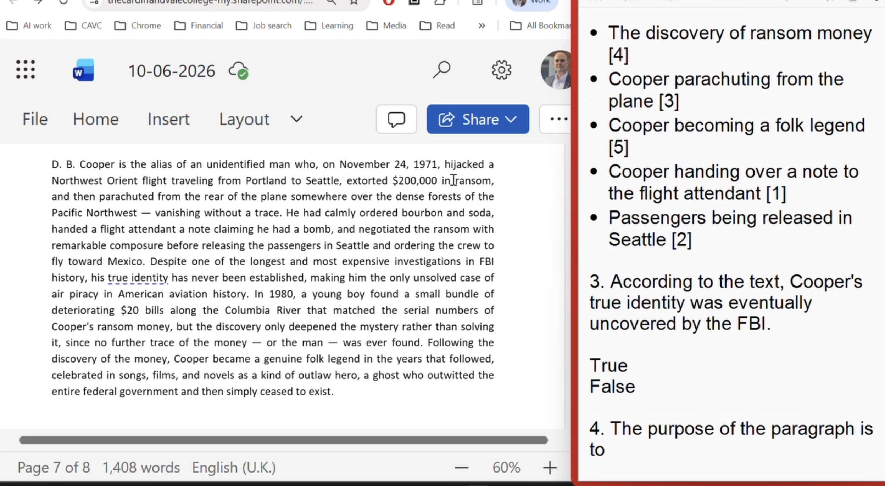

# 2026-06-10

## Topic

## Class Notes

- Read the text and find 10 mistakes in the text. (grammar, spelling, punctuation, etc.) Two in every paragraph. (See the text in attachments folder)

In the contemporary era, social media has revolutionized how we communicate, knitting the globe into a single, interconnected network. While these platforms genuinely allow individuals to maintain contact with distant relatives, they also pose significant threats to our psychological well-being. Many users find themselves trapped in a cycle of comparison, constantly measuring their mundane realities against the curated, flawless lives of influencers. Furthermore, the relentless pursuit of validation through "likes" often leads to an addictive behavior, which can severely damage a person's self-esteem. If they would spend less time online, their mental health would likely improve significantly.

Turning to the societal level, the spread of misinformation has become a deeply concerning phenomenon that threatens democratic institutions. Platforms are engineered to prioritize engagement, meaning that sensationalist headlines propagate much faster than nuanced truths. Seldom users verify the source of an article before hitting the share button, which inadvertently fuels polarization. Consequently, communities are becoming increasingly fractured as people retreat into ideological silos, completely insulated from opposing viewpoints. This isolation prevents citizens from engaging in constructive debate, no matter how hard do they try. 

From an economic perspective, social media has completely transformed the business landscape, giving rise to the "attention economy." Companies no longer rely solely on traditional advertising; instead, they invest heavily in influencer marketing to target specific demographics. This shift has enabled small businesses to thrive by reaching niche markets that were previously being inaccessible. However, this hyper-commercialization means that users are constantly bombarded with sponsored content, subtly nudging them into buying expensive equipments they do not actually need. 

Moreover, the impact of these platforms on the younger generation are often overstated by critics, yet the vulnerability of teenagers to algorithmic manipulation remains undeniable. Excessive screen time has been conclusively linked to rising rates of anxiety, depression, and sleep deprivation among adolescents. Schools and parents are struggling to keep pace with the rapidly evolving digital landscape, often failing to provide adequate guidance to youth. Without proper intervention, we risk to lose an entire generation to digital dependency. 

Ultimately, social media is a double-edged sword that requires careful, deliberate management rather than outright rejection. Tech conglomerates must be held accountable for their algorithms, while users must cultivate mindfulness regarding their online habits. Only by establishing a healthier relationship with technology can we harness its vast potential for good while mitigating its harms. If we fail to act decisively, we face the prospect of the society becoming entirely atomized. Unless immediate regulatory steps are taken, these platforms will have continued to dictate the very fabric of human interaction. 

---

Discussion question
If you could commit the perfect crime, would you do it? Why? Why not?

---

8 images for discussion (D. B. Cooper case)

Homework:
The local newspaper is offering to publish the most informative article from a local student. The task is to write an article on one of the following topics. 
A Doing volunteer work should be part of the primary and secondary school experience for all students. Discuss. 
B What advice would you give to someone who wanted to make faster progress with their English skills? 
You must plan the points you are going to include and how you are going to introduce, develop and finish your writing. 
Write at least 200 words 

## Materials

<!--
Put screenshots, scans, handouts into attachments/ subfolder:

-->

## New Words

→ see [vocab.md](../../vocab.md)
