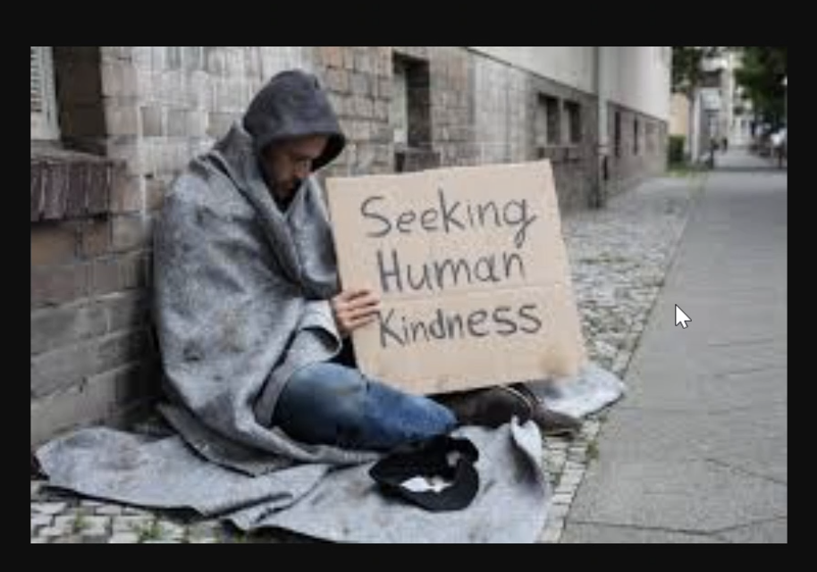
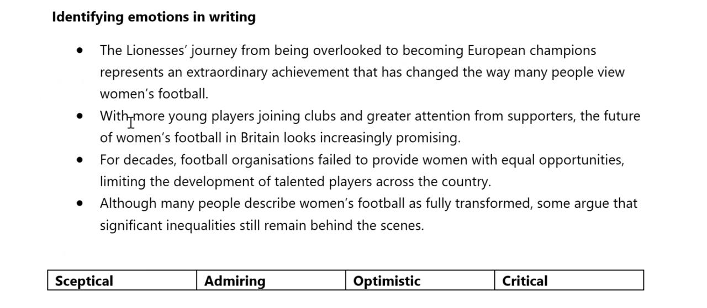
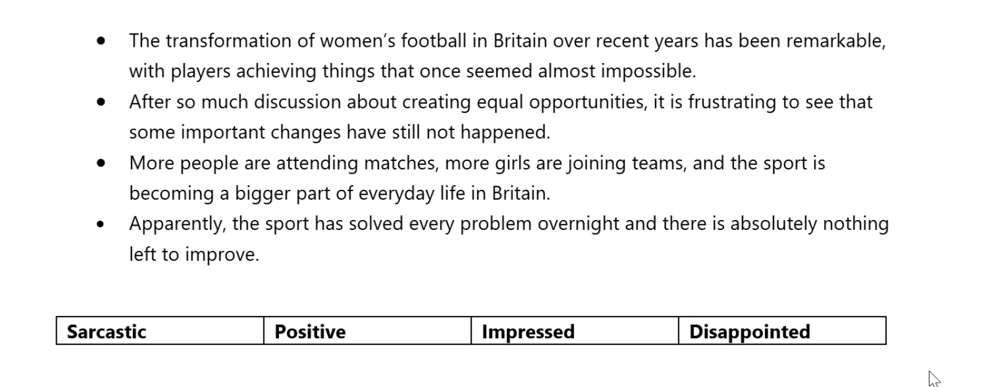

# 2026-06-17

## Topic

## Class Notes

- How many countries can you visit in one day? Future Perfect:

By the end of the day, I will have visited 30 countries.

12 gramma mistakes in the email:

Hi Jamie,
How's it going? I hope everything's fine with you. I have to tell you about this World Cup — it's honestly the best tournament I've watched in years.
Current, I'm watching every single match I can, even the ones at 3am here in the UK! Did you see Messi's hat-trick against Algeria? Incredible stuff. I am agree with everyone saying he's still the best player in the world, even at this stage of his career.
Despite of the tickets being ridiculously expensive, I'm seriously considering flying out for the knockout stage. If I would have the money right now, I'd book the flight tonight, no question.
Honestly, everyone at work keeps arguing on which team wins their group, and it's all anyone talks about in the office these days.
My brother gave me an advice about which matches are worth watching, and he said I should make a photo of myself at the stadium if I ever manage to go.
I wish I would have booked some time off work for the group stage, because I'm used to stay up so late for the matches now that I'm completely exhausted every morning.
Although the time difference is brutal, but I'm not missing a single game. Never I have felt so invested in a tournament, and I keep telling myself not to do a mistake by missing the next England game.
Let me know if you're following it too — maybe we could watch one together?
Speak soon,
Sam

---

Wish - ways ot using it:

1. Present Situation (Wish + Past Simple) [A present situation you want to change]
  I wish I had a safe place to live.
  I wish I were in a better situation.

2. Past Regret (Wish + Past Perfect) [A past regret]
  I wish I had made better decisions in my life.
  I wish I hadn’t ended up in this situation.

3. Annoyance (Wish + Would + V1) [A present situation you want to change, but it is not your fault] It's always not about you, but about the other person. You want them to change their behavior.
  I wish my boss would stop calling me at 10pm.
  I wish my neighbour would stop playing loud music at night.

Past:
I wish I hadn’t ended up in this situation.
I wish I had a safe place to live.

Past Perfect:
I wish I had made better decisions in my life.
I wish I hadn’t ended up in this situation.
I wish I hadn’t lost my job.
I wish I had asked for help before it was too late.

IF ONLY:
Same meaning and usage as WISH, but more emotional and dramatic. It is often used to express regret or longing for a different outcome in the past or present.
- If only I had studied harder for the exam, I would have passed.

---

Research job:

1989 - British dark day in history: the Hillsborough disaster, where 96 football fans tragically lost their lives due to a crush at the stadium. The incident led to significant changes in stadium safety regulations and had a lasting impact on football culture in the UK.

The Hillsborough Disaster was one of the worst sporting tragedies in British history.

Hillsborough disaster took place on 15 April 1989 at the Hillsborough Stadium in Sheffield during an FA Cup semi-final between Liverpool F.C. and Nottingham Forest F.C..

What happened?

* Thousands of Liverpool supporters were directed into already overcrowded standing pens behind one of the goals.
* A large crowd surge developed.
* Fans at the front were crushed against the perimeter fencing.
* The match was stopped after only a few minutes.

The consequences

* 97 Liverpool supporters eventually lost their lives as a result of the disaster.
* Hundreds more were injured.
* It remains the deadliest disaster in British football history.

Why is it so significant?

For many years, some authorities and sections of the media wrongly blamed Liverpool fans for the tragedy.

Later investigations found that:

* the supporters were not responsible for the disaster;
* serious failures in crowd management and police operations contributed to the crush.

The disaster led to major changes in football stadium safety across the UK, including the move toward all-seater stadiums following recommendations in the Taylor Report.

B2 Speaking Answer

The Hillsborough Disaster was a tragic crowd crush that occurred during a football match in Sheffield in 1989. Ninety-seven Liverpool supporters died, and many more were injured. The disaster led to significant changes in stadium safety regulations throughout the United Kingdom and remains a very important event in British sporting history.

---

Позитивні Attitudes

Word	Значення
Approving	схвальний
Supportive	підтримуючий
Sympathetic	співчутливий
Admiring	захоплений
Enthusiastic	захоплений, сповнений ентузіазму
Optimistic	оптимістичний
Respectful	шанобливий
Positive	позитивний

Приклад

The new policy has significantly improved working conditions.

Автор звучить:

✅ Approving
✅ Supportive

⸻

Негативні Attitudes

Word	Значення
Critical	критичний
Disapproving	несхвальний
Sceptical	скептичний
Doubtful	той, що сумнівається
Concerned	стурбований
Negative	негативний
Disappointed	розчарований
Hostile	ворожий
Angry	сердитий

Приклад

The authorities failed to act despite repeated warnings.

Автор:

✅ Critical

⸻

Нейтральні Attitudes

Word	Значення
Objective	об’єктивний
Neutral	нейтральний
Balanced	збалансований
Factual	фактологічний
Informative	інформативний

Приклад

The report presents data from five different countries.

Автор:

✅ Objective

⸻

Часті екзаменаційні слова

Critical

Не означає “критичний стан”.

Означає:

finding faults, blaming

Приклад:

The writer is critical of the government’s response.

Автор вважає, що уряд погано впорався.

⸻

Sympathetic

Не означає “симпатичний”.

Означає:

showing understanding and compassion

Приклад:

The writer is sympathetic towards the victims.

Автор співчуває жертвам.

⸻

Sceptical

Дуже популярне слово на екзаменах.

not completely convinced

Приклад:

The writer is sceptical about artificial intelligence.

Автор сумнівається, що AI такий чудовий.

⸻

Concerned

worried

Приклад:

The writer is concerned about climate change.

Автор стурбований.

⸻

Approving

thinks something is good

Приклад:

The writer is approving of the reforms.

Автор підтримує реформи.

⸻

Indifferent

Дуже підступне слово.

does not care

байдужий

Приклад:

The writer appears indifferent to the issue.

Автору все одно.

⸻

Швидка шпаргалка

Позитив

* approving
* supportive
* sympathetic
* enthusiastic
* optimistic
* admiring

Негатив

* critical
* disapproving
* sceptical
* concerned
* hostile
* disappointed

Нейтраль

* objective
* balanced
* factual
* neutral

⸻

Лайфхак для екзамену

Дивись на прикметники та прислівники в тексті.

Наприклад, у Hillsborough:

wrongly suggested

poor policing

inadequate safety arrangements

Це слова з негативним забарвленням.

Отже:

❌ Approving
❌ Neutral
✅ Critical

---

## Materials

<!--
Put screenshots, scans, handouts into attachments/ subfolder:

-->

## New Words

→ see [vocab.md](../../vocab.md)
