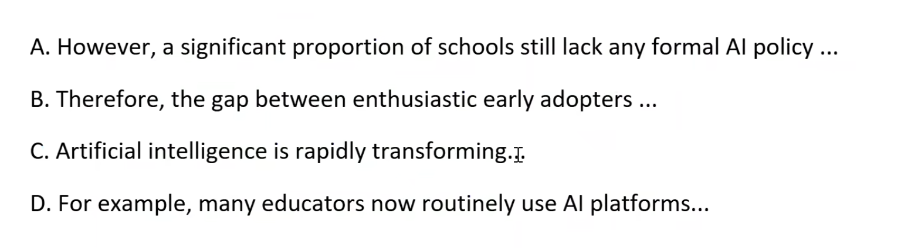
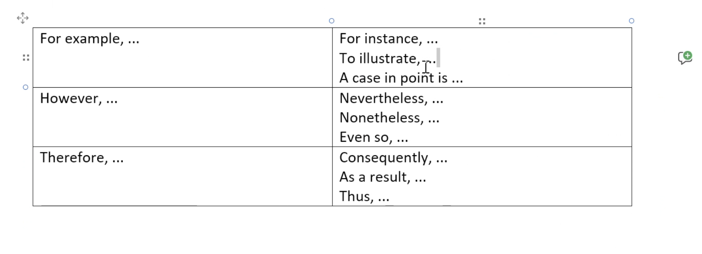
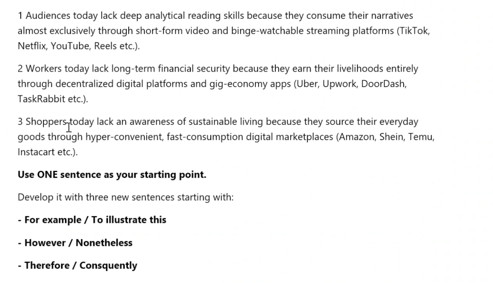

# 2026-06-24

## Topic

## Class Notes

- Read and find the 12 mistakes in the text.

I am writing to you regarding the upcoming restructuring. I would like to express my deepest congratulations for your recent promotion; it is thoroughly deserved given your hard work.
Over the last few months, the management team has been discussing about new department layouts. We have arrived to a point where decisions must be finalized. Had we known the budget cuts were going to be this severe, we altered our initial approach much sooner.
Furthermore, I must explain you that the timeline has been brought forward. This means we need to take a decision on the redundancies by Friday. I am aware this puts a lot of pressure on your team, but under no circumstances we should delay the announcement.
I look forward to receive your updated spreadsheet. Despite the situation is quite tense, I am confident we can handle it professionally. Please find attached the preliminary report in respect to the upcoming changes.
In addition of this, I believe these changes will ultimately benefit the company, in spite of they might cause short-term disruption.
Best regards,
Elena Vance
Operations Director

---

- Complete sentences. and find the most logical order of the sentences.

A. However, a significant proportion of schools still lack any formal Al policy ...
B. Therefore, the gap between enthusiastic early adopters ...
C. Artificial intelligence is rapidly transforming
D. For example, many educators now routinely use Al platforms...

C
A
D
B

Mechanical way to do writing - 4 sentence paragraphs!

Main topic or Topic sentence - 1 sentence
Supporting sentence - example - 1 sentence
Counterargument - contrast - 1 sentence
Conclusion - balance - 1 sentence

[1](Topic sentence) Artificial intelligence is rapidly transforming the way British secondary school teachers approach lesson planning and classroom delivery. [2](Supporting sentence - example) For example, many educators now routinely use Al platforms to generate differentiated resources, saving considerable preparation time each week. [3](Counterargument - contrast) However, a significant proportion of schools still lack any formal Al policy, leaving both teachers and students navigating this powerful technology without adequate institutional guidance. [4](Conclusion - balance) Therefore, the gap between enthusiastic early adopters and cautious or under-supported schools risks widening educational inequality rather than closing it.

85 words

| | |
|-|-|
| For example,... | For instance,... To illustrate,... A case in point,... |
| However,... | Nevertheless,... On the other hand,... In contrast,... |
| Therefore,... | As a result,... Consequently,... In conclusion,... Thus,... |

---

Put these paragraphs in order and add linking words
However / Therefore / For example
1 ..................., organisers will need to carefully balance this newfound inclusivity and commercial growth with the sporting quality of the competition.
2 ...................,, some critics argue that increasing the number of participants may reduce the overall quality of matches and place additional pressure on players who already face demanding schedules.
3 The 2026 FIFA World Cup is expected to be one of the most significant sporting events in history due to its expanded size and international reach.
4 ..................., the tournament will involve more teams than previous editions, giving countries with less established football traditions a greater opportunity to compete on the global stage.

3
4 For example
2 However
1 Therefore

---

For example, many peole spend hours watching short videos on social media platforms but rarely engage with reading books, articles, or long-form content. However, digital platforms can also provide access to valuable educational resources, such as online courses, tutorials when they are used responsibly. Therefore, it is important for individuals to make a balance between consuming digital content and reding traditional materials in order to develop critical thinking and analytical skills.

## Materials

<!--
Put screenshots, scans, handouts into attachments/ subfolder:

-->

## New Words

→ see [vocab.md](../../vocab.md)
