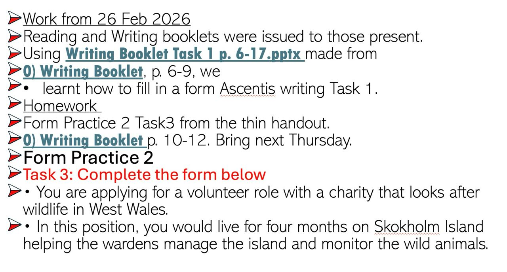

# 2026-02-26

## Topic

Form filling — Ascentis Writing Task 1

## Class Notes

- Reading and Writing booklets were issued to those present
- Using **Writing Booklet Task 1 p. 6-17.pptx** (presentation from teacher)
- Writing Booklet p. 6–9: learnt how to fill in a form (Ascentis Writing Task 1)

## Materials

## New Words

→ see [vocab.md](../../vocab.md#andrew-thu)
