# Homework — 2026-03-05

**Assigned:** 2026-03-05
**Due:** 2026-03-12 (next Thursday)
**Status:** 🔴 Not started

## Task

1. **Complete Writing Booklet Task 1 p. 6–17** (via Writing Booklet Task 1 p. 6-17.pptx on Teams)
   - Form practice exercises from the Writing Booklet

## Materials

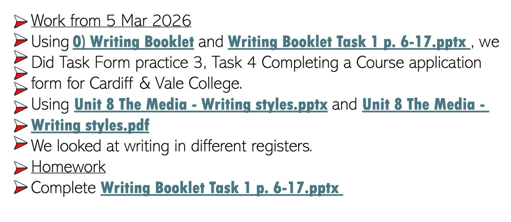

### Writing Booklet p. 6–17

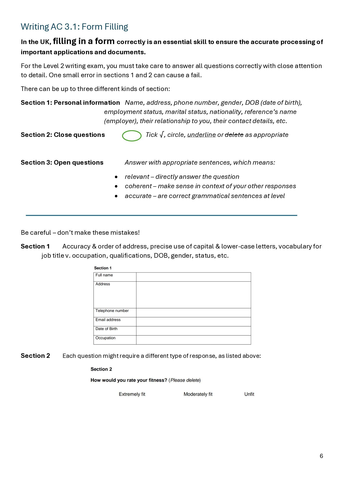
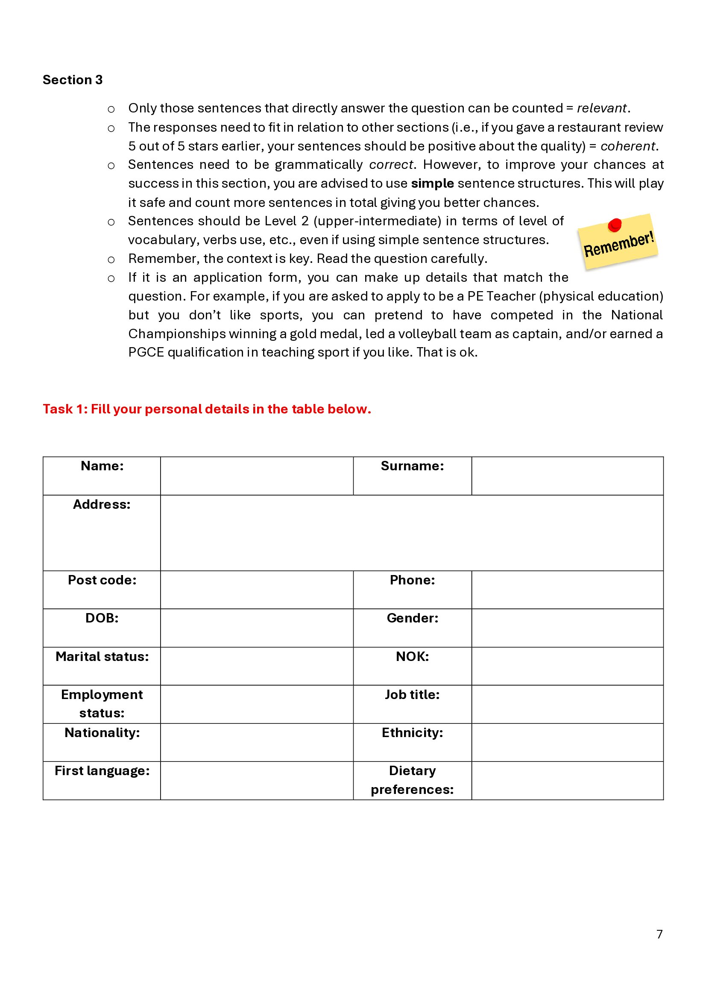
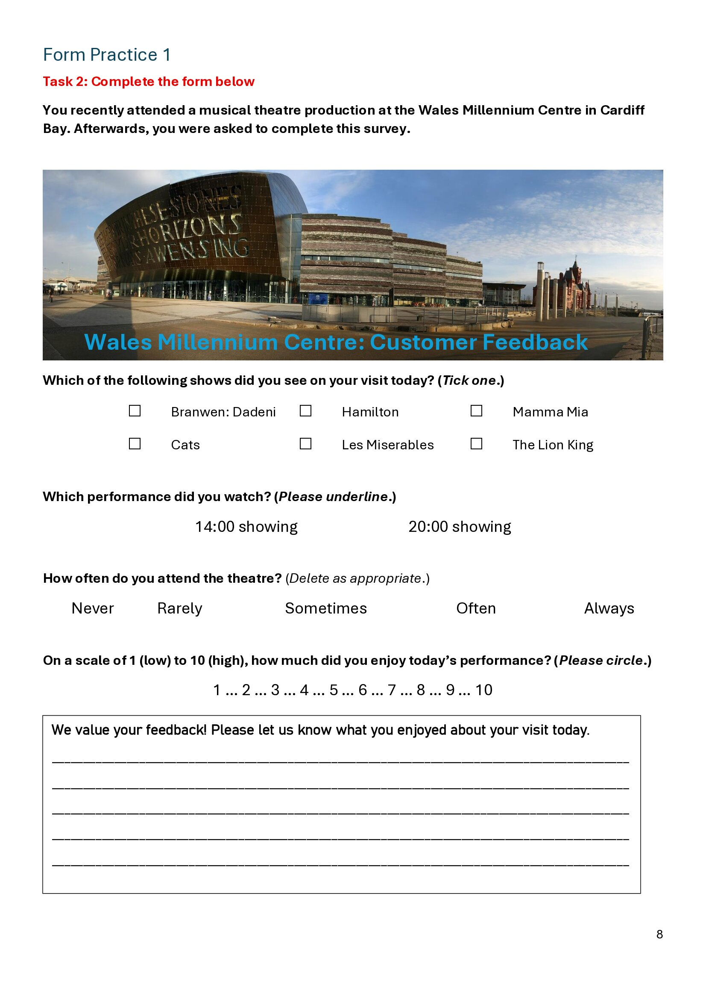
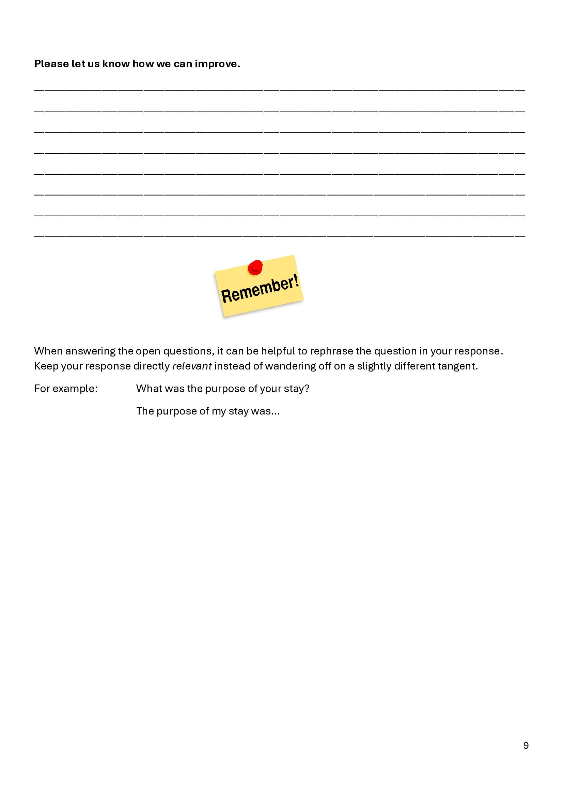
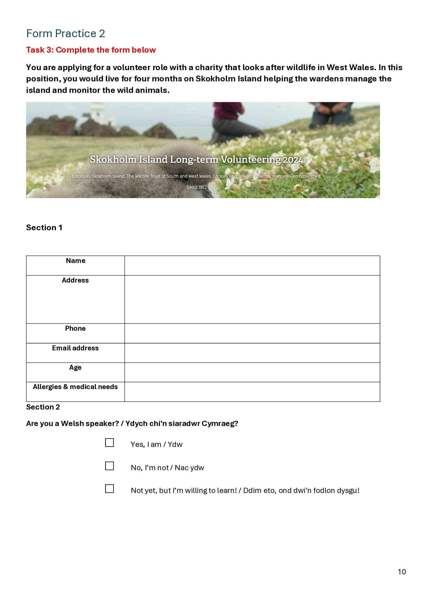
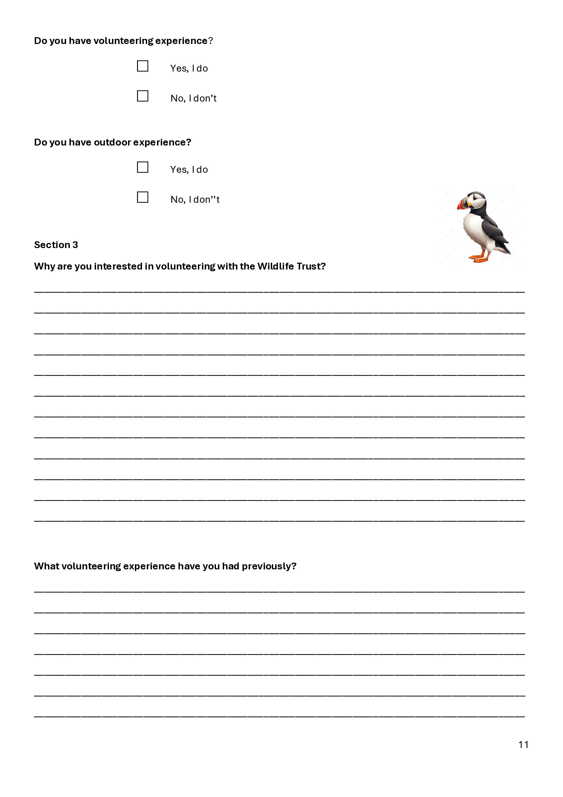
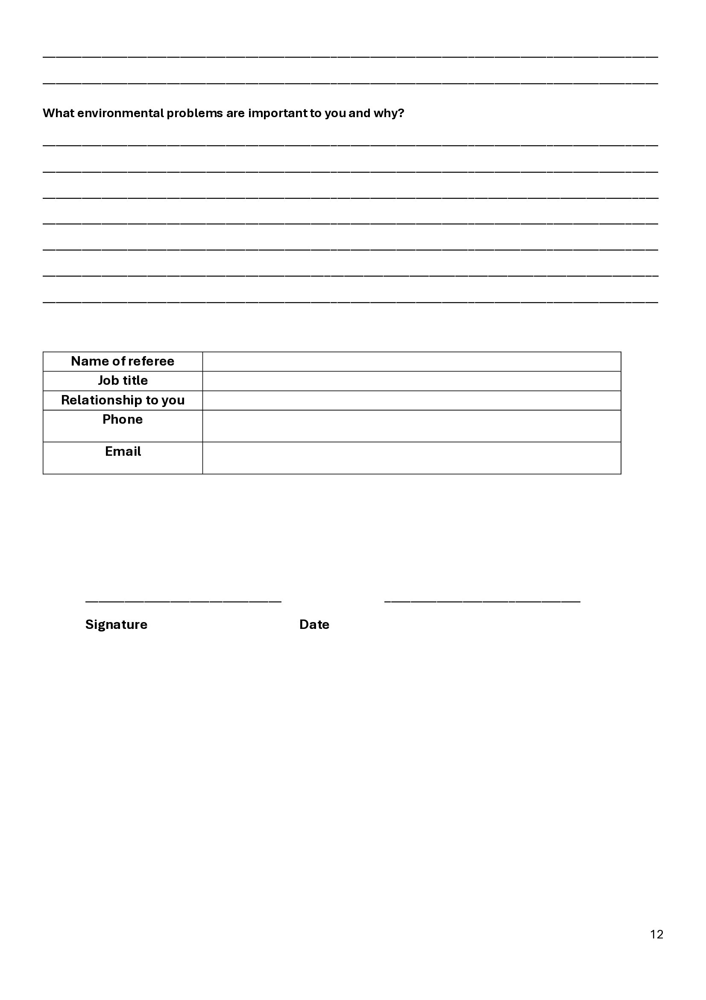
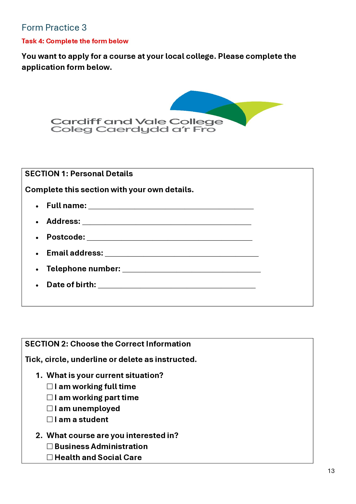
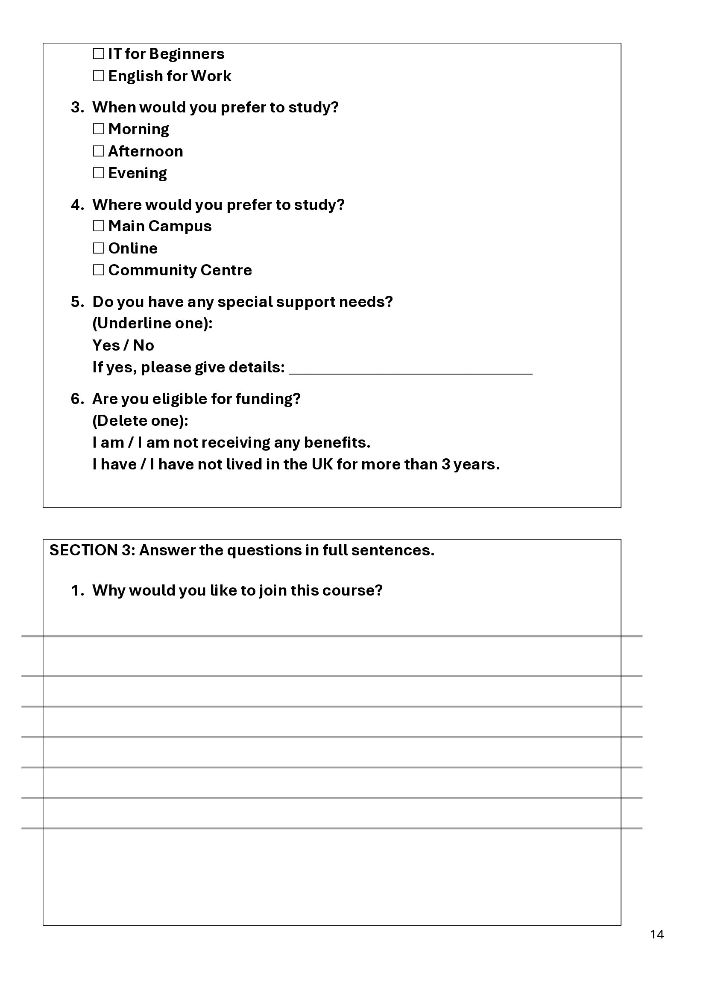
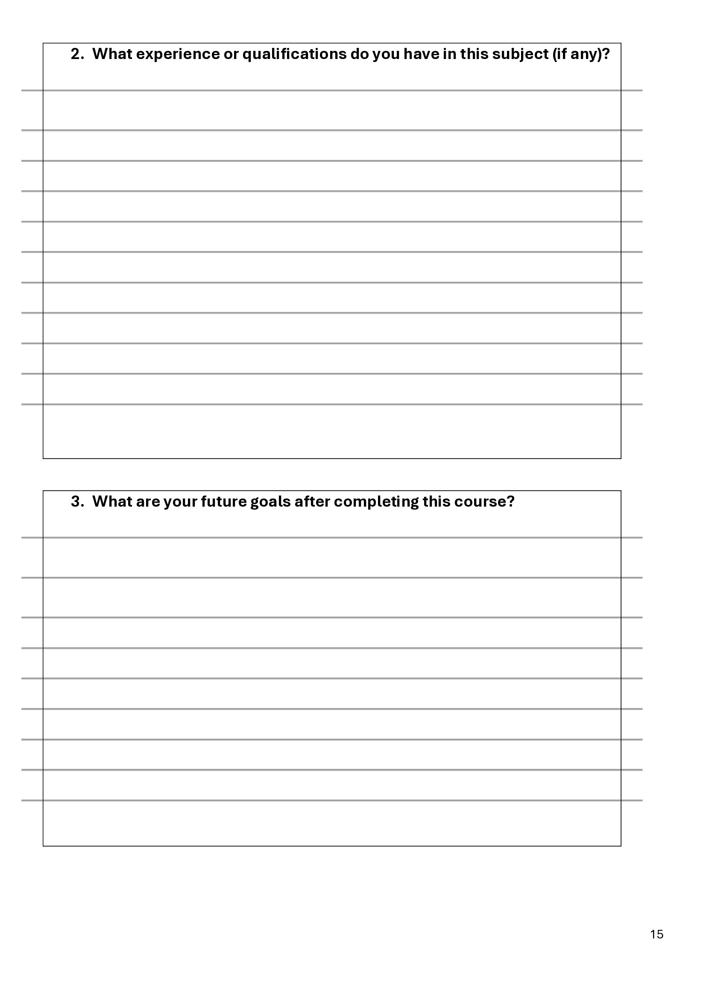
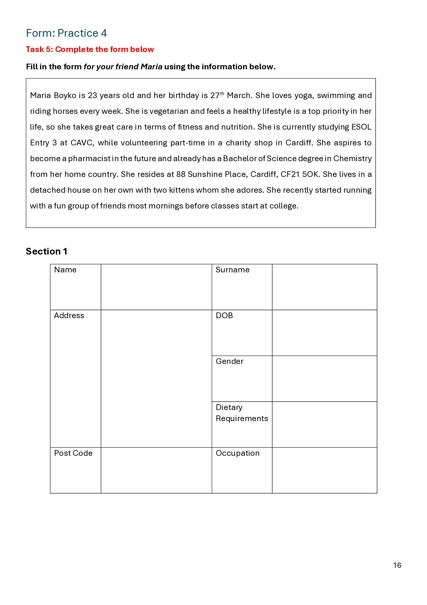
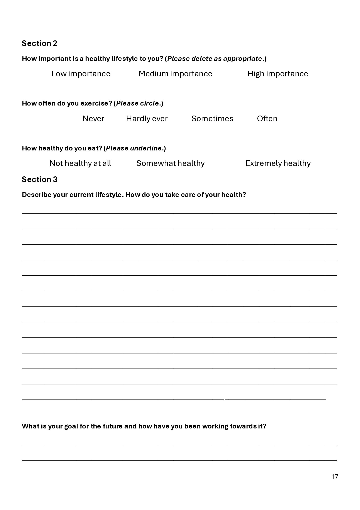
