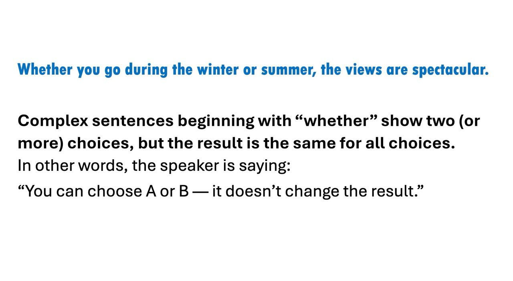
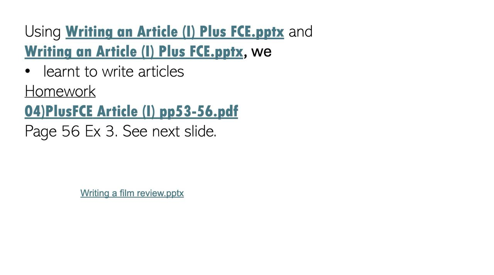
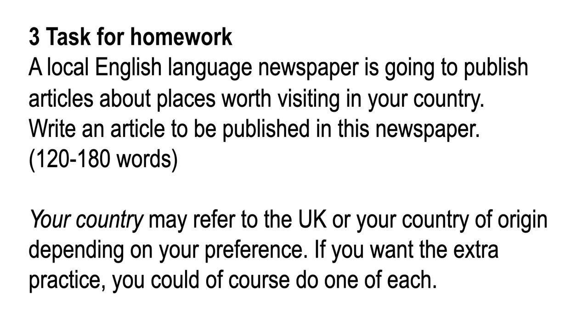

# 2026-03-12

## Topic

Complex sentences with "whether" + Writing articles

## Class Notes

- Complex sentences beginning with "whether" show two (or more) choices, but the result is the same for all choices
  - *"Whether you go during the winter or summer, the views are spectacular."*
  - Speaker is saying: "You can choose A or B — it doesn't change the result."
- Using **Writing an Article (I) Plus FCE.pptx** (Teams) — learnt to write articles
- Also referenced: **Writing a film review.pptx** (Teams)

## Materials

### Lesson PDFs

- [Lesson plan PDF](attachments/3%20ESCCCP24%202025-2026%2012%20Mar%202026.pdf)
- [04)PlusFCE Article (I) pp53-56.pdf](attachments/04)PlusFCE%20Article%20(I)%20pp53-56.pdf)
- [Writing an Article (I) Plus FCE.pdf](attachments/Writing%20an%20Article%20(I)%20Plus%20FCE.pdf)
- [Writing a film review.pdf](attachments/Writing%20a%20film%20review.pdf)

<!-- Additional resources from Teams (to download later):
- Writing an Article (I) Plus FCE.pptx
- Writing a film review.pptx
- 04)PlusFCE Article (I) pp53-56.pdf
-->

## New Words

→ see [vocab.md](../../vocab.md#andrew-thu)
