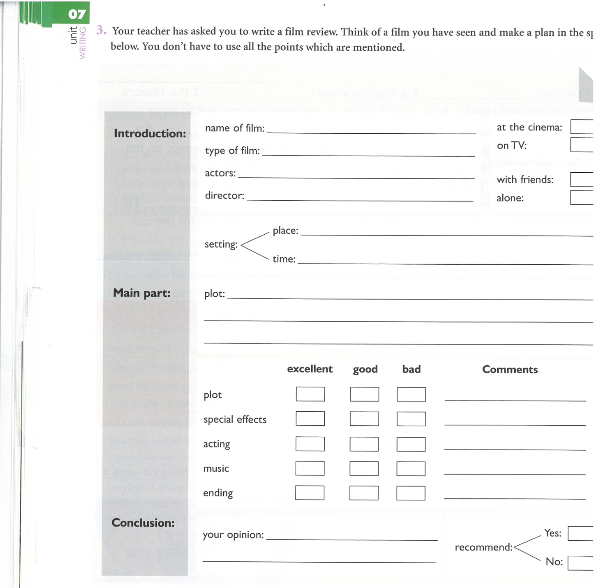

# 2026-03-19

## Topic

Film reviews: structure, language, and practice

## Class Notes

Origin text of the lesson plan:
Work from 19 Mar 2026
Using  Writing a film review.pptx made from 
07_PlusPreIntU7_Film_review.pdf, we 
• learnt to write a film review.
Homework
07_PlusPreIntU7_Film_review.pdf 
Using the plan template in Ex 3 p. 56 of 07_PlusPreIntU7_Film_review.pdf , or your own plan – experience has taught me that not everyone likes this framework, plan and write a film review of a film of your choice. P. 56 Ex 

4. Use Writing a film review.pptx to help you.

- Used lesson plan: [4) ESCCCP24 2025-2026 19 Mar 2026.pdf](attachments/4_ESCCCP24_2025-2026_19_Mar_2026.pdf)
- Analysed and wrote film reviews
- Used resource: [07) PlusPreIntU7 Film review.pdf](attachments/07_PlusPreIntU7_Film_review.pdf)
- Also referenced previous resource: [Writing a film review.pdf](attachments/Writing_a_film_review.pdf)

## Materials

- [Lesson plan PDF](attachments/4_ESCCCP24_2025-2026_19_Mar_2026.pdf)
- [07) PlusPreIntU7 Film review.pdf](attachments/07_PlusPreIntU7_Film_review.pdf)
- [Writing a film review.pdf](attachments/Writing_a_film_review.pdf)

## New Words

→ see [vocab.md](../../vocab.md#andrew-thu)
