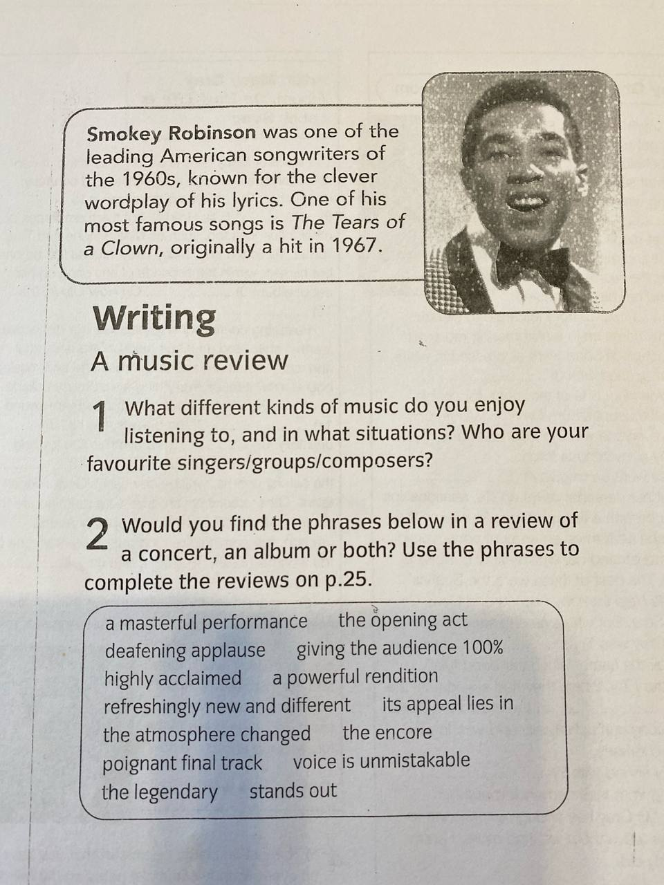
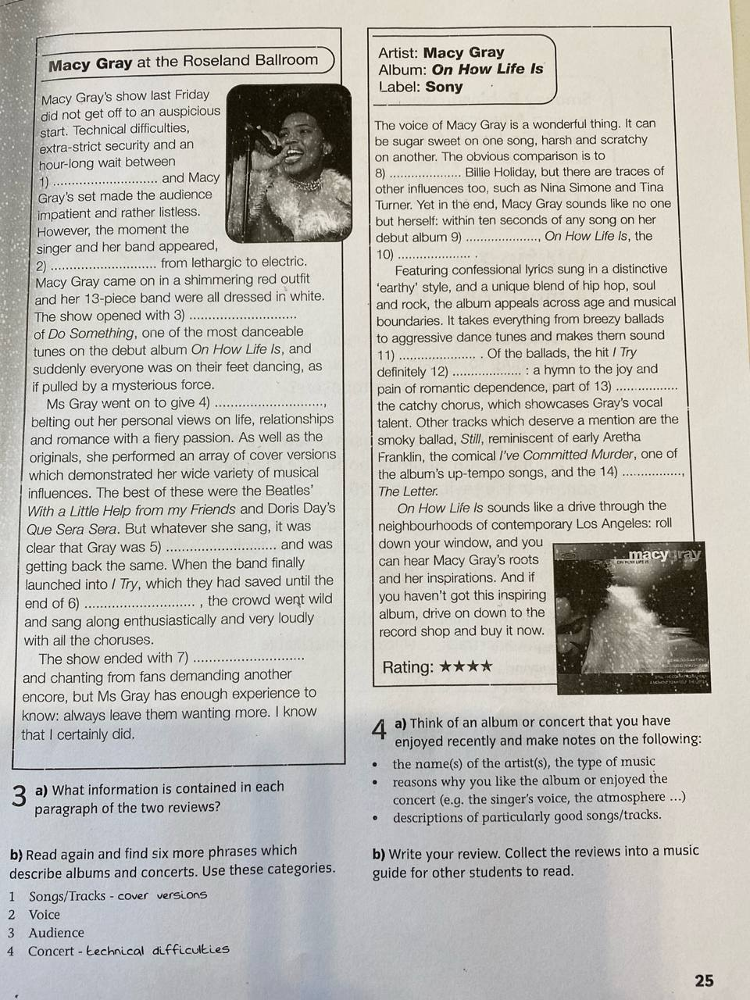
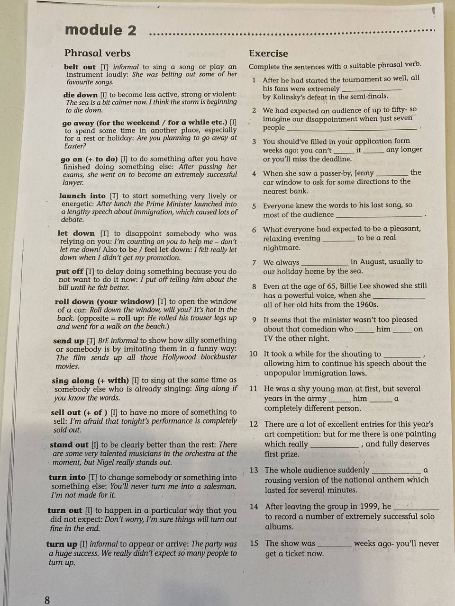
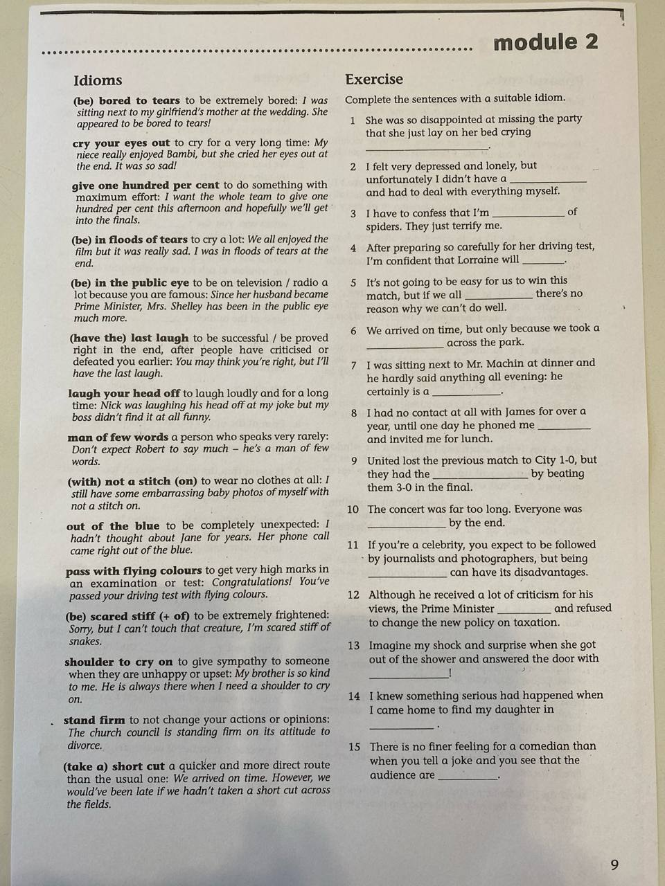
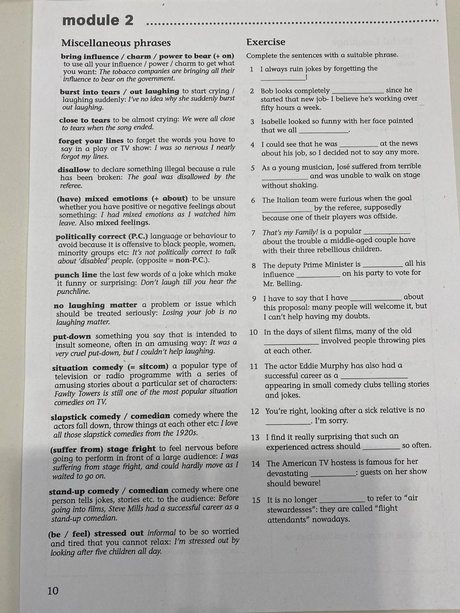
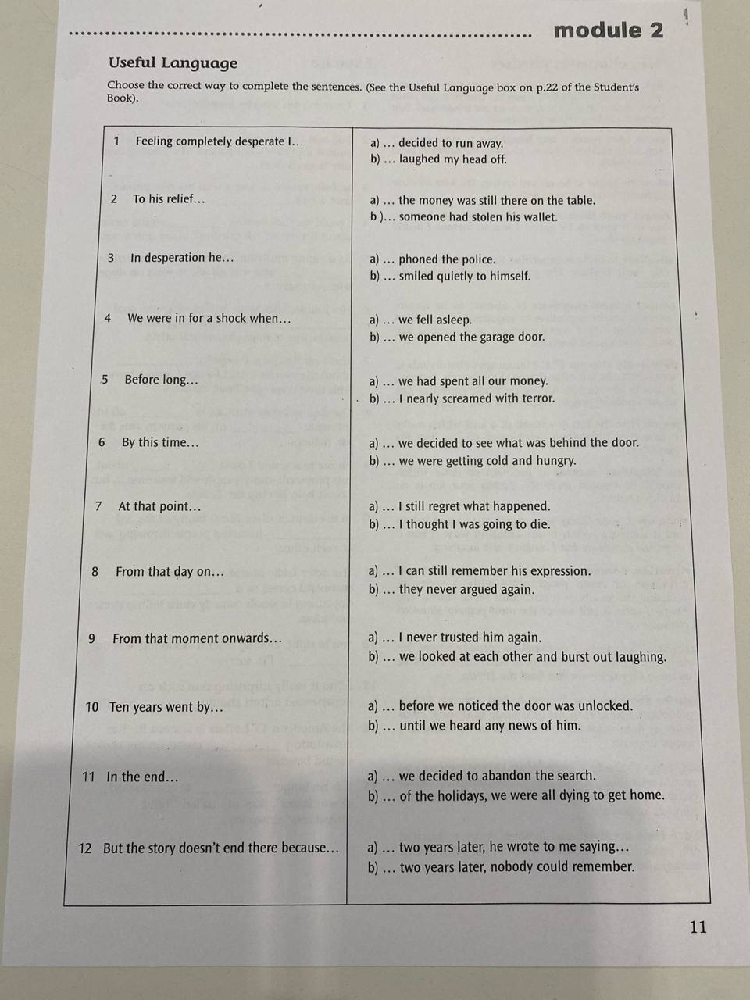

# YYYY-MM-DD

## Topic

## Class Notes

- сьогодны буде music review. того що це може бути на екзамені, я не знаю, але це буде цікаво.
- перше потрыбно заповнити пропуски словами з списку. Частина відноситься до концерту частина до альбому а деякі до обох!

Smokey Robinson was one of the leading American songwriters of the 1960s, known for the clever wordplay of his lyrics. One of his most famous songs is The Tears of a Clown, originally a hit in 1967.

Writing
A music review
1. What different kinds of music do you enjoy listening to, and in what situations? Who are your favourite singers/groups/composers?
2. Would you find the phrases below in a review of a concert, an album or both? Use the phrases to write complete the reviews on p.25.

List of phrases:
a masterful performance the opening act
deafening applause giving the audience 100%
highly acclaimed a powerful rendition
refreshingly new and different its appeal lies in
the atmosphere changed
the encore
poignant final track voice is unmistakable
the legendary stands out

Macy Gray at the Roseland Ballroom
Macy Gray's show last Friday did not get off to an auspicious start. Technical difficulties, extra-strict security and an hour-long wait between
1____ and Macy Gray's set made the audience impatient and rather listless. However, the moment the singer and her band appeared, 2____ from lethargic to electric. Macy Gray came on in a shimmering red outfit and her 13-piece band were all dressed in white. The show opened with 3____ of Do Something, one of the most danceable tunes on the debut album On How Life Is, and suddenly everyone was on their feet dancing, as if pulled by a mysterious force.
Ms Gray went on to give 4____ belting out her personal views on life, relationships and romance with a fiery passion. As well as the originals, she performed an array of cover versions which demonstrated her wide variety of musical influences. The best of these were the Beatles' With a Little Help from my Friends and Doris Day's Que Sera Sera. But whatever she sang, it was clear that Gray was 5____  and was getting back the same. When the band finally launched into / Try, which they had saved until the end of 6____ , the crowd went wild and sang along enthusiastically and very loudly
with all the choruses.
The show ended with 7____ and chanting from fans demanding another encore, but Ms Gray has enough experience to know: always leave them wanting more. I know
that I certainly did.

✅ Відповіді:
	1.	the opening act
	2.	the atmosphere changed
	3.	a powerful rendition
	4.	a masterful performance
	5.	giving the audience 100%
	6.	the encore
	7.	deafening applause

---

Artist: Macy Gray
Album: On How Life Is
Label: Sony

The voice of Macy Gray is a wonderful thing. It can be sugar sweet on one song, harsh and scratchy on another. The obvious comparison is to 8____ Billie Holiday, but there are traces of other influences too, such as Nina Simone and Tina Turner. Yet in the end, Macy Gray sounds like no one but herself: within ten seconds of any song on her debut album 9____, On How Life Is, the 10____
Featuring confessional lyrics sung in a distinctive 'earthy' style, and a unique blend of hip hop, soul and rock, the album appeals across age and musical boundaries. It takes everything from breezy ballads to aggressive dance tunes and makes them sound 11____. Of the ballads, the hit / Try definitely 12____: a hymn to the joy and pain of romantic dependence, part of 13____ the catchy chorus, which showcases Gray's vocal talent. Other tracks which deserve a mention are the smoky ballad, Still, reminiscent of early Aretha Franklin, the comical /'ve Committed Murder, one of the album's up-tempo songs, and the 14____, The Letter.
On How Life Is sounds like a drive through the neighbourhoods of contemporary Los Angeles: roll down your window, and you can hear Macy Gray's roots and her inspirations. And if you haven't got this inspiring album, drive on down to the record shop and buy it now. 

Відповіді:
	8.	the legendary
	9.	highly acclaimed
	10.	voice is unmistakable
	11.	refreshingly new and different
	12.	stands out
	13.	its appeal lies in
	14.	poignant final track

Q3
a) What information is contained in each paragraph of the two reviews?
b) Read again and find six more phrases which describe albums and concerts. Use these categories.
1 Songs/Tracks - cover versions
2 Voice
3 Audience
4 Concert - technical difficulties

Q4
a) Think of an album or concert that you have enjoyed recently and make notes on the following:
• the name(s) of the artists), the type of music
• reasons why you like the album or enjoyed the concert (e.g. the singer's voice, the atmosphere ...)
• descriptions of particularly good songs/tracks.
b) Write your review. Collect the reviews into a music guide for other students to read.

---

Module 2

| Phrasal Verb | Meaning |
|--------------|---------|
| **belt out** | to sing or play a song very loudly and with great energy |
| **die down** | to become less strong or active |
| **go away(for the weekend/for a while)** | to leave a place for a short period of time |
| **go on(+ to do something)** | to continue doing something, especially after doing something else |
| **launch into** | to start doing something with a lot of energy and enthusiasm |
| **let down** | to disappoint someone by not doing something that they were expecting you to do |
| **put off** | to delay doing something, especially because you do not want to do it |
| **roll down(your window)** | to lower the window of a car |
| **send up** | to cause something to rise or increase |
| **sing along(+ with)** | to sing together with someone else, especially a performer |
| **sell out(+ of)** | to sell all of something, especially tickets for a concert or copies of an album |
| **stand out** | to be very noticeable or to be much better than other similar things |
| **turn into** | to change something into something else, or to change in a way that makes something into something else |
| **turn out** | to happen in a particular way, or to have a particular result, especially an unexpected one |
| **turn up** | to arrive somewhere, especially unexpectedly or without making a firm arrangement |

| Idiom | Meaning |
|-------|---------|
| **(be) bored to tears** | to be very bored |
| **cry your eyes out** | to cry a lot |
| **give one hundred percent** | to do something with all your energy and enthusiasm |
| **(be) in floods of tears** | to be crying a lot |
| **(be) in the public eye** | to be famous and often seen in public |
| **(have the) last laugh** | to be successful after other people have laughed at you or thought that you would fail |
| **laugh your head off** | to laugh a lot |
| **man of few words** | a person who does not say much |
| **(with) not a stich (on)** | completely naked |
| **out of the blue** | unexpectedly |
| **pass with flying colours** | to succeed at something very easily |
| **(be) scared stiff (+ of)** | to be very frightened |
| **shoulder to cry on** | a person who listens to your problems and gives you sympathy and support |
| **stand firm** | to refuse to change your opinion or decision, even when other people are trying to persuade you to change it |
| **(take a) short cut** | to do something in a quicker and easier way than the usual way, often by doing something dishonest or illegal |

---

---

A joke from the teacher:
Do-you-think-he-saurus?

Tyranosaurus
Stegosaurus

saw-us?

## Materials

<!--
Put screenshots, scans, handouts into attachments/ subfolder:

-->

## New Words

→ see [vocab.md](../../vocab.md)
