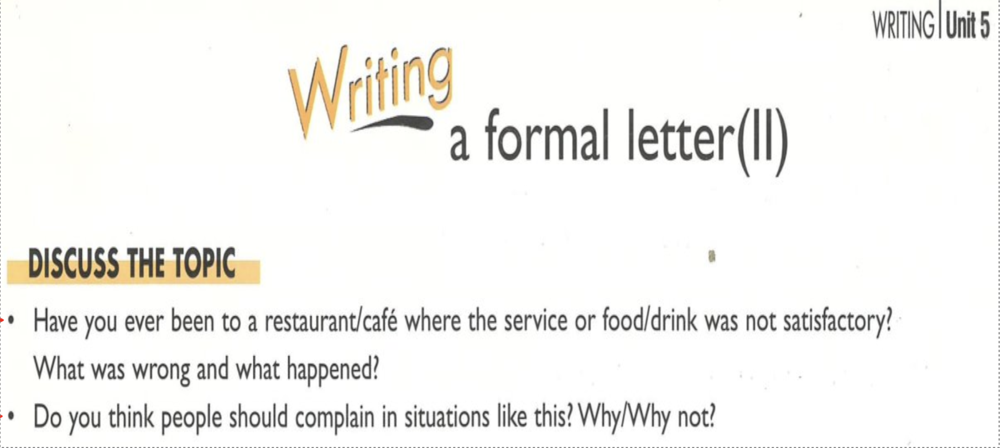
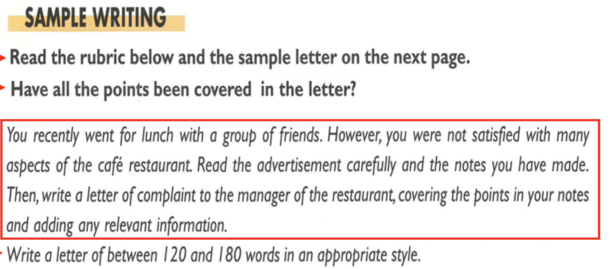
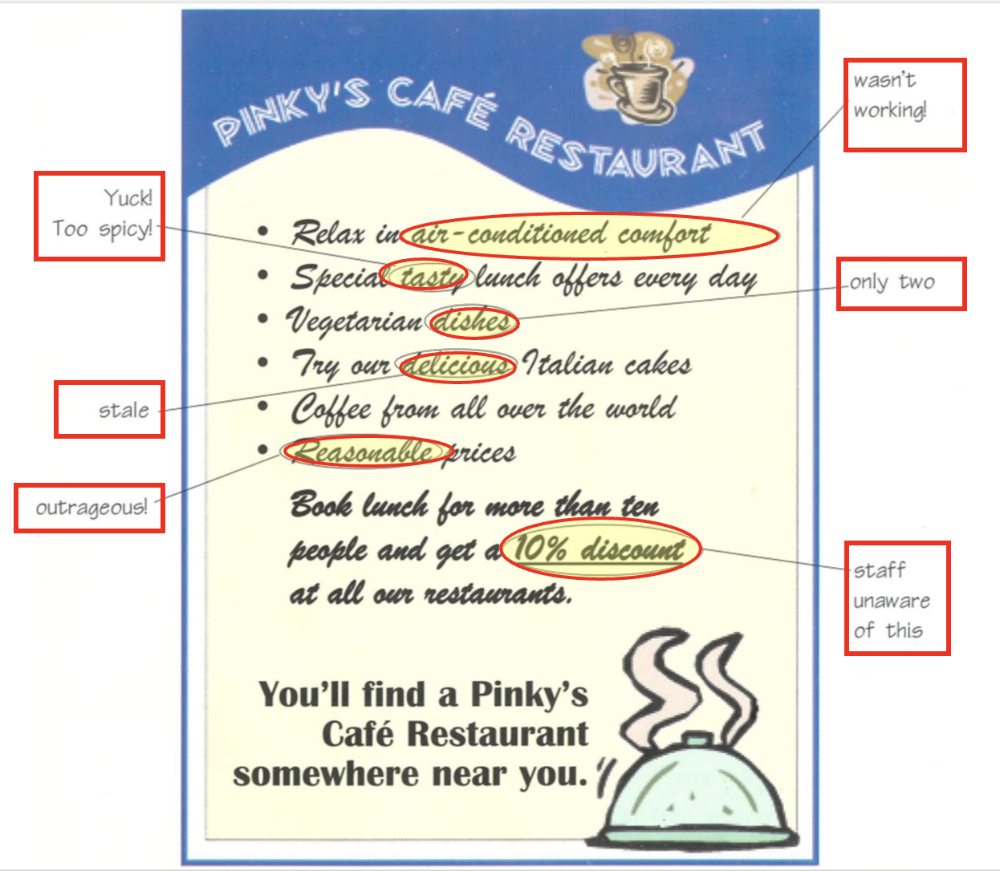
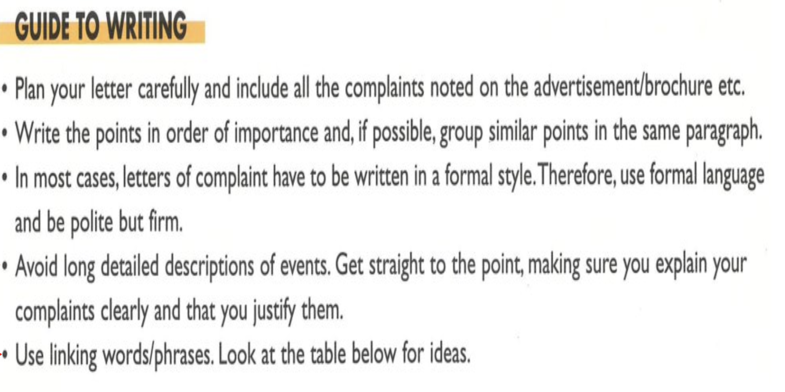
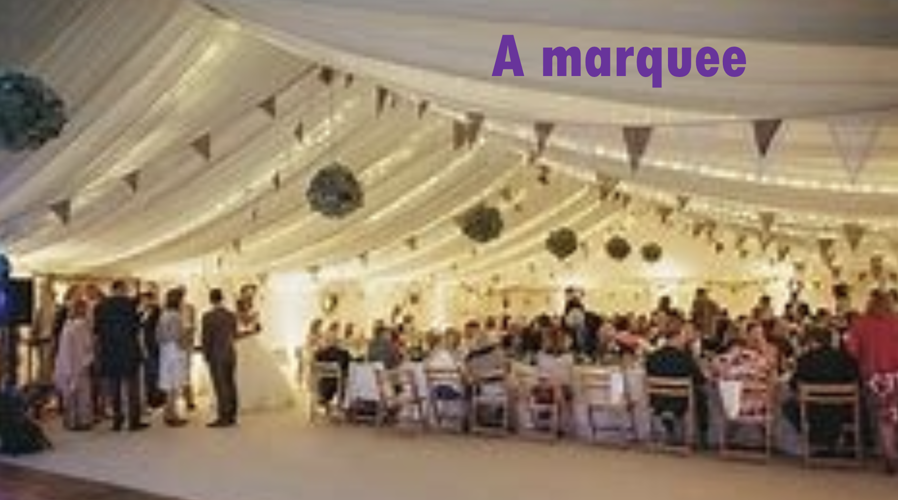
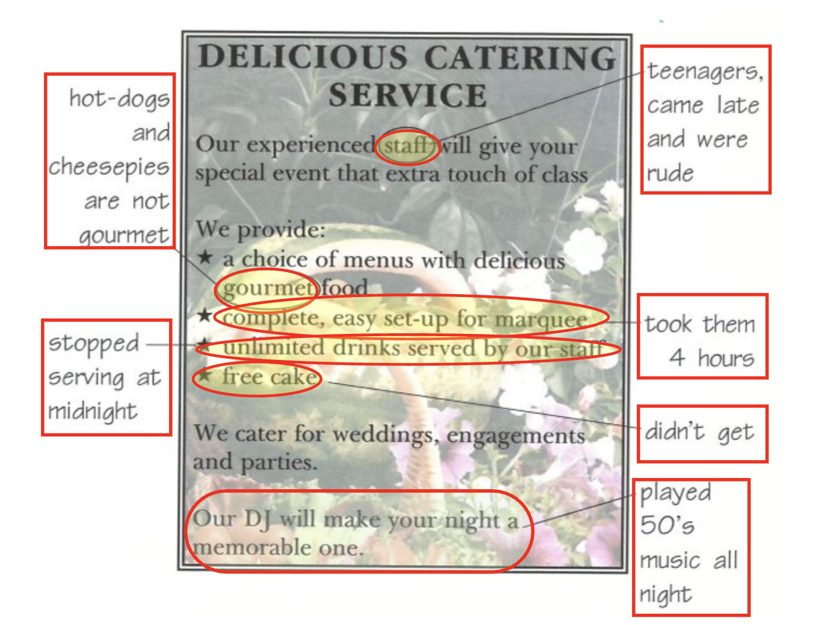
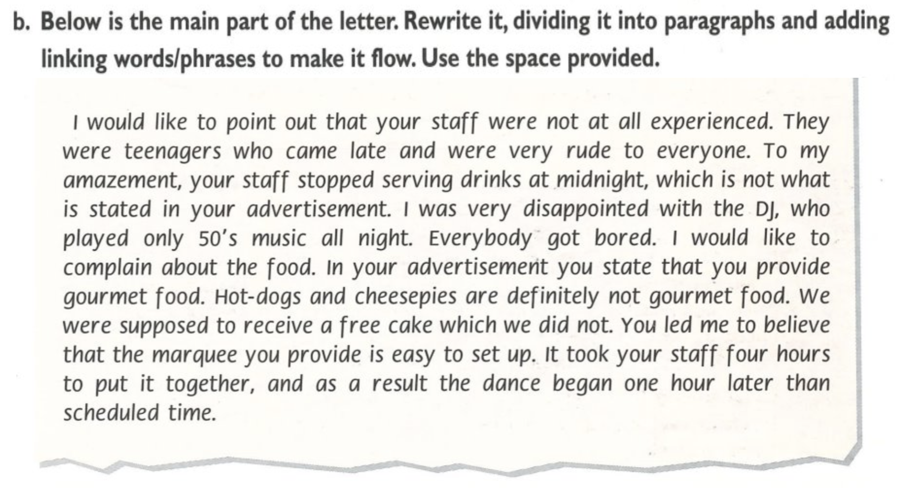

# 2026-05-14

## Topic

Formal letter of complaint — structure, set phrases, linking words; sample letter analysis; writing exercise (Delicious Catering)

## Class Notes

- Writing  formal letter (II)

DISCUSS THE TOPIC
• Have you ever been to a restaurant/café where the service or food/drink was not satisfactory?
What was wrong and what happened?
• Do you think people should complain in situations like this? Why/Why not?

SAMPLE WRITING
Read the rubric below and the sample letter on the next page. Have all the points been covered in the letter?
You recently went for lunch with a group of friends. However, you were not satisfied with many aspects of the café restaurant. Read the advertisement carefully and the notes you have made. Then, write a letter of complaint to the manager of the restaurant, covering the points in your notes and adding any relevant information.
Write a letter of between 120 and 180 words in an appropriate style.

Dear Sir / Madam,
I feel I must complain about the lunch we had at your restaurant on Thursday 17th December. Unfortunately, both the food and the service were not satisfactory.
To begin with, the dishes we ordered were not tasty because of heavy seasoning. There was so much salt and pepper on the food that it was impossible to eat the whole meal. Furthermore, your advertisement was misleading as there were only two vegetarian dishes on the menu.
I must also point out that none of the desserts we ordered were fresh. In fact, the "delicious Italian cakes" were stale. As if this was not bad enough, the prices were far from reasonable and contrary to what was stated in your advertisement, we found everything outrageously priced.
To make matters worse, the air-conditioning was out of order. As a result, we were hot and extremely uncomfortable.
Finally, when we asked for the bill, we were surprised at the staff's ignorance of the 10% discount for group bookings. Again, this was something highlighted in your advertisement. We could have made a fuss about it, but we decided not to.
Considering all the above, I believe I am entitled to a partial refund. I am confident that this matter will receive your prompt attention. I look forward to hearing from you.
Yours faithfully,
James Kent

---

як використовувавти 
Dear Sir / Madam,
...
Yours faithfully,
James Kent

Dear Mr/Mrs/Miss/Ms [Last Name],
...
Yours sincerely,
[Your Name]

To Whom It May Concern,
...
Yours faithfully,
[Your Name]

---

GUIDE TO WRITING
• Plan your letter carefully and include all the complaints noted on the advertisement/brochure etc.
• Write the points in order of importance and, if possible, group similar points in the same paragraph.
• In most cases, letters of complaint have to be written in a formal style. Therefore, use formal language and be polite but firm.
• Avoid long detailed descriptions of events. Get straight to the point, making sure you explain your complaints clearly and that you justify them.
• Use linking words/phrases. Look at the table below for ideas.

| | |
|-|-|
| listing points | firstly, to begin with, for a start, secondly, finally |
| providing additional information | furthermore, moreover, in addition, also, besides this, what is more |
| emphasising | in fact, apparently, obviously, to be honest, as a matter of fact, not only ... but also |
| expressing contrast | however, although, despite the fact that, in spite of, whereas, contrary to, in contrast |
| expressing result or consequence | therefore, so, as a result, for this reason, in this case, as a consequence |
| summarising | all in all, on the whole |

• Use some of the following set phrases and expressions to emphasise what you are saying so as to draw the reader's attention to your complaint.

| | |
|-|-|
| set phrases for opening paragraph | I am writing to complain about/make a complaint about ...,  I am writing to you regarding/in connection with/on account of ..., I regret that I am obliged to complain about ..., I feel I must complain about ..., It was completely different from..., I feel it is absolutely unacceptable..., I am dissatisfied with..., Unfortunately, it was nothing like what I expected. |
| expressions for middle paragraphs | The problem is ..., To my amazement/surprise ..., I must mention/point out ..., Your advertisement/brochure was misleading in this respect., As if that was not bad enough ..., In your advertisement/brochure you state otherwise., I was shocked/surprised/disappointed ..., You failed to mention that ..., You led me to believe that ... |
| set phrases for closing paragraph | Considering all the above, I believe I am entitled to a partial/full refund., I demand a full refund/immediate action/a replacement., I expect to be compensated/all expenses to be paid., I would be grateful if you (would) deal with this matter immediately., I would appreciate it if we could sort this matter out as soon as possible., I feel sure/am confident that this matter will receive your prompt attention., I hope that you will give this matter your attention., I am afraid that if this matter is not dealt with immediately, I will ..., I hope to hear from you as soon as possible., I look forward to hearing from you., Thanking you in advance. |

---

You were president of a committee responsible for organising your school's end-of-year dance. The committee chose Delicious Catering Service for the set-up and food. However, many problems occurred on the day. Read carefully the advertisement and the notes you have made. Then write a letter of complaint to Delicious Catering Service, covering the points in your notes and adding any relevant information.
Write an email of between 120 and 180 words in an appropriate style.

A marquee

b. Below is the main part of the letter. Rewrite it, dividing it into paragraphs and adding linking words/phrases to make it flow. Use the space provided.
I would like to point out that your staff were not at all experienced. They were teenagers who came late and were very rude to everyone. To my amazement, your staff stopped serving drinks at midnight, which is not what is stated in your advertisement. I was very disappointed with the DJ, who played only 50's music all night. Everybody got bored. I would like to complain about the food. In your advertisement you state that you provide gourmet food. Hot-dogs and cheesepies are definitely not gourmet food. We were supposed to receive a free cake which we did not. You led me to believe that the marquee you provide is easy to set up. It took your staff four hours to put it together, and as a result the dance began one hour later than scheduled time.

---

To begin with, I would like to point out that your staff were not at all experienced. They were teenagers who came late and were very rude to everyone. Furthermore, to my amazement, your staff stopped serving drinks at midnight, which is not what is stated in your advertisement.
I was also very disappointed with the DJ, who played only 50's music all night. As a result, everybody got bored.
Moreover, I would like to complain about the food. In your advertisement you state that you provide gourmet food**; however,** hot-dogs and cheesepies are definitely not gourmet food. What is more, we were supposed to receive a free cake, which we did not.
Finally, you led me to believe that the marquee you provide is easy to set up. In fact, it took your staff four hours to put it together, and as a result the dance began one hour later than the scheduled time.

---

TEST WORK

## Materials

<!--
Put screenshots, scans, handouts into attachments/ subfolder:

-->

## New Words

→ see [vocab.md](../../vocab.md)
