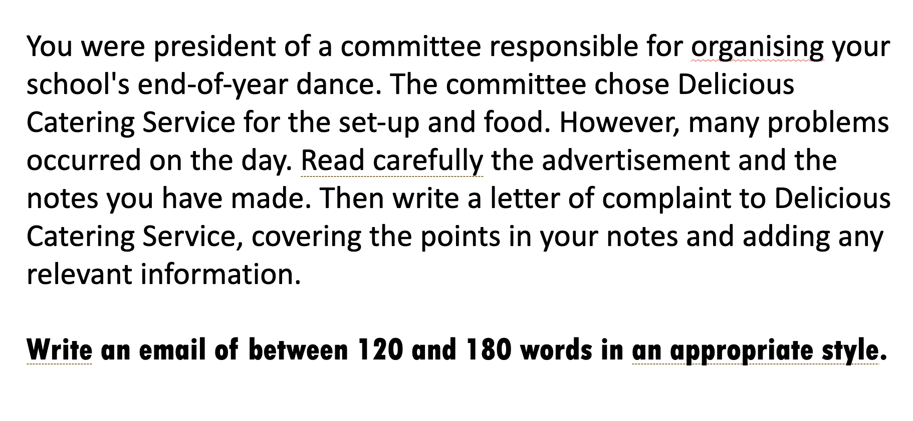

# Homework — 2026-05-14

**Assigned:** 2026-05-14
**Due:** 2026-05-21
**Status:** 🔴 Not started

## Task

Write a formal email of complaint (120–180 words) to Delicious Catering Service as president of the school dance committee.

Cover all the points from the advertisement notes:
- inexperienced/rude staff (teenagers, came late)
- staff stopped serving drinks at midnight
- DJ played only 50s music all night
- food was not gourmet (hot-dogs and cheesepies)
- free cake was not provided
- marquee took 4 hours to set up → dance started 1 hour late

Use formal language, set phrases from class and linking words.

## Materials

- [hw_solution.md](hw_solution.md)
- [class.md](class.md) — phrase tables and sample letter
