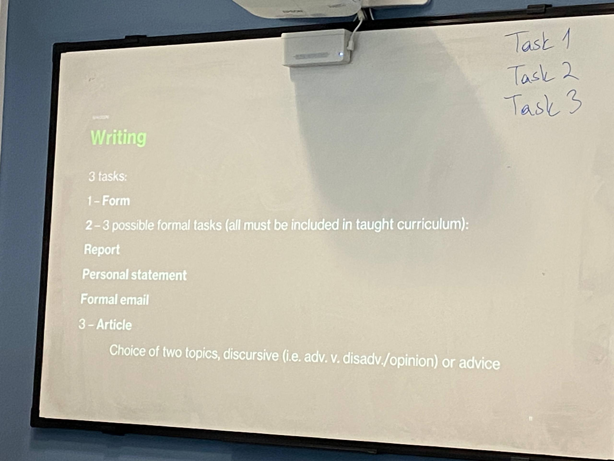

# 2026-06-04

## Topic

## Class Notes

- Writing

Attention to:
- instructions
- Capital letters
- Punctuation
- Correct sentences

30 mins

---

1.1 Planning
p18
Advice: How to write a good plan
1. Understand the question
2. Use Bullet points or a mind map
3. Describe the structure
4. Add examples or details
5. Check for Purpose and tone

HW: 
- Writing booklet p16-17 fill the form
- Planning 4 p.23 choose one of the questions and write a plan

## Materials

<!--
Put screenshots, scans, handouts into attachments/ subfolder:

-->

## New Words

→ see [vocab.md](../../vocab.md)
