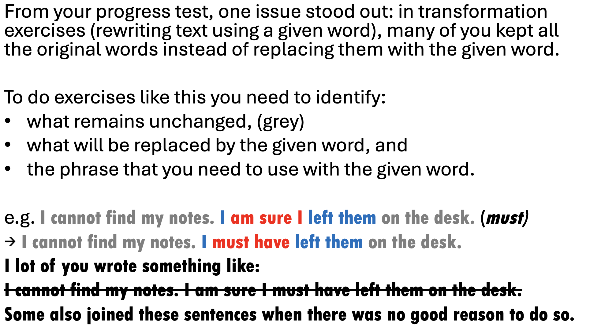

# 2026-06-11

## Topic

## Class Notes

- Review of the last test:

From your progress test, one issue stood out: in transformation
exercises (rewriting text using a given word), many of you kept all
the original words instead of replacing them with the given word.

To do exercises like this you need to identify:
• what remains unchanged, (grey)
• what will be replaced by the given word, and
• the phrase that you need to use with the given word.

e.g. I cannot find my notes. I am sure I left them on the desk. (must)
→ I cannot find my notes. I must have left them on the desk.
I lot of you wrote something like:
~I cannot find my notes. I am sure I must have left them on the desk.~
Some also joined these sentences when there was no good reason to do so.

---

I      am    going to have    eaten      breakfast
|                              |              |
                    splits into (be) + eaten
                               |
|                         + "been"            |
|                              |              |
v                              v              v
(by me)                    been eaten      Breakfast
[→ to end]                              [→ to front]

Breakfast   is   going to have   been eaten   (by me).

---
15 sentences:

Active → Passive

1. The company launches a new product every year.
    → _______________________________________
2. They are building a new shopping centre near the station.
    → _______________________________________
3. The committee approved the proposal yesterday.
    → _______________________________________
4. Scientists have discovered a new treatment for the disease.
    → _______________________________________
5. They had completed the project before the deadline.
    → _______________________________________
6. The government will introduce new regulations next year.
    → _______________________________________
7. They are going to announce the results tomorrow.
    → _______________________________________
8. Someone must finish this report by Friday.
    → _______________________________________
9. They should inform all employees about the changes.
    → _______________________________________
10. The police may arrest several suspects soon.
    → _______________________________________
11. They were repairing the road when the accident happened.
    → _______________________________________
12. Nobody had told me about the meeting.
    → _______________________________________
13. People speak English in many countries.
    → _______________________________________
14. They have been investigating the case for several months.
    → _______________________________________
15. Someone had stolen the painting before the museum opened.
    → _______________________________________

---

## Materials

<!--
Put screenshots, scans, handouts into attachments/ subfolder:

-->

## New Words

→ see [vocab.md](../../vocab.md)
