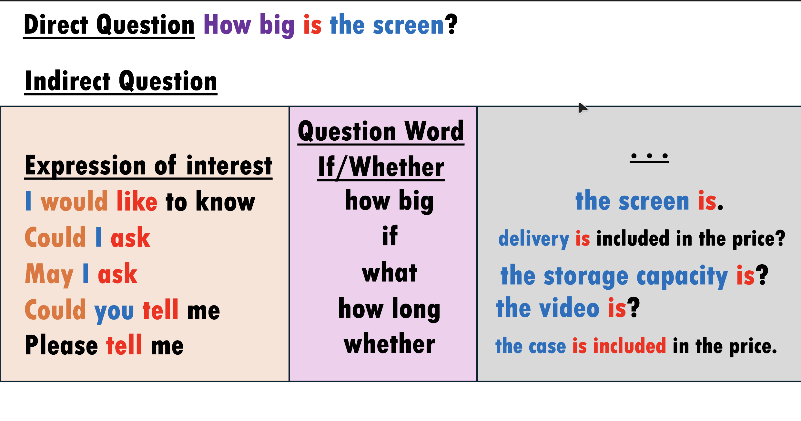

# YYYY-MM-DD

## Topic

## Class Notes

- WRITING
a formal letter (I)
Discuss the topic
- Have you ever asked for information about an advertisement in writing or over the telephone? If yes, why?
- What sort of information was missing?
Sample writing
1. Below is an advertisement for a summer language course. A teenager has read the advertisement and noted down several questions he/she wants to ask. Read the advertisement and the letter on the following page. Then underline the sentences in the letter which refer to the questions asked by the teenager.

---

---

## Materials

<!--
Put screenshots, scans, handouts into attachments/ subfolder:

-->

## New Words

→ see [vocab.md](../../vocab.md)
