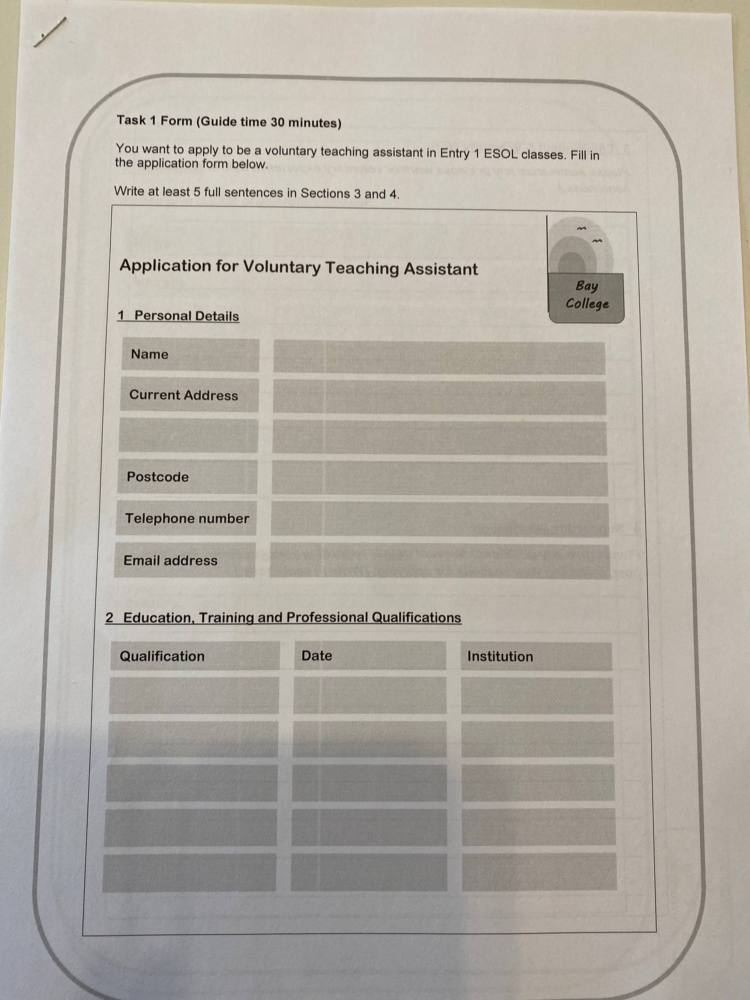
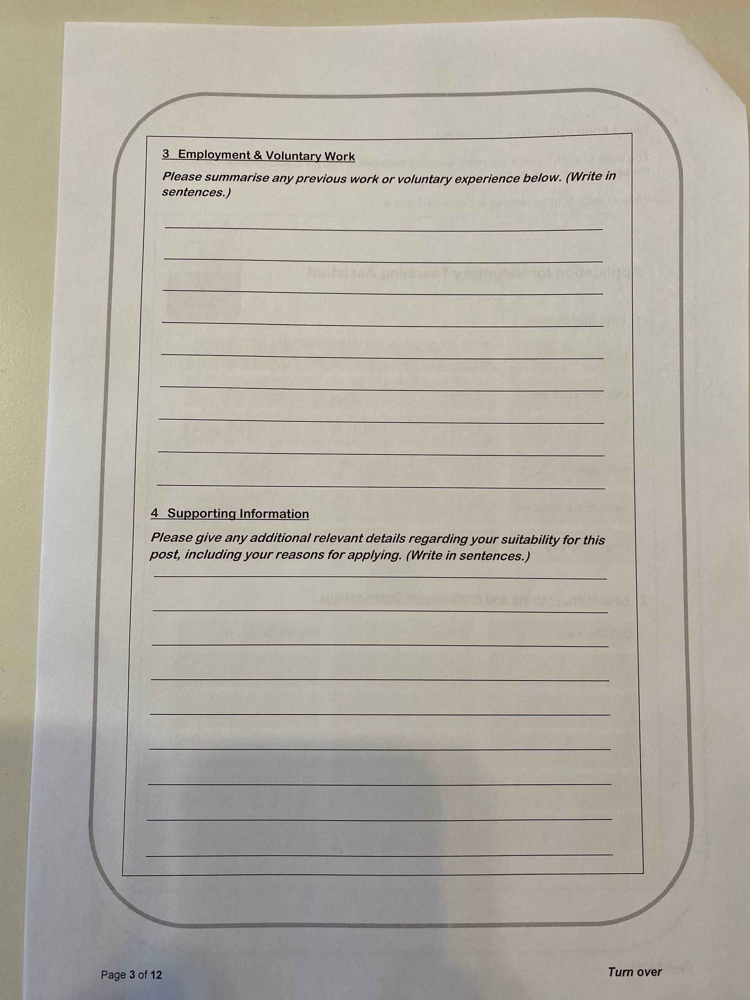

# YYYY-MM-DD

## Topic

## Class Notes

- 

Education, Training, and Professional Qualifications:
- Highest to lowest:
- Doctor of Philosophy (PhD)
- Master of Arts (MA)
- Master of Science (MSc) in English Language Teaching (ELT)
- Master of Engineering (MEng)
- Bachelor of Arts (BA)
- Bachelor of Science (BSc)
- Higher Diploma
- Ordinary Diploma

- Ascentis ESOL Skills for Life Level 2 Reading
- Ascentis ESOL Skills for Life Level 2 Writing
- Ascentis ESOL Skills for Life Level 2 Speaking/Listening

- Post Graduate Certificate in Education (PGCE)

---

## Materials

<!--
Put screenshots, scans, handouts into attachments/ subfolder:

-->

## New Words

→ see [vocab.md](../../vocab.md)
