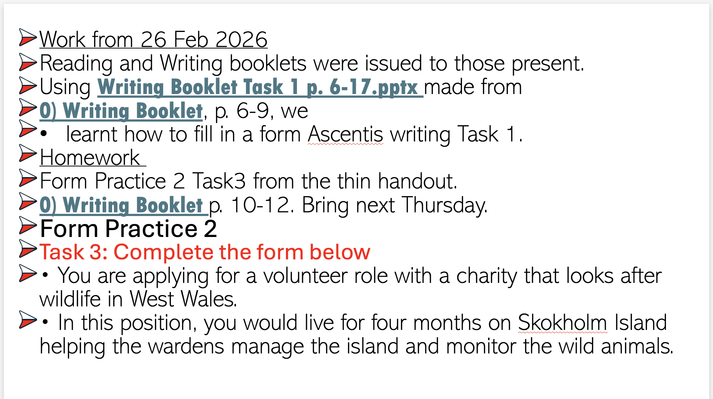

Home work

26/02/2026

Form Practice 2 Task3 from the thin handout.

__0) Writing Booklet__ p. 10-12. Bring next Thursday.

Form Practice 2

Task 3: Complete the form below
 * You are applying for a volunteer role with a charity that looks after wildlife in West Wales.
 * In this position, you would live for four months on Skokholm Island helping the wardens manage the island and monitor the wild animals.